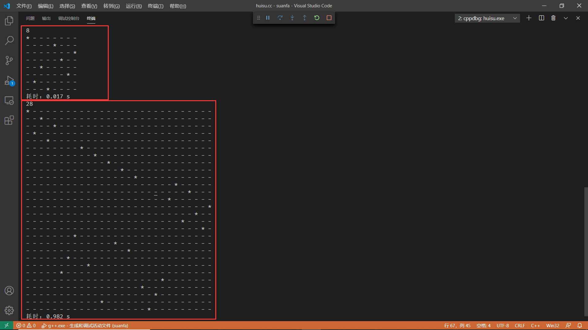
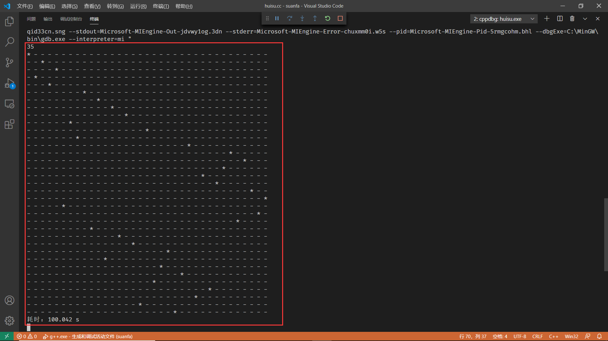
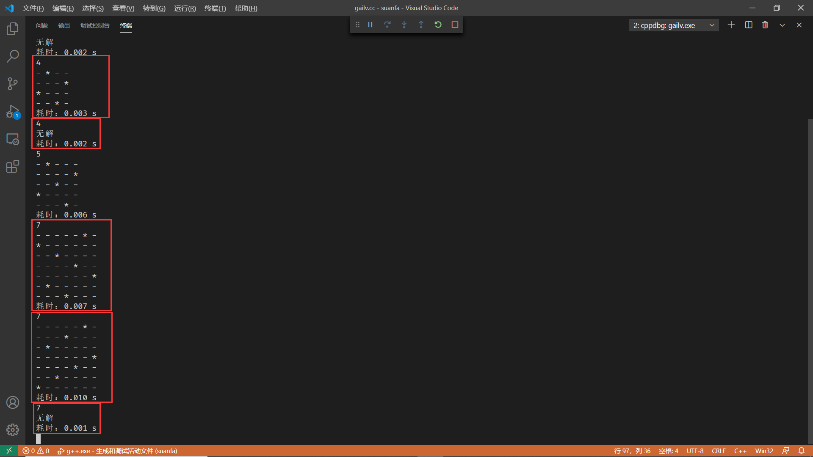
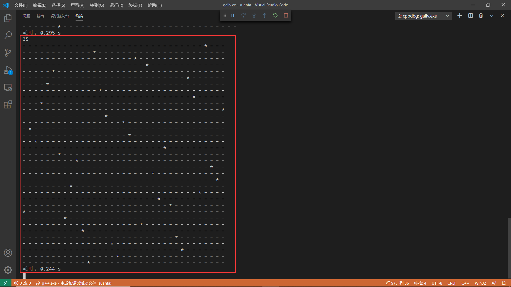
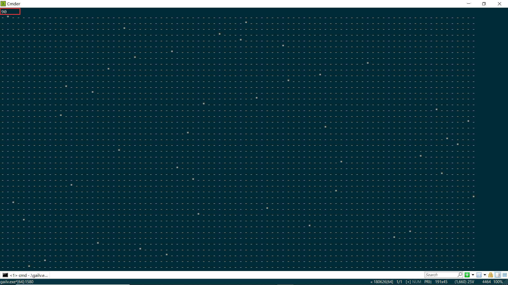
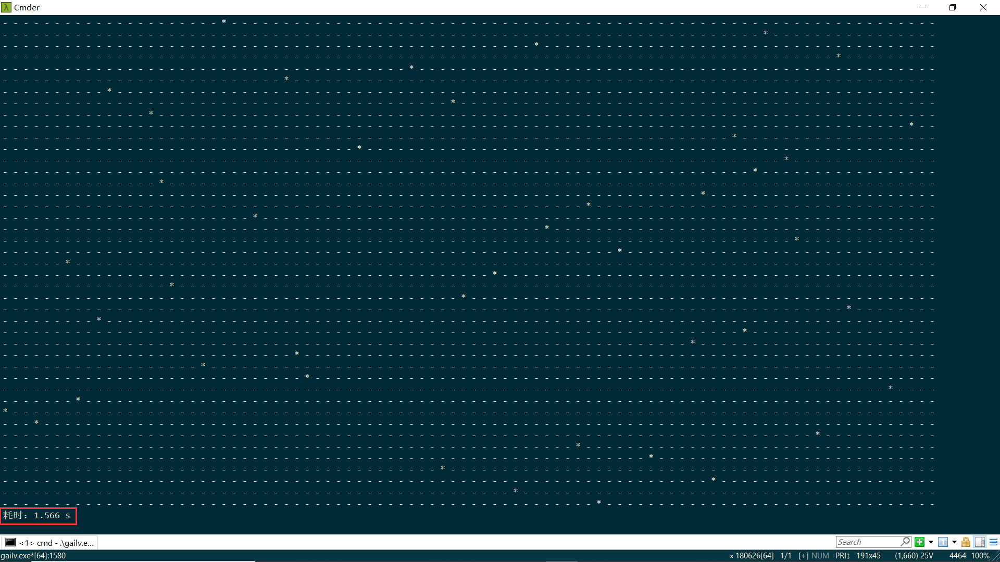

# n皇后问题

> 在 $n×n$ 的国际象棋棋盘中放 $n$ 个皇后，使得任意两个皇后都不能互相吃掉。规则是皇后能吃掉同一行、同一列、同一对角线的任意棋子。

## 模型建立

$n$ 个皇后从 $1$ ~ $n$ 编号，第 $i$ 个皇后的位置设定为第 $i$ 行，第 $x_i$ 列，坐标 $(i, x_i)$。

.png)

要使得任意两个皇后都不能相互吃掉，那么 $(1, x_1)$、$(2, x_2)$、... 、$(n, x_n)$，就不能在同一行、同一列、同一对角线。

由于 $n$ 皇后是从 $1$ ~ $n$ 编号的，所以不在同一行已经满足。

不在同一列，意味着 $x_1$、$x_2$、... 、$x_n$ 必须两两不相等，而且范围是从 $1$ ~ $n$。即 $x_1$、$x_2$、... 、$x_n$ 是 $1$ ~ $n$ 的一种排列。

不在同一对角线，意味着两个皇后 $(i, x_i)$、$(j, x_j)$ 构成的直线斜率不能为 $1$ 或者 $-1$。即 $| x_i - x_j | \neq | i - j |$ 。

## 算法思路

$n$ 个皇后的行数可以直接确定，剩下的就是列数。列数是 $x_1$、$x_2$、... 、$x_n$ 是 $1$ ~ $n$ 的一种排列，因此可以采用`全排列生成算法`获取所有的排列，然后尝试搜索所有的排列以找到一组可行解。而搜索的过程又可以使用不同的算法以优化时间复杂度。

### 1、回溯法

回溯法采用的是“走不通就掉头”的策略，可以尝试搜索 $n^n$ 种情况，直到找到一组可行解。按深度优先思想，从第一个皇后开始搜索，确定一个位置后，再搜索第二个皇后的位置；每前进一步都要检查当前是否满足所有的约束条件，不满足时，回溯到上一个皇后，继续尝试下一个位置，满足时，开始搜索下一个皇后的位置，直到找出问题的解。

#### 代码

```c++
// 回溯法解 n 皇后问题（递归）
#include <iostream>
#include <sys/time.h>
using namespace std;

typedef long long ll;

// 获取系统时间 s
double getCurrentTime()
{
    timeval tv;
    gettimeofday(&tv, NULL);
    ll tap = tv.tv_sec * 1000LL + tv.tv_usec / 1000LL;
    return tap / 1000.0;
}

// 交换
void swap(int& a, int& b)
{
    int t = a;
    a = b;
    b = t;
}

const int MAX_N = 100;      // n 的最大值

int column[MAX_N + 1];      // column[i] 表示第 i 个皇后的列
int n;                      // 当前 n 的值
bool flag;                  // 是否已找到可行解的标记

// 输出结果
void printResult()
{
    if (flag)
        for (int i=1; i <= n; ++ i)
        {
            for (int j=1; j <= n; ++ j)
            {
                if (column[i] == j)
                    printf("* ");
                else
                    printf("- ");
            }
            putchar('\n');
        }
    else
        printf("无解\n");
}

// 检查前 t 个皇后是否符合约束条件
bool checkConstraints(int t)
{
    for (int i=1; i <= t-1; ++ i)
    {
        if (abs(column[i] - column[t]) == abs(i - t))
            return false;
    }
    return true;
}

// 从第 t 个皇后开始搜索
void backTrackingSearch(int t)
{
    if (t > n || flag)  // 找到了一组可行解
        flag = true;
    else
        for (int i=t; i <= n && !flag; ++ i)
        {
            swap(column[i], column[t]);
            if (checkConstraints(t))
                backTrackingSearch(t + 1);
            if (!flag)
                swap(column[i], column[t]);
        }
}

int main(int argc, char const *argv[])
{
    while (~scanf("%d", &n))
    {
        for (int i=1; i <= n; ++ i)
            column[i] = i;
        flag = false;
        double start = getCurrentTime();

        backTrackingSearch(1);
        printResult();
        
        double stop = getCurrentTime();
        printf("耗时：%.3f s\n", stop - start);
    }
    return 0;
}
```

#### 运行结果

> \* 代表皇后，\- 代表空。



当 n 较小时，算法的运行速度是可观的，但是当 n 较大时，算法的运行时间就比较大了：



### 2、概率算法

概率算法也叫随机化算法，是在算法执行过程中随机地选择下一个计算步骤。在 $n$ 皇后问题的回溯算法解决方案中，对于第 $i$ 个皇后，都有 $n-i+1$ 种情况要考虑；如果采用概率算法，只随机地取其中一部分情况来进行考虑，就能节省算法的运行时间。

#### 代码

```c++
// 概率算法解 n 皇后问题
#include <iostream>
#include <cstdlib>
#include <cmath>
#include <sys/time.h>
using namespace std;

typedef long long ll;

// 获取系统时间 s
double getCurrentTime()
{
    timeval tv;
    gettimeofday(&tv, NULL);
    ll tap = tv.tv_sec * 1000LL + tv.tv_usec / 1000LL;
    return tap / 1000.0;
}

// 交换
void swap(int& a, int& b)
{
    int t = a;
    a = b;
    b = t;
}

// 获取 [a, b] 中的一个随机整数
int randInt(int a, int b)
{
    return (rand() % (b - a + 1)) + a;
}

const int MAX_N = 100;      // n 的最大值

int column[MAX_N + 1];      // column[i] 表示第 i 个皇后的列
int n;                      // 当前 n 的值
bool flag;                  // 是否已找到可行解的标记
double density;             // 随机搜索的密度 (0, 1]。

// 输出结果
void printResult()
{
    if (flag)
        for (int i=1; i <= n; ++ i)
        {
            for (int j=1; j <= n; ++ j)
            {
                if (column[i] == j)
                    printf("* ");
                else
                    printf("- ");
            }
            putchar('\n');
        }
    else
        printf("无解\n");
}

// 检查前 t 个皇后是否符合约束条件
bool checkConstraints(int t)
{
    for (int i=1; i <= t-1; ++ i)
    {
        if (abs(column[i] - column[t]) == abs(i - t))
            return false;
    }
    return true;
}

// 从第 t 个皇后开始搜索
void probabilitySearch(int t)
{
    if (t > n || flag)
    {
        flag = true;
    }
    else
    {
        int num = ceil((n - t + 1) * density);  // 只搜索 num 种情况
        while (num -- && !flag)
        {
            int p = randInt(t, n);
            swap(column[t], column[p]);
            if (checkConstraints(t))
                probabilitySearch(t + 1);
            if (!flag)
                swap(column[t], column[p]);
        }
    }
}

int main(int argc, char const *argv[])
{
    density = 0.5;      // 只搜索每个分支中的 0.5 倍路径
    while (~scanf("%d", &n))
    {
        for (int i=1; i <= n; ++ i)
            column[i] = i;
        flag = false;
        double start = getCurrentTime();

        probabilitySearch(1);
        printResult();

        double stop = getCurrentTime();
        printf("耗时：%.3f s\n", stop - start);
    }
    return 0;
}
```

#### 运行结果

> \* 代表皇后，\- 代表空。

当 n 较小时，算法的时间复杂度和回溯法差不多，而且出错的概率较大。



当 n 较大时，概率算法依旧表现出了很好的性能：







### 3、不同参数（density密度值）下概率算法的效率和准确度分析

| n的值                   |   4    |   8    |   15   |    25    |    35    |    50    |  70  | 100  |
| ----------------------- | :----: | :----: | :----: | :------: | :------: | :------: | :--: | :--: |
| 回溯法                  |   0s   |   0s   | 0.002s |  0.057s  | 414.353s |   ...    | ...  | ...  |
| 概率算法（density=0.2） | 0s/0.2 |  0s/0  |  0s/0  | 0.049s/1 | 0.564s/1 | 3.904s/1 | ...  | ...  |
| 概率算法（density=0.4） | 0s/0.5 | 0s/0.4 |  0s/1  | 0.003s/1 | 0.004s/1 |  0.2s/1  | ...  | ...  |
| 概率算法（density=0.6） | 0s/0.5 | 0s/0.9 |  0s/1  | 0.001s/1 | 0.002s/1 | 0.014s/1 | ...  | ...  |
| 概率算法（density=0.8） | 0s/0.8 |  0s/1  |  0s/1  | 0.002s/1 | 0.002s/1 | 0.006s/1 | ...  | ...  |
| 概率算法（density=1.0） | 0s/0.8 |  0s/1  |  0s/1  |   0s/1   | 0.003s/1 | 0.023s/1 | ...  | ...  |
| 概率算法（density=1.2） | 0s/0.9 |  0s/1  |  0s/1  | 0.003s/1 | 0.001s/1 | 0.072s/1 | ...  | ...  |

