# 图论

图是表示一些事物或者状态的关系的表达方法。许多的问题看上去和图没关系，其实都可以归结为图的问题。在 ACM 中就有许多需要直接或间接用图解决的问题。


## 1、图是什么

图由顶点 vertex 和 边 edge 组成，顶点代表对象，边表示的是两个对象的连接关系。

顶点的集合是 V、边的集合是 E 的图记为 G = (V, E)，连接两点 u 和 v 的边用 e = (u, v) 表示。

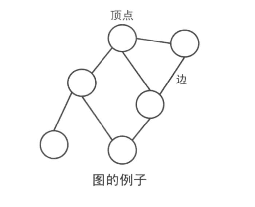

### 1）图的种类

图大体上分为 2 种：

- **无向图**
    - 边没有指向性的图
    - 表示朋友关系的图、路线图

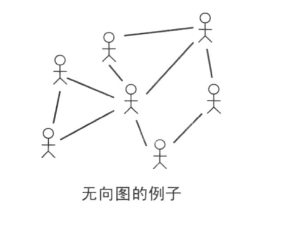

- **有向图**
    - 边具有指向性的图
    - 表示数值的大小关系的图、流程图

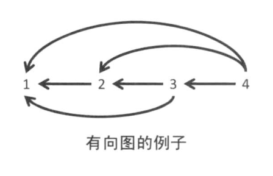

我们可以给边赋予各种各样的属性，比如==权值==（cost）。

这种边上带有权值的图就叫做**带权图**。

在不同的问题中，权值可以代表距离、时间以及价格等不同的属性。

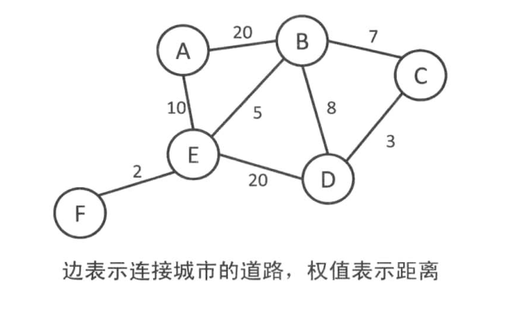

### 2）无向图的术语

两个顶点之间如果有边连接，那么就视为两个顶点==相邻==。相邻顶点的序列称为==路径==。起点和终点重合的路径叫做==环==。任意两点之间都有路径连接的图叫做==连通图==。顶点连接的边数叫做这个顶点的==度==。

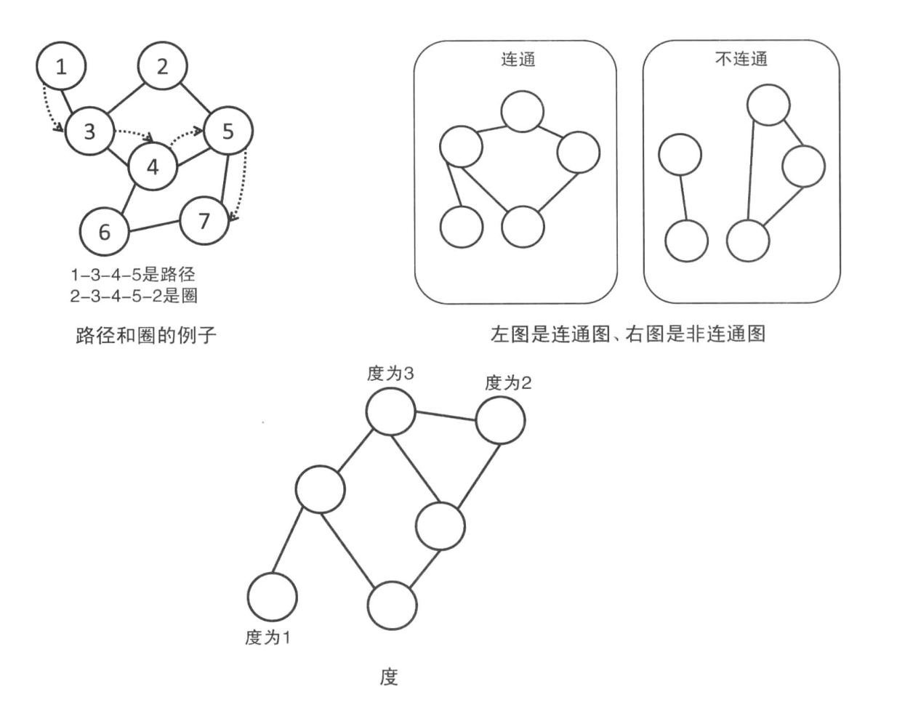

没有环的连通图叫做==树==（tree），没有环的非连通图叫做==森林==。**一棵树的边数恰好是顶点数 - 1 。**反之，边数等于顶点数 - 1 的连通图就是一颗树。

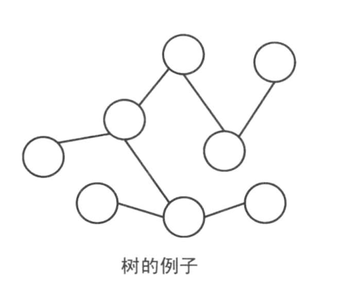

如果在树上选择一个顶点作为==根==（root），就可以把根提到最上面，而离根越远的顶点越往下安排其位置。这样的树叫做==有根树==。不过，对于==无根树==，有时选择适当的顶点作为根使之变成有根树，可以使问题得到简化。如果把有根树看作家谱图，则可以在顶点之间建立父子关系，也可以认为这是给边加上了方向。

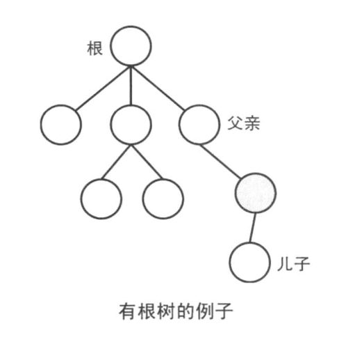

### 3）有向图的术语

设定以有向图的顶点 v 为起点的边的集合记作 &+(v)，以顶点 v 为终点的边的集合记作 &-(v)。|&+(v)| 叫做 v 的==出度==，|&-(v)| 叫做 v 的==入度==。


没有环的有向图叫做==有向无环图==（DAG）。例如，用顶点表示整数，n 能整除 m 时从 n 向 m 连一条边的图，这就构成了一个 DAG 。

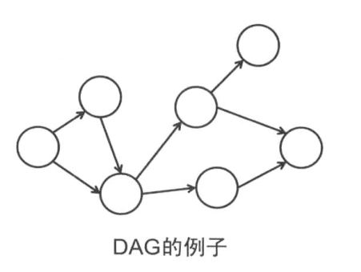

对于每个顶点我们给它一个编号，第 i 号顶点叫做 vi 。那么存在从顶点 vi 到 顶点 vj 的边时就有 i < j 成立，这样的编号方式叫做==拓扑序==。

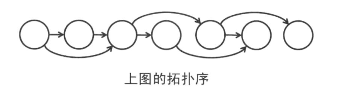

如果把图中的顶点按照拓扑序从左到右排列，那么所有的边都是从左指向右的。因此，通过这样的编号方式，有些 DAG 的问题就可以使用 DP 来解决了。求解拓扑序的算法叫做==拓扑排序==。


## 2、图的表示

为了能在程序中对图进行处理，需要把顶点和边用具体的数据结构存储下来。在图的表示方法中，比较具有代表性的有**邻接矩阵**和**邻接表**。需要注意的是，两种方法都有各自的优缺点，根据问题的不同，使用不同的存储方式可能会影响算法的时间复杂度。

记顶点和边的集合为 V 和 E ，|V| 和 |E| 表示顶点和边的个数。在 V 中，顶点被编号为 0 ~ |V|－1 。

### 1）邻接矩阵

邻接矩阵用 |V| × |V| 的二维数组 G 来表示图。G\[ i \]\[ j \] 表示的是顶点 i 和顶点 j 的关系。

由于在无向图中，只需要知道 “顶点 i 和顶点 j 之间是否有边连着” 这样的信息，因此如果顶点 i 和顶点 j 之间有边相连，那么 G\[ i \]\[ j \] 和 G\[ j \]\[ i \] 就设为 1 ，否则设为 0 .这样就可以表示一个无向图了。

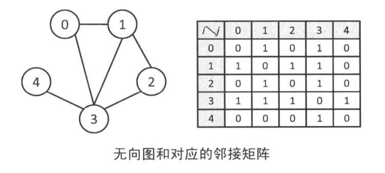

由于在有向图中，只需要知道 “是否有从顶点 i 出发指向顶点 j 的边” 这样的信息，因此如果顶点 i 有一条指向顶点 j 的边，那么 G\[ i \]\[ j \] 就设为 1 ，否则设为 0 。这样就可以表示一个有向图了。有向图与无向图不同，并不需要满足 G\[ i \]\[ j \] = G\[ j \]\[ j \] 。

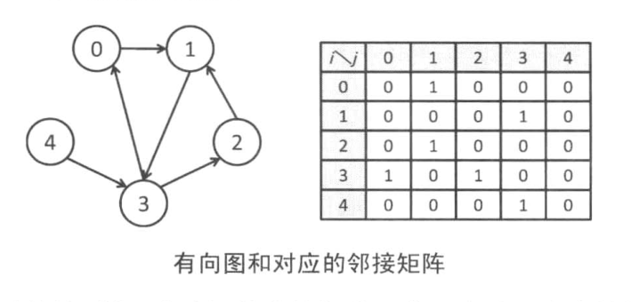

使用邻接矩阵的好处是可以在常数时间内判断两点之间是否有边存在，但是要花费 O(|V|²) 的空间。在边很少的稀疏图里十分浪费。例如：如果图是一棵树，那么边数就只有 |V|－1 条，所以数组 G 绝大部分的元素都变成了 0 。在 |V| 达到 1000000 时，即使 G 的每个元素只需要 1 个字节的空间，整个数组也需要 1 TB 的内存才能存下。

此外，两点之间有==重边==或者==自环==的情况需要特别注意。在无权图中，只需要设 G\[ i \]\[ j \] 为顶点 i 到 j 的边数即可，但是在带权图中是不行的，因为还要记录权值。当然大部分情况下只需要保留权值最大或者最小的边就行了，这种情况就可以忽视其它边。必须保存所有的边时，可以使用邻接表。

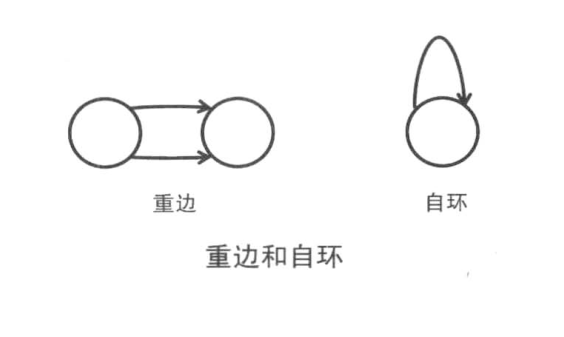

**邻接矩阵的实现：**

```c++
// 有向有权图
#include <iostream>
#include <algorithm>
#include <climits>
using namespace std;

const int MAX_V = 100000;
const int MAX_E = 100000;
const int INF = INT_MAX / 2;

int G[MAX_V][MAX_V];        // 邻接矩阵
int V, E;                   // V 点的个数、E 边的个数

void inputs()
{
    int a, b, d;
    cin >> V >> E;
    for (int i=0; i < V; ++ i)
    {
        fill(G[i], G[i] + V, INF);
    }
    for (int i=0; i < E; ++ i)
    {
        cin >> a >> b >> d;
        G[a][b] = d;
    }
}

// 判断 a 和 b 是否连通
bool connected(int a, int b)
{
    return G[a][b] != INF;
}

int main()
{
    return 0;
}
```

### 2）邻接表

用邻接矩阵表示稀疏图会浪费大量的内存空间。而在邻接表中，是通过把 “从顶点 0 出发有到顶点 2，4，5 的边” 这样的信息保存在链表中来表示图的。这样就只需要 O(|V| + |E|) 的内存空间。


事实上，实现邻接表的方式多种多样，每个人的法都可能有所不同。

在带权图等边有附加属性的图中，将边用结构体或者类来表示就可以很方便地存储了。邻接表虽然在边数稀少时只需要占用少量内存，但是和邻接矩阵相比实现较为复杂。而且，在邻接表中查询两点间是否有边需要遍历一遍链表才知道。

**邻接表的实现：**

```c++
// 有向有权图
#include <iostream>
#include <vector>
#include <algorithm>
using namespace std;

const int MAX_V = 100000;
const int MAX_E = 100000;
typedef pair<int, int> Edge;    // first 代表权值，second 代表点

int V, E;               // V 点的个数、E 边的个数
vector<Edge> G[MAX_V];  // 邻接表


void inputs()
{
    int a, b, d;
    cin >> V >> E;
    for (int i=0; i < E; ++ i)
    {
        cin >> a >> b >> d;
        G[a].push_back(make_pair(d, b));
    }
}

bool connected(int a, int b)
{
    for (int i=0; i < G[a].size(); ++ i)
    {
        Edge e = G[a][i];
        if (e.second == b)
            return true;
    }
    return false;
}

int main()
{
    return 0;
}
```


## 3、图的搜索

让我们来试着解决下面这道题：

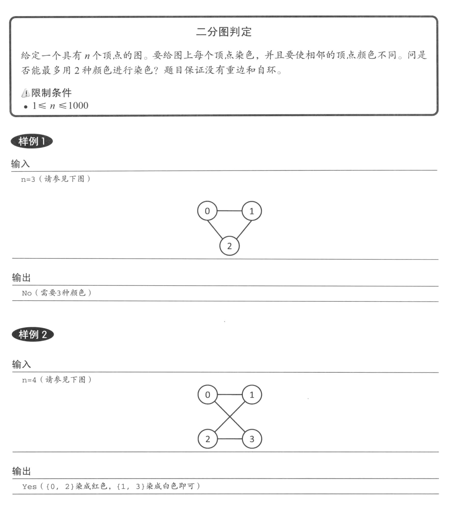

把相邻顶点染成不同颜色的问题叫做图着色问题。对图进行染色所需要的最小颜色数被称为最小着色数。最小着色数是 2 的图称做==二分图==。

如果只用 2 种颜色，那么确定一个顶点的颜色之后，和它相邻的点的颜色也就确定了。因此，选择任意一个顶点出发，依次确定相邻顶点的颜色，就可以判断是否可以被 2 种颜色染色了。这个问题如果用深度优先搜索的话，能够简单地实现。

如果是连通图，那么一次 dfs 就可以访问到所有的顶点。如果题目描述中没有说明，那么有可能图是不连通的，这样就需要依次检查每个顶点是否访问过。

**邻接矩阵解法：**

```c++
#include <cstdio>
#include <cstring>
using namespace std;

const int MAX_V = 1000;
const int MAX_E = 1000000;

int G[MAX_V][MAX_V];    // 邻接矩阵
int color[MAX_V];       // 颜色 1（颜色1）、-1（颜色2）、0（未染色）

int V, E;

// 输入
void inputs()
{
    int a, b;
    scanf("%d %d", &V, &E);
    for (int i=0; i < V; ++ i)
    {
        memset(G[i], 0, sizeof(G[i]));
    }
    for (int i=0; i < E; ++ i)
    {
        scanf("%d %d", &a, &b);
        G[a][b] = G[b][a] =1;
    }
}

// 染色，给第 pos 个点染上 c
bool dye(int pos, int c)
{
    color[pos] = c;
    for (int i=0; i < V; ++ i)
    {
        if (G[pos][i])
        {
            if (color[i] == c)
                return false;
            else if (color[i] == 0 && !dye(i, -c))
                return false;
        }
    }
    return true;
}


bool solve()
{
    memset(color, 0, sizeof(color));
    for (int i=0; i < V; ++ i)
    {
        if (color[i] == 0)
            if (!dye(i, 1))
                return false;
    }
    return true;
}

int main()
{
    inputs();
    if (solve())
        puts("Yes");
    else
        puts("No");
    return 0;
}
```

**邻接表解法：**

```c++
#include <cstdio>
#include <cstring>
#include <vector>
using namespace std;

const int MAX_V = 1000;
const int MAX_E = 1000000;

vector<int> G[MAX_E];   // 邻接表
int color[MAX_V];       // 颜色 1（颜色1）、-1（颜色2）、0（未染色）

int V, E;

// 输入
void inputs()
{
    int a, b;
    scanf("%d %d", &V, &E);
    for (int i=0; i < E; ++ i)
    {
        scanf("%d %d", &a, &b);
        G[a].push_back(b);
        G[b].push_back(a);
    }
}

// 染色，给第 pos 个点染上 c
bool dye(int pos, int c)
{
    color[pos] = c;
    for (int i=0; i < G[pos].size(); ++ i)
    {
        int target = G[pos][i];
        if (color[target] == c)
            return false;
        else if (color[target] == 0 && !dye(target, -c))
            return false;
    }
    return true;
}


bool solve()
{
    memset(color, 0, sizeof(color));
    for (int i=0; i < V; ++ i)
    {
        if (color[i] == 0)
            if (!dye(i, 1))
                return false;
    }
    return true;
}

int main()
{
    inputs();
    if (solve())
        puts("Yes");
    else
        puts("No");
    return 0;
}
```


## 4、最短路问题

最短路问题是图论中最基础的问题，在 ACM 的试题中也经常出现。最短路是给定两个顶点，在以这两个点为起点和终点的路径中，边的==权值和==最小的路径。如果把权值当作距离，考虑最短距离的话就很容易理解了。智力游戏中的求解最少步数问题也可以说是一种最短路问题。

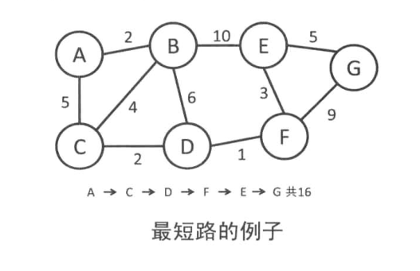

### 1）单源最短路问题（Bellman-Ford算法）

==单源最短路问题==是固定一个起点，求它到其他所有点的最短路的问题。终点也固定的问题叫做==两点之间最短路问题==。但是因为解决单源最短路问题的复杂度也是一样的，因此通常当作单源最短路路问题来求解。

记从起点 s 出发到顶点 i 的最短距离为 d\[ i \]，则下述等式成立：
$$
d [ i ] = min \{ d [ j ] + (从 j 到 i 的边的权值) | e = ( j, i ) ∈ E \}
$$
如果给定的图是一个 DAG ，就可以按拓扑序给顶点编号，并利用这条递推关系式计算出 d 。但是，如果图中有环，就无法依赖这样的顺序进行计算。在这种情况下，记当前 s 到顶点 i 的最短路长度为 d\[ i \] ，并设初值 d\[ s \] = 0 ， d\[ i \] = INF ，再不断使用这条递推关系式更新 d 的值，就可以算出新的 d 。只要图中不存在==负环==，这样的更新操作就是有限的。结束之后的 d 就是所求的最短距离了。

```c++
#include <iostream>
#include <climits>
#include <algorithm>
using namespace std;

const int MAX_V = 1000000;
const int MAX_E = 1000000;
const int INF = INT_MAX / 2;

struct Edge
{
    int from;   // s
    int to;     // v
    int cost;   // 权
};

Edge es[MAX_E];
int d[MAX_V];
int V, E;

void shortest_path(int s)
{
    bool flag = false;
    fill(d, d + V, INF);
    d[s] = 0;
    while (true)
    {
        for (int i=0; i < E; ++ i)
        {
            Edge e = es[i];
            if (d[e.from] != INF && d[e.to] > d[e.from] + e.cost)
            {
                d[e.to] = d[e.from] + e.cost;
                flag = true;
            }
        }
        if (!flag)
            break;
    }
}

int main()
{
    return 0;
}
```

这个算法叫做 Bellman-Ford 算法。如果图中不存在从 s 可达的负环，那么最短路不会经过同一个顶点两次（也就是说，最多通过 |V|-1 条边），更新 d 数组的循环操作最多执行 |V| - 1 次，因此，复杂度是 O(|V|×|E|) 。反之，如果存在从 s 可达的负环，那么在第 |V| 次循环中也会更新 d 的值，因此也可以用这个性质来检查负环。如果一开始对所有顶点 i ，都把 d\[ i \] 初始化为 0 ，那么可以检查出所有的负环。

```c++
bool find_negative_loop()
{
    memset(d, 0, sizeof(d));
    for (int i=0; i < V; ++ i)
    {
        for (int j=0; j < E; ++ j)
        {
            Edge e = es[i];
            if (d[e.to] > d[e.from] + e.cost)
            {
                d[e.to] = d[e.from] + e.cost;
                if (i == V-1)
                    return true;
            }
        }
    }
    return false;
}
```

### 2）单源最短路问题（Dijkstra算法）

让我们考虑一下没有负边的情况。在 Bellman-Ford 算法中，如果 d\[ i \] 还不是最短距离的话，那么即使进行 d\[ i \] = d\[ i \] + (从 i 到 j 的边的权值) 的更新，d\[ j \] 也不会变成最短距离。而且，即使 d\[ i \] 没有变化，每一次循环也要检查一遍从 i 出发的所有边。这显然是很浪费时间的。因此可以对算法做如下修改。

（1）找到最短距离已经确定的顶点，从它出发更新相邻顶点的最短距离。

（2）此后不需要再关心 “最短距离已经确定的点” 。

在（1）和（2）中提到的 “最短距离已经确定的点” 要怎么得到是问题的关键。在最开始时，只有起点的最短距离是确定的。而在尚未使用过的顶点中，距离 d\[ i \] 最小的顶点就是 “最短距离已经确定的点” 。这是因为由于不存在负边，所以 d\[ i \] 不会在之后的更新中变小。这个算法叫做 Dijkstra 算法。


```c++
#include <iostream>
#include <climits>
#include <cstring>
#include <algorithm>
using namespace std;

const int MAX_V = 1000000;
const int MAX_E = 1000000;
const int INF = INT_MAX / 2;

int G[MAX_V][MAX_V];    // 邻接矩阵，G[i][j] 表示 i 到 j 的路径长
int d[MAX_V];           // 最短路
bool visit[MAX_V];      // 是否已经确定最短路
int V, E;

void dijkstra(int s)
{
    fill(d, d + V, INF);
    fill(visit, visit + V, false);
    d[s] = 0;
    while (true)
    {
        int v = -1;
        // 从尚未确定最短路的顶点中选择一个距离最小的顶点
        for (int i=0; i < V; ++ i)
        {
            if (!visit[i] && (v==-1 || d[i] < d[v]))
                v = i;
        }
        if (v == -1)
            break;
        visit[v] = true;
        for (int i=0; i < V; ++ i)
        {
            d[i] = min(d[i], d[v] + G[v][i]);
        }
    }
}

int main()
{
    return 0;
}
```

使用邻接矩阵实现的 Dijkstra 算法的复杂度是 O(|V|²) 。使用邻接表的话，更新最短距离只需要访问每条边一次即可，因此这部分的复杂度是 O(|E|) 。但是每次要枚举所有的顶点来查找下一个使用的顶点，因此最终复杂度还是 O(|V|²) 。在 |E| 比较小时，大部分的时间花在了查找下一个使用的顶点上，因此需要使用合适的数据结构对其进行优化。

需要优化的是数值的插入（更新）和取出最小值两个操作，因此使用堆就可以了。把每个顶点当前的最短距离用堆维护，在更新最短距离时，把对应的元素往根的方向移动以满足堆的性质。而每次从堆中取出的最小值就是下一次要使用的顶点。这样堆中的元素共有 O(|V|) 个，更新和取出数值的操作有 O(|E|) 次，因此整个算法的复杂度是 O(|E| * log |V|) 。

下面是使用 STL 的优先队列的实现：

```c++
#include <iostream>
#include <climits>
#include <cstring>
#include <vector>
#include <queue>
#include <algorithm>
using namespace std;

const int MAX_V = 1000000;
const int MAX_E = 1000000;
const int INF = INT_MAX / 2;

typedef pair<int, int> Edge;        // first 是边的权值，second 是点

int V, E;
vector<Edge> G[MAX_V];      // 邻接表
int d[MAX_V];


void dijkstra(int s)
{
    priority_queue<Edge, vector<Edge>, greater<Edge> > que;
    fill(d, d + V, INF);
    d[s] = 0;
    que.push(make_pair(0, s));

    while (!que.empty())
    {
        Edge e = que.top();
        que.pop();
        int v = e.second;
        if (d[v] < e.first)
            continue;
        for (int i=0; i < G[v].size(); ++ i)
        {
            e = G[v][i];
            if (d[e.second] > d[v] + e.first)
            {
                d[e.second] = d[v] + e.first;
                que.push(make_pair(d[e.second], e.second));
            }
        }
    }
}
```

相对于 Bellman-Ford 的 O(|V||E|) 的复杂度，Dijkstra 算法的复杂度是 O(|E| * log |V|) ，可以更加高效地计算最短路的长度。但是，在图中存在负边的情况下，Dijkstra 算法就无法正确求解问题，还是需要使用 Bellman-Ford 算法。

### 3）任意两点间的最短路问题（Floyd-Warshall算法）

求解所有两点间的最短路的问题叫做任意两点间的最短路问题。通常可以在任何图中使用，包括有向图、带负权边的图。

单独一条边的路径也不一定是最佳路径。 从任意一条单边路径开始。所有两点之间的距离是边的权的和，(如果两点之间没有边相连, 则为无穷大）。 从第一个顶点开始，依次将每个顶点作为媒介 k，然后对于每一对顶点 u 和 v ，查看其是否存在一条经过 k 的，距离比已知路径更短的路径，如果存在则更新它。

```c++
#include <iostream>
#include <climits>
#include <algorithm>
using namespace std;

const int MAX_V = 100000;
const int MAX_E = 100000;
const int INF = INT_MAX / 2;

int d[MAX_V][MAX_V];
int V, E;

void warshall_floyd()
{
    for (int i=0; i < V; ++ i)
    {
        fill(d[i], d[i] + V, INF);
    }
    for (int k=0; k < V; ++ k)
    {
        for (int i=0; i < V; ++ i)
        {
            for (int j=0; j < V; ++ j)
            {
                d[i][j] = min(d[i][j], d[i][k] + d[k][j]);
            }
        }
    }
}

int main()
{
    return 0;
}
```

这样通过三重循环非常简单地就可以求出所有两点间的最短路长度。由于实现起来非常简单，如果复杂度在可以承受的范围之内，单源最短路也可以使用 Floyd-Warshall 算法进行求解。

### 4）路径还原

截至目前，我们都是在求解最短距离。虽然许多问题只需输出最短距离就可以了，但是也有的问题需要求解最短路的路径。我们以 Dijkstra 算法为例，试着来求解最短路径。在求解最短距离时，满足 d\[ j \]  = d\[ k \] + cost\[ k \]\[ j\] 的顶点 k ，就是最短路上顶点 j 的前趋节点，因此通过不断寻找前趋节点就可以恢复出最短路。

此外，如果用 pre\[ j \] 来记录最短路上顶点 j 的前趋，那么就可以在 O(|V|) 的时间内完成最短路的恢复。在 d\[ j \] = d\[ k \] + cost\[ k \]\[ j \] 更新 d\[ j \] 时，修改 pre\[ j \] = k ，这样就可以求得 pre 数组。在计算从 s 出发到 j 的最短路时，通过 pre\[ j \] 就可以知道顶点 j 的前趋，因此不断把 j 替换成 pre\[ j \] 直到 j = s 为止就可以了。Bellman-Ford 算法和 Floyd-Warshall 算法都可以用类似的方法进行最短路的还原。

```c++
#include <iostream>
#include <climits>
#include <cstring>
#include <algorithm>
using namespace std;

const int MAX_V = 10000;
const int MAX_E = 10000;
const int INF = INT_MAX / 2;

int pre[MAX_V];         // 前趋数组
int G[MAX_V][MAX_V];    // 邻接矩阵，G[i][j] 表示 i 到 j 的路径长
int d[MAX_V];           // 最短路
bool visit[MAX_V];      // 是否已经确定最短路
int V, E;


void dijkstra(int s)
{
    fill(d, d + V, INF);
    fill(visit, visit + V, false);
    fill(pre, pre + V, -1);
    d[s] = 0;
    while (true)
    {
        int v = -1;
        // 从尚未确定最短路的顶点中选择一个距离最小的顶点
        for (int i=0; i < V; ++ i)
        {
            if (!visit[i] && (v==-1 || d[i] < d[v]))
                v = i;
        }
        if (v == -1)
            break;
        visit[v] = true;
        for (int i=0; i < V; ++ i)
        {
            if (d[i] > d[v] + G[v][i])
            {
                d[i] = d[v] + G[v][i];
                pre[i] = v;
            }
        }
    }
}

int main()
{
    return 0;
}
```


## 5、最小生成树

给定一个无向图，如果它的某个子图中任意两个顶点都互相连通并且是一棵树，那么这棵树就叫做==生成树== (Spanning Tree) 。如果边上有权值，那么使得**边权和**最小的生成树叫做==最小生成树== (MST, Minimum Spanning Tree) 。

例如我们假设有这样一个图：把顶点看作村庄，边看作计划要修建的道路。为了在所有的村庄间通行，恰好修建村庄数目－1 条道路时的情形就对应了一颗生成树。修建道路要投入建设费，那么求解使得道路建设费用最小的生成树就是最小生成树问题。

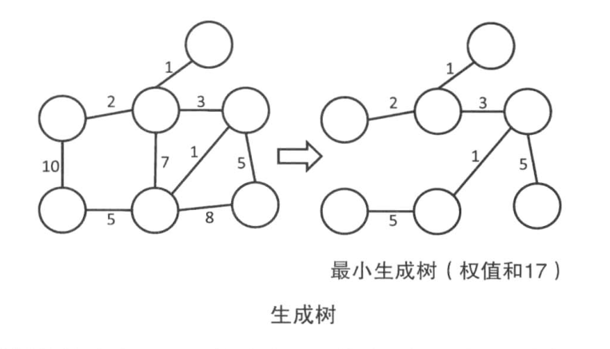

常见的求解最小生成树的算法有 Kruskal 算法和 Prim 算法。很显然，生成树是否存在和图是否连通是等价的，因此我们假定图是连通的。

### 1）Prim 算法

Prim 算法和 Dijkstra 算法十分相似，都是从某个顶点出发，不断添加边的算法。

首先，我们假设有一颗只包含一个顶点 v 的树 T 。然后贪心地选取 T 和其他顶点之间相连的最小权值的边，并把它加到 T 中。不断进行这个操作，就可以得到一颗生成树了。

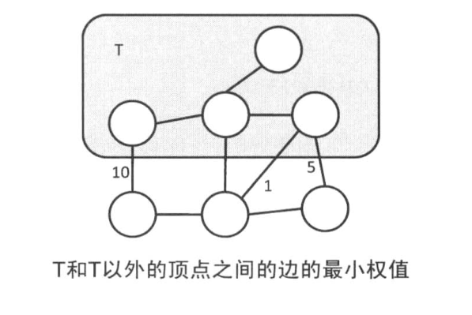

```c++
#include <iostream>
#include <algorithm>
#include <climits>
using namespace std;

const int MAX_V = 10000;
const int MAX_E = 10000;
const int INF = INT_MAX / 2;

int G[MAX_V][MAX_V];        // 邻接矩阵
int d[MAX_V];               // 点集到其它顶点的最短距离
bool used[MAX_V];           // 记录点集（为 true 的在点集中）
int V, E;

int prim()
{
    fill(d, d + V, INF);
    fill(used, used + V, false);
    d[0] = 0;
    int result = 0;

    while (true)
    {
        int v = -1;
        // 从不属于点集的顶点中选取距离最小的点，加入点集
        for (int i=0; i < V; ++ i)
        {
            if (!used[i] && (v == -1 || d[i] < d[v]))
                v = i;
        }
        if (v == -1)
            break;
        used[v] = true;     // 把顶点 v 加入点集
        result += d[v];     // 把边的长度加入 result 结果

        for (int i=0; i < V; ++ i)
        {
            d[i] = min(d[i], G[v][i]);
        }
    }
    return result;
}

void inputs()
{
    
    int a, b, d;
    cin >> V >> E;
    for (int i=0; i < V; ++ i)
    {
        fill(G[i], G[i] + V, INF);
    }
    for (int i=0; i < E; ++ i)
    {
        cin >> a >> b >> d;
        G[a][b] = G[b][a] = d;
    }
}

int main()
{
    inputs();
    cout << prim() << endl;
    return 0;
}
```

### 2）Kruskal 算法

Kruskal 算法按照边的权值顺序从小到大查看一遍，如果不产生环，就把当前这条边加入到生成树中。

假设现在要把连接顶点 u 和顶点 v 的边 e 加入生成树中。如果加入之前 u 和 v 不在同一个连通分量里，那么加入 e 也不会产生环。反之，如果 u 和 v 在同一个连通分量里，那么一定会产生圈。可以使用并查集高效地判断是否属于同一个==连通分量==。

```c++
#include <iostream>
#include <climits>
#include <algorithm>
using namespace std;

const int MAX_V = 10000;
const int MAX_E = 10000;
const int INF = INT_MAX / 2;

// 表示边的结构体
struct Edge
{
    int from;
    int to;
    int cost;   // 权值
};

bool cmp(const Edge& a, const Edge& b)
{
    return a.cost < b.cost;
}

Edge edge[MAX_E];
int bingchaji[MAX_V];
int V, E;

// 初始化并查集
void init_bingchaji()
{
    for (int i=0; i < V; ++ i)
    {
        bingchaji[i] = i;
    }
}

// 寻找并查集的根节点
int find_root(int pos)
{
    if (pos == bingchaji[pos])
        return pos;
    else
        return bingchaji[pos] = find_root(bingchaji[pos]);
}

// 判断 a 和 b 是否在同一个集合
bool same(int a, int b)
{
    return find_root(a) == find_root(b);
}

// 把 a 和 b 放入同一个集合
void join_same(int a, int b)
{
    int tap = find_root(a);
    bingchaji[tap] = b;
}

int kruskal()
{
    int result = 0;
    sort(edge, edge + E, cmp);
    init_bingchaji();
    for (int i=0; i < E; ++ i)
    {
        Edge e = edge[i];
        if (!same(e.from, e.to))
        {
            join_same(e.from, e.to);
            result += e.cost;
        }
    }
    return result;
}

void inputs()
{
    cin >> V >> E;
    for (int i=0; i < E; ++ i)
    {
        cin >> edge[i].from >> edge[i].to >> edge[i].cost;
    }
}

int main()
{
    inputs();
    cout << kruskal() << endl;
    return 0;
}
```

### 3）例题

题目链接：[POJ3723](http://poj.org/problem?id=3723)

解法：

```c++
#include <cstdio>
#include <climits>
#include <vector>
#include <algorithm>
using namespace std;

const int MAX_V = 20000;
const int MAX_E = 50000;
const int INF = INT_MAX / 2;

struct Edge
{
    int from;
    int to;
    int cost;
};

bool cmp(const Edge& a, const Edge& b)
{
    return a.cost < b.cost;
}

Edge edge[MAX_E];
int bingchaji[MAX_V];
int V, E;

void inputs()
{
    int N, M, R;
    scanf("%d %d %d", &N, &M, &R);
    V = N + M;
    E = R;
    for (int i=0; i < R; ++ i)
    {
        scanf("%d %d %d", &edge[i].from, &edge[i].to, &edge[i].cost);
        edge[i].to += N;
        edge[i].cost = -edge[i].cost;
    }
}

// 初始化并查集
void init_bingchaji()
{
    for (int i=0; i < V; ++ i)
    {
        bingchaji[i] = i;
    }
}

// 寻找并查集的根节点
int find_root(int pos)
{
    if (pos == bingchaji[pos])
        return pos;
    else
        return bingchaji[pos] = find_root(bingchaji[pos]);
}

// 判断 a 和 b 是否在同一个集合
bool same(int a, int b)
{
    return find_root(a) == find_root(b);
}

// 把 a 和 b 放入同一个集合
void join_same(int a, int b)
{
    int tap = find_root(a);
    bingchaji[tap] = b;
}

int krusal()
{
    int result = 0;
    sort(edge, edge + E, cmp);
    init_bingchaji();
    for (int i=0; i < E; ++ i)
    {
        Edge e = edge[i];
        if (!same(e.from, e.to))
        {
            join_same(e.from, e.to);
            result += e.cost;
        }
    }
    return result;
}

int main()
{
    int T;
    scanf("%d", &T);
    while (T --)
    {
        inputs();
        printf("%d\n", 10000 * V + krusal());
    }
}
```

