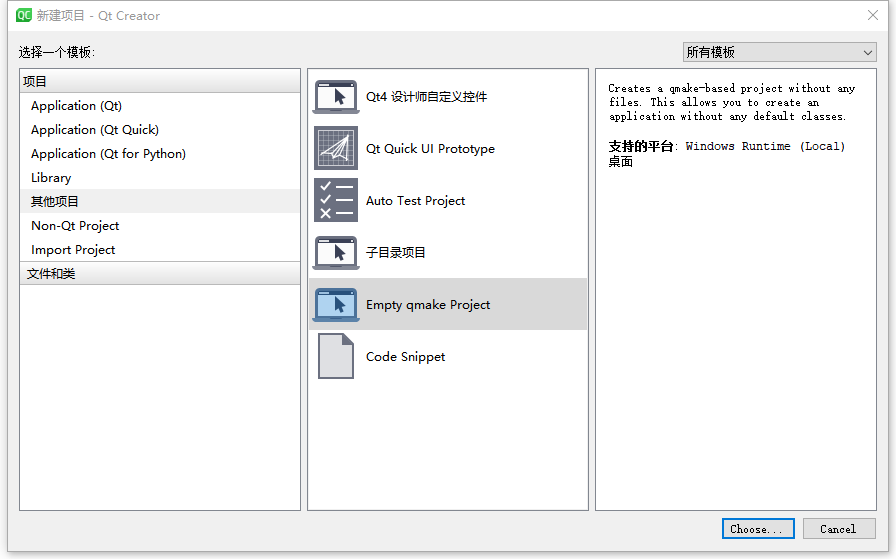

# 第一个Qt程序

## 1、创建Empty工程



## 2、编写项目文件

demo_03.pro

```properties
QT += widgets

SOURCES += \
    main.cpp
```

main.cpp

```c++
#include <QApplication>
#include <QWidget>  // 窗口控件基类
#include <QPushButton>


int main(int argc, char **argv)
{
    QApplication app(argc, argv);

    QWidget w;
    w.setWindowTitle("主要看气质");  // 设置标题

    QPushButton b;
    b.setText("^_^");   // 设置按钮内容
    // b.show();

    /* 如果不指定父对象（窗口和窗口），对象和对象没有关系，独立
     * a指定b为父对象，a放在b的上面
     * 指定父对象有2种方式：
     *      1）setParent
     *      2）构造函数传参
     * 指定父对象后，只需要父对象show，子对象自动show
     */
    b.setParent(&w);    // 指定父对象
    b.move(100, 100);   // 移动坐标

    QPushButton b1(&w);
    b1.setText("Abc Bar");
    b1.move(200, 200);

    w.show();

    return app.exec();
}
```

