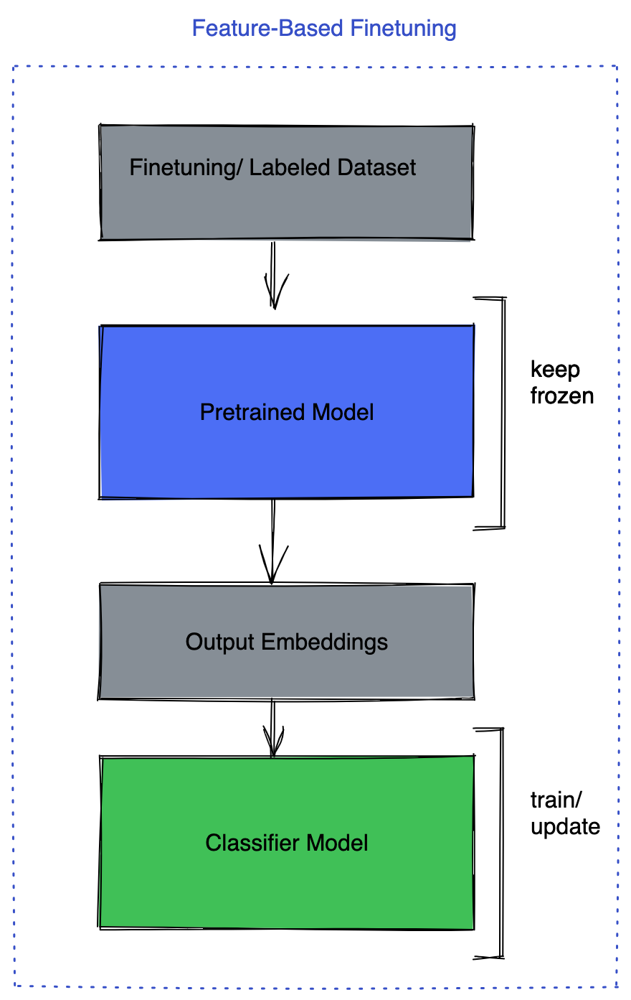
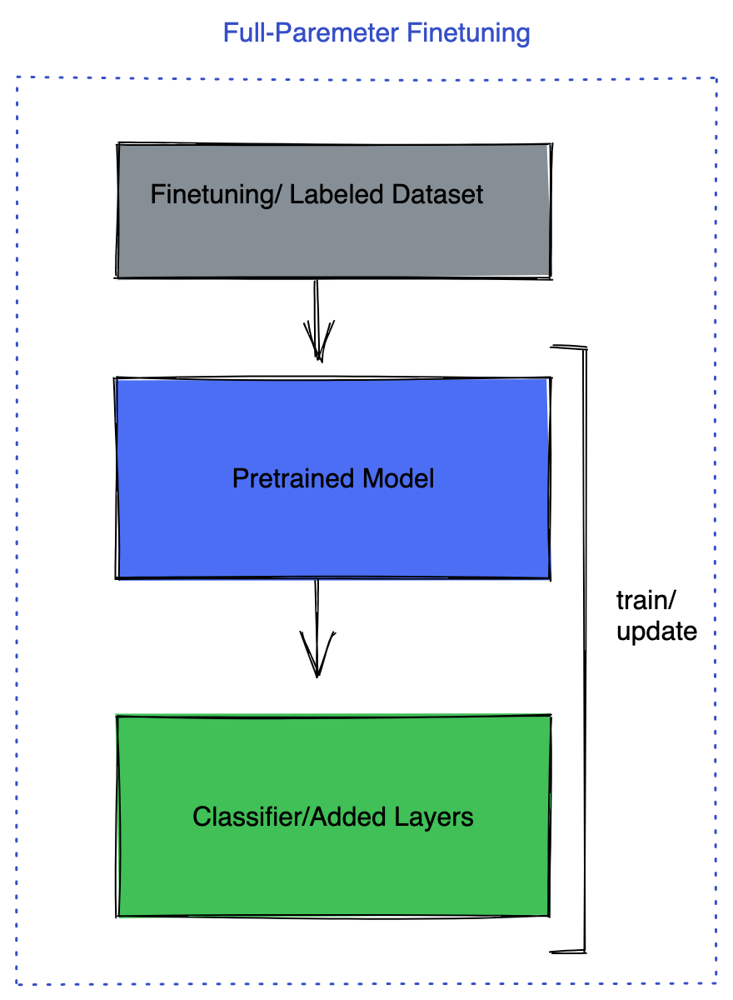

# LLM Fine-Tuning

## 前置条件

- Ubuntu 20.04/22.04
- Linux Kernel >= 5.5.0，如果使用的是20.04，可能需要安装`linux-generic-hwe-20.04`以使用更新的内核
- Python >= 3.10，如果默认的版本较低，可以通过`pyenv`来管理多版本Python，以安装高版本
- CUDA 11.8，cudnn 8.9.7

> 硬件支持（Hardware Enablement, HWE）的内核会始终使用更新的版本，比`linux-generic`的内核版本高，但稳定性可能略低。

## 方法分类

### Parameter Efficient Model Fine-Tuning (PEFT)

保持整个预训练模型参数冻结，并仅向模型中添加微小的可学习参数/层。通过这种方式，只需要训练一小部分参数。目前的方法有`LoRA`、`QLoRA`、`LLaMA Adapter`和`Prefix-tuning`。

现有的PEFT库：https://github.com/huggingface/peft

### Full/Partial Parameter Fine-Tuning

这种微调方式有三种策略可选：

- 保持预训练模型冻结，只微调任务头。
- 保持预训练模型冻结，只在顶部添加几个全连接层。
- 对所有层进行微调。

<div style="display: flex;">
    
    
    
</div>
在这种情况下，可能需要不止一个GPU进行训练。这需要足够的GPU显存来保存模型参数、梯度和优化器状态。

## Fully Sharded Data Parallel (FSDP)

FSDP是PyTorch中的一个包，用于训练需要多个GPU的模型。

在FSDP之前是`Distributed Data Parallel (DDP)`，它使得每个GPU都保存完整的模型，只对数据进行分片，在反向传播结束后同步梯度。

而FSDP不仅对数据进行分片，还对模型参数、梯度和优化器状态进行分片，每个GPU都只保存模型的一个分片。这样可以节省大量显存，以便于将更大的模型放入多个GPU中。

安装方式：

```shell
pip3 install --pre torch torchvision torchaudio --index-url https://download.pytorch.org/whl/nightly/cu118
```

