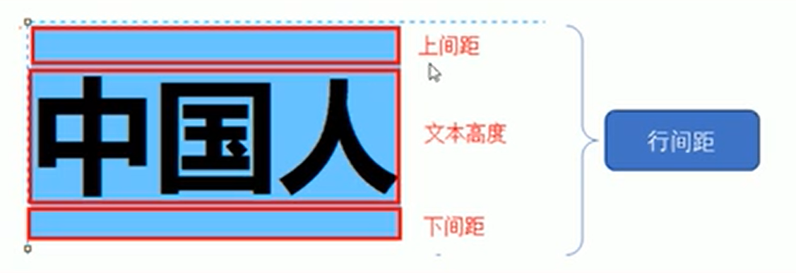

# CSS 文本属性

CSS 文本属性可以定义文本的外观，比如文本的`颜色`、`对齐文本`、`装饰文本`、`文本缩进`、`行间距`。

# 1、文本颜色

==color== 属性用于定义文本的颜色。

```css
div {
    color: red;
}
```

| 颜色表示       | 属性值（例子）                    |
| -------------- | --------------------------------- |
| 预定义的颜色值 | red，green，blue，pink            |
| 十六进制       | #FF0000，#FF6600，#29D794         |
| RGB代码        | rgb(255, 0, 0)，rgb(100%, 0%, 0%) |

## 2、对齐文本

==text-align== 属性用于设置元素内文本内容的水平对齐方式。

```css
div {
    text-align: center;
}
```

| 属性值 | 解释           |
| ------ | -------------- |
| left   | 左对齐（默认） |
| right  | 右对齐         |
| center | 居中对齐       |

## 3、装饰文本

==text-decoration== 属性规定添加到文本的修饰。可以给文本添加下划线、删除线、上划线。

```css
div {
    text-decoration: underline;
}
```

| 属性值       | 描述               |
| ------------ | ------------------ |
| none         | 没有装饰线（默认） |
| underline    | 下划线             |
| overline     | 上划线             |
| line-through | 删除线             |

## 4、文本缩进

==text-indent== 属性用来指定文本的第一行缩进，通常是将段落的首行缩进。

```css
p {
    text-indent: 10px;
}
```

```css
p {
    text-indent: 2em;
}
```

==em== 是一个相对单位，就是当前元素1个文字的大小，如果当前元素没有设置大小，则会按照父元素的1个文字大小。

## 5、文本缩进

==line-height== 属性用于设置行间的距离（行高）。可以控制文本行与行之间的距离。

```css
p {
    line-height: 26px;
}
```



