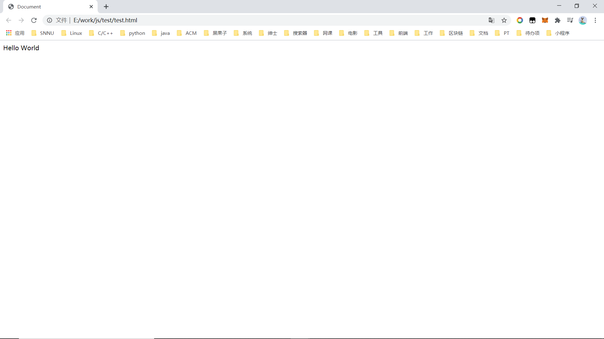

# html 标签导读

## 1、基本语法概述

1）HTML 标签是由尖括号包围的关键词，例如 \<html\>。

2）HTML 标签通常是成对出现的，例如 \<html\> 和 \</html\>，我们称之为**双标签**。标签对中的第一个标签是开始标签，第二个标签是结束标签。

3）有些特殊的标签必须是单个标签，例如 \<br/\>，我们称之为**单标签**。

## 2、标签关系

双标签关系可以分为两类：包含关系和并列关系。

**包含关系**：

```html
<head>
    <title> </title>
</head>
```

**并列关系**：

```html
<head> </head>
<body> </body>
```

## 3、第一个 HTML 网页

每个网页都会有一个基本的结构标签（也称为骨架标签），页面内容也是在这些基本标签上书写。

HTML 页面也称为 HTML 文档。

```html
<html>
    <head>
        <title>我的第一个页面</title>
    </head>
    <body>
        搞事情
    </body>
</html>
```

| 标签      | 定义       | 说明                                                    |
| --------- | ---------- | ------------------------------------------------------- |
| \<html\>  | HTML标签   | 页面中最大的标签，我们称之为`根标签`                    |
| \<head\>  | 文档的头部 | 设置页面的一些属性，比如标题                            |
| \<title\> | 文档的标题 | 设置网页的标题                                          |
| \<body\>  | 文档的主体 | body 元素包含文档的所有内容，页面内容基本都是放到它里面 |

HTML 文档的后缀名必须是 .html 或 .htm，浏览器的作用是读取 HTML 文档，并以网页的形式显示出它们。

## 4、网页开发工具

VsCode：https://code.visualstudio.com/

1）安装扩展：


2）选择第一个模板：


3）右键 Open In Default Browser：


4）效果：



## 5、顶部标签的补充

1）\<!DOCTYPE\> ：文档类型声明，作用是告诉浏览器使用哪种 HTML 版本来显示网页。

```html
<!DOCTYPE html>
```

这句代码的意思是：当前页面采取的是 HTML5 版本来显示网页。

- **注意：**
    - \<!DOCTYPE\> 声明位于文档中的最前面的位置，处于 \<html\> 标签之前。
    - \<!DOCTYPE\> 不是一个 HTML 标签，它是文档类型声明标签。

2）lang：用来定义当前文档显示的语言。

```html
<html lang="en"> </html>
```

- en 定义语言为英语
- zh-CN 定义语言为中文

简单来说，定义为 en 就是英文网页、zh-CN 就是中文网页。

其实对于文档显示来说，定义成 en 的文档也可以显示中文，定义成 zh-CN 的文档也可以显示英文

这个属性对浏览器和搜索引擎还是有点用的。（比如浏览器的翻译功能）

3）charset 字符集：

字符集（Character set）是多个字符的集合，以便于计算机能够识别和存储各种文字。

在 \<head\> 标签内，可以通过 \<meta\> 标签的 charset 属性来规定 HTML 文档应该使用哪种字符编码。

```html
<meta charset="UTF-8"/>
```

charset 常用的值有：GB2312（简体中文）、BIG5（繁体中文）、GBK（包含前两者）、UTF-8，其中 UTF-8 也被称为`万国码`，基本包含了全世界所有国家需要用到的字符。

