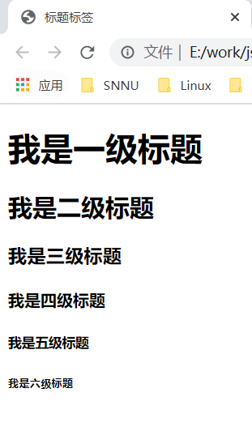
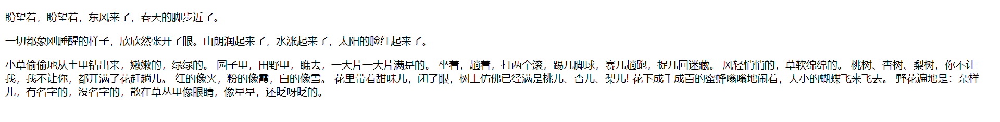
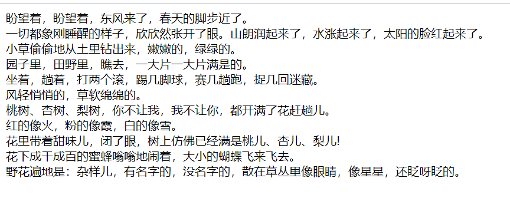
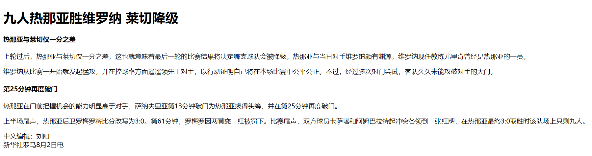
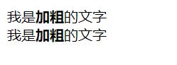
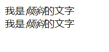
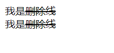
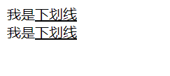
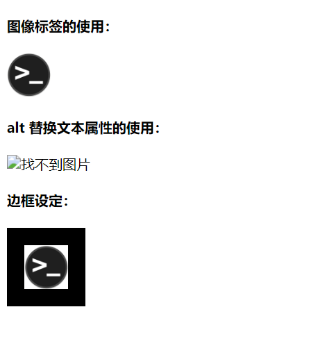
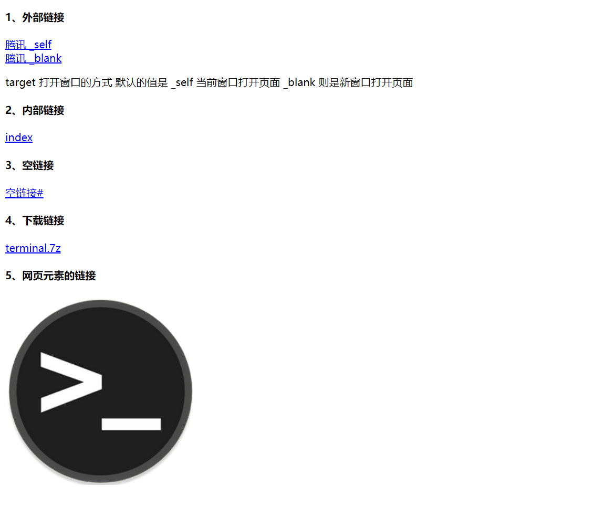

# html 常用标签

## 1、标签语义

学习标签是有技巧的，重点是记住每个标签的语义。简单理解就是指标签的含义，即这个标签是用来干嘛的。

根据标签的语义，在合适的地方添加一个最为合理的标签，可以让页面结构更清晰。


## 2、标题标签 \<h1\> - \<h6\>

为了使网页更具有语义化，我们经常会在页面中用到标题标签。HTML 提供了 6 个等级的网页标题。

即 \<h1\> - \<h6\> 。

```html
<h1>我是一级标题</h1>
```

单词 head 的缩写，意为头部、标题。

**标签语义：**==作为标题使用，并且依据重要性递减。==

**特点：**

- 加了标题的文字会加粗，字号也会变大
- 一个标题独占一行

**示例：**

```html
<!DOCTYPE html>
<html lang="zh-CN">
    <head>
        <meta charset="UTF-8">
        <title>标题标签</title>
    </head>
    <body>
        <h1>我是一级标题</h1>
        <h2>我是二级标题</h2>
        <h3>我是三级标题</h3>
        <h4>我是四级标题</h4>
        <h5>我是五级标题</h5>
        <h6>我是六级标题</h6>
    </body>
</html>
```




## 3、段落标签 \<p\>

在网页中，要把文字有条理地显示出来，就需要将这些文字分段显示。在 HTML 标签中，\<p\> 标签用于定义段落，它可以将整个网页分为若干个段落。

```html
<p>这是一个段落标签</p>
```

单词 paragraph 的缩写，意为段落。

**标签语义：**==可以把 HTML 文档分割为若干段落。==

**特点：**

- 文本在一个段落中会根据浏览器窗口的大小自动换行
- 段落和段落之间保有空隙

**示例：**

```html
<!DOCTYPE html>
<html lang="zh-CN">
    <head>
        <meta charset="UTF-8">
        <title>段落标签</title>
    </head>
    <body>
        <p>盼望着，盼望着，东风来了，春天的脚步近了。</p>
        <p>一切都象刚睡醒的样子，欣欣然张开了眼。山朗润起来了，水涨起来了，太阳的脸红起来了。</p>
        <p>
            小草偷偷地从土里钻出来，嫩嫩的，绿绿的。
            园子里，田野里，瞧去，一大片一大片满是的。
            坐着，趟着，打两个滚，踢几脚球，赛几趟跑，捉几回迷藏。
            风轻悄悄的，草软绵绵的。
            桃树、杏树、梨树，你不让我，我不让你，都开满了花赶趟儿。
            红的像火，粉的像霞，白的像雪。
            花里带着甜味儿，闭了眼，树上仿佛已经满是桃儿、杏儿、梨儿!
            花下成千成百的蜜蜂嗡嗡地闹着，大小的蝴蝶飞来飞去。
            野花遍地是：杂样儿，有名字的，没名字的，散在草丛里像眼睛，像星星，还眨呀眨的。
        </p>
    </body>
</html>
```




## 4、换行标签 \<br/\>

在 HTML 中，一个段落中的文字会从左到右依次排列，直到浏览器窗口的右端，然后才自动换行。

如果希望某段文本强制换行显示，就需要使用换行标签 \<br/\> 。

```html
我是换行标签<br/>
```

单词 break 的缩写，意为打断、换行。

**标签语义：**==强制换行。==

**特点：**

- \<br/\> 是一个单标签
- \<br/\> 标签只是简单地开始新的一行，和 \<p\> 不一样，段落之间会插入一些垂直的间距

**示例：**

```html
<!DOCTYPE html>
<html lang="zh-CN">
    <head>
        <meta charset="UTF-8">
        <title>换行标签</title>
    </head>
    <body>
        盼望着，盼望着，东风来了，春天的脚步近了。<br/>
        一切都象刚睡醒的样子，欣欣然张开了眼。山朗润起来了，水涨起来了，太阳的脸红起来了。<br/>
        小草偷偷地从土里钻出来，嫩嫩的，绿绿的。<br/>
        园子里，田野里，瞧去，一大片一大片满是的。<br/>
        坐着，趟着，打两个滚，踢几脚球，赛几趟跑，捉几回迷藏。<br/>
        风轻悄悄的，草软绵绵的。<br/>
        桃树、杏树、梨树，你不让我，我不让你，都开满了花赶趟儿。<br/>
        红的像火，粉的像霞，白的像雪。<br/>
        花里带着甜味儿，闭了眼，树上仿佛已经满是桃儿、杏儿、梨儿!<br/>
        花下成千成百的蜜蜂嗡嗡地闹着，大小的蝴蝶飞来飞去。<br/>
        野花遍地是：杂样儿，有名字的，没名字的，散在草丛里像眼睛，像星星，还眨呀眨的。<br/>
    </body>
</html>
```




## 5、案例 -- 体育新闻

代码：

```html
<!DOCTYPE html>
<html lang="zh-CN">
    <head>
        <meta charset="UTF-8">
        <title>体育新闻</title>
    </head>
    <body>
        <h1>九人热那亚胜维罗纳 莱切降级</h1>

        <h4>热那亚与莱切仅一分之差</h4>
        <p>
            上轮过后，热那亚与莱切仅一分之差，这也就意味着最后一轮的比赛结果将决定哪支球队会被降级。热那亚与当日对手维罗纳颇有渊源，维罗纳现任教练尤里奇曾经是热那亚的一员。
        </p>
        <p>
            维罗纳从比赛一开始就发起猛攻，并在控球率方面遥遥领先于对手，以行动证明自己将在本场比赛中公平公正。不过，经过多次射门尝试，客队久久未能攻破对手的大门。
        </p>

        <h4>第25分钟再度破门</h4>
        <p>
            热那亚在门前把握机会的能力明显高于对手，萨纳夫里亚第13分钟破门为热那亚拔得头筹，并在第25分钟再度破门。
        </p>
        <p>
            上半场尾声，热那亚后卫罗梅罗将比分改写为3:0。第61分钟，罗梅罗因两黄变一红被罚下。比赛尾声，双方球员卡萨塔和阿姆巴拉特起冲突各领到一张红牌，在热那亚最终3:0取胜时该队场上只剩九人。
        </p>
        
        <p>
            中文编辑：刘阳<br/>
            新华社罗马8月2日电
        </p>
    </body>
</html>
```

效果：




## 6、文本格式化标签

在网页中，有时需要为文字设置**粗体**、*斜体*、<u>下划线</u> 等效果，这时就需要用到 HTML 中的文本格式化标签，使文字以特殊的方式显示。

**标签语义：**==突出重要性，比普通文字更重要。==

| 语义   | 标签                                   |
| ------ | -------------------------------------- |
| 加粗   | \<strong\>\</strong\> 或者 \<b\>\</b\> |
| 倾斜   | \<em\>\</em\> 或者 \<i\>\</i\>         |
| 删除线 | \<del\>\</del\> 或者 \<s\>\</s\>       |
| 下划线 | \<ins\>\</ins\> 或者 \<u\>\</u\>       |

### 1）加粗 \<strong\> \<b\>

**示例：**

```html
<!DOCTYPE html>
<html lang="zh-CN">
    <head>
        <meta charset="UTF-8">
        <title>文本格式化标签</title>
    </head>
    <body>
        我是<strong>加粗</strong>的文字<br/>
        我是<b>加粗</b>的文字
    </body>
</html>
```



### 2）倾斜 \<em\> \<i\>

**示例：**

```html
<!DOCTYPE html>
<html lang="zh-CN">
    <head>
        <meta charset="UTF-8">
        <title>文本格式化标签</title>
    </head>
    <body>
        我是<em>倾斜</em>的文字<br/>
        我是<i>倾斜</i>的文字
    </body>
</html>
```



### 3）删除线 \<del\> \<s\>

**示例：**

```html
<!DOCTYPE html>
<html lang="zh-CN">
    <head>
        <meta charset="UTF-8">
        <title>文本格式化标签</title>
    </head>
    <body>
        我是<del>删除线</del><br/>
        我是<s>删除线</s>
    </body>
</html>
```



### 4）下划线 \<ins\> \<u\>

**示例：**

```html
<!DOCTYPE html>
<html lang="zh-CN">
    <head>
        <meta charset="UTF-8">
        <title>文本格式化标签</title>
    </head>
    <body>
        我是<ins>下划线</ins><br/>
        我是<u>下划线</u>
    </body>
</html>
```




## 7、盒子标签 \<div\> \<span\>

\<div\> 和 \<span\> 是没有语义的，它们就是一个盒子，用来装内容的。

```html
<div>盒子</div>
<span>盒子</span>
```

div 是 division 的缩写，表示分割、分区，span 意为跨度、跨距。

**特点：**

- \<div\> 标签用来布局，但是现在一行只能放一个 \<div\> 。可以理解为大盒子
- \<span\> 标签用来布局，一行可以放多个 \<span\> 。可以理解为小盒子

**示例：**

```html
<!DOCTYPE html>
<html lang="zh-CN">
    <head>
        <meta charset="UTF-8">
        <title>盒子标签</title>
    </head>
    <body>
        <div>我是一个div标签，我单独占一行</div>123
        <div>我是一个div标签，我单独占一行</div>123
        <span>百度</span>
        <span>新浪</span>
        <span>搜狐</span>
    </body>
</html>
```


## 8、图像标签 \

在 HTML 标签中，\ 标签用于定义 HTML 页面中的图像。

```html

```

单词 image 的缩写，意为图像。

src 是 \ 标签的必须属性，它用于指定图像文件的路径。

属性：属于标签的特性。

**标签的其它属性：**

| 属性   | 属性值     | 说明                           |
| ------ | ---------- | ------------------------------ |
| src    | 图片的路径 | 必须属性                       |
| alt    | 文本       | 当图像不能显示时，显示的文字   |
| title  | 文本       | 当鼠标放到图像上时，提示的文字 |
| width  | 像素       | 设置图像的宽度                 |
| height | 像素       | 设置图像的高度                 |
| border | 像素       | 设置图像的边框粗细             |

**注意点：**

- 图像标签可以有多个属性，必须写在标签名后面
- 属性之间不分先后顺序，属性与属性之间用空格分开
- 属性采取键值对的格式，即 key="value" 的格式

**示例：**

```html
<!DOCTYPE html>
<html lang="zh-CN">
    <head>
        <meta charset="UTF-8">
        <title>图像标签</title>
    </head>
    <body>
        <h4>图像标签的使用：</h6>
        
        <h4>alt 替换文本属性的使用：</h4>
        
        <h4>边框设定：</h4>
        
    </body>
</html>
```



**关于路径：**

- 目录文件夹
    - 存放了页面相关的素材（比如 html文件、图片文件）
- 根目录
    - 目录文件夹的第一层就是根目录
- 路径
    - 相对路径
        - 以引用文件所在位置为参考基础，而建立出的目录路径（图片相对于 HTML 页面的位置）
    - 绝对路径
        - 目录下的绝对位置，直接到达目标位置，通常是从盘符开始或从根路径开始，抑或是 URL 地址


## 9、超链接标签 \<a\>

在 HTML 标签中，\<a\> 标签用于定义超链接，作用是从一个页面链接到另一个页面。

```html
<a href="跳转目标路径" target="窗口的弹出方式">文本或图像</a>
```

单词 anchor 的缩写，意为：锚。

| 属性   | 作用                                                         |
| ------ | ------------------------------------------------------------ |
| href   | 必须属性，用于指定链接目标的 url 地址，当为标签应用了 href 属性时，它就具有了超链接的功能 |
| target | 用于指定链接页面的打开方式，\_self 为默认值（在当前窗口打开），\_blank （在新窗口中打开） |

**链接分类：**

| 链接         | 说明                                                     |
| ------------ | -------------------------------------------------------- |
| 外部链接     | 链接外部网站，href 里面是一个完整的 URL                  |
| 内部链接     | 网站内部页面之间的相互链接，直接链接内部页面名称即可。   |
| 空链接       | 当没有确定链接目标时                                     |
| 下载链接     | href 里面的地址是一个文件或者压缩包                      |
| 网页元素链接 | 在网页中的各种网页元素，如文本、图像、表格、音频、视频等 |
| 锚点链接     | 可以快速定位到页面中的某个位置                           |

**示例：**

```html
<!DOCTYPE html>
<html lang="zh-CN">
    <head>
        <meta charset="UTF-8">
        <title>超链接标签</title>
    </head>
    <body>
        <h4>1、外部链接</h4>
        <a href="https://www.qq.com" target="_self">腾讯 _self</a><br/>
        <a href="https://www.qq.com" target="_blank">腾讯 _blank</a><br/>
        <p>target 打开窗口的方式  默认的值是 _self 当前窗口打开页面  _blank 则是新窗口打开页面</p>
        <h4>2、内部链接</h4>
        <a href="index.html">index</a>
        <h4>3、空链接</h4>
        <a href="#">空链接#</a>
        <h4>4、下载链接</h4>
        <a href="terminal.7z">terminal.7z</a>
        <h4>5、网页元素的链接</h4>
        <a href="https://www.baidu.com"></a>
    </body>
</html>
```



```html
<!DOCTYPE html>
<html lang="zh-CN">
    <head>
        <meta charset="UTF-8">
        <title>超链接标签</title>
    </head>
    <body>
        <h4>6、锚点链接</h4>
        <a href="#chrome">常用浏览器</a><br/>
        ....
        ....
        ....
        ....
        ....
        ....
        ....
        <h4 id="chrome">## 2、常用浏览器</h4><br/>
        ....
        ....
        ....
        ....
        ....
    </body>
</html>
```

