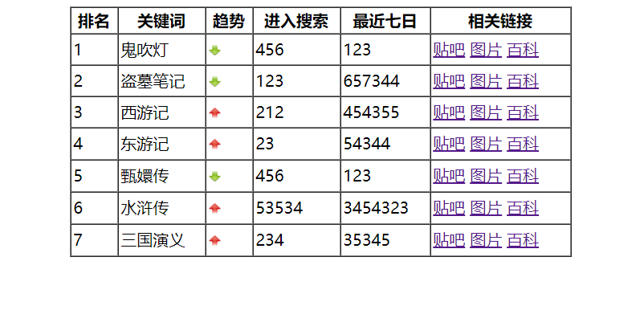
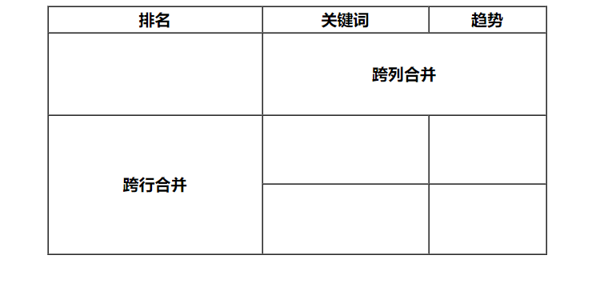
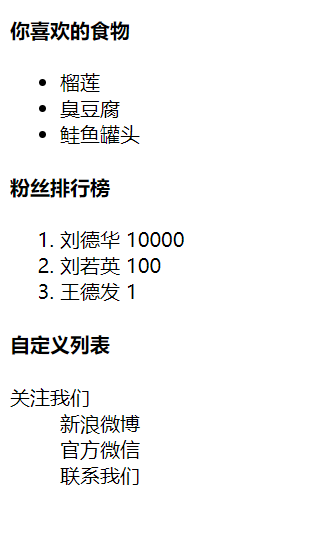

# html 标签（下）

## 1、表格标签 \<table\>

表格主要用于显示、展示数据，因为它可以让数据显示的非常规整，可读性非常好。

特别是后台展示数据的时候，能够熟练运用表格就显得很重要，一个清爽简约的表格能够把复杂的数据表现得很有条理。

**语法：**

```html
<table>
    <tr>
        <td>单元格内的文字</td>
        <!-- ... -->
    </tr>
    <!-- ... -->
</table>
```

- \<table\> 是用于定义表格的标签

### 1）表格的行 \<tr\>

- \<tr\> 用于定义表格中的行，必须嵌套在 \<table\> 中

### 2）表格的单元格 \<td\>

- \<td\> 用于定义表格中的单元格，必须嵌套在 \<tr\> 中
- 字母 td 指表格数据（table data），即数据单元格的内容

### 3）表头单元格标签 \<th\>

一般表头单元格位于表格的第一行或第一列，表头单元格里面的**文本内容加粗居中显示**。

\<th\> 标签表示 HTML 表格的表头部分（table head）的缩写。

**语法：**

```html
<table>
    <tr>
        <th>姓名</th>
    </tr>
</table>
```

表头单元格也是单元格，常用于表格第一行，突出重要性，表头单元格里面的文字会加粗居中显示。

### 4）表格结构标签 \<thead\> \<tbody\>

因为表格可能很长，为了更好地表示表格的语义，可以将表格分割成表格头部和表格主体两大部分。

在表格标签中，分别用：\<thead\> 标签表示表格的头部区域、\<tbody\> 标签表示表格的主体区域。这样可以更好地分清表格结构。

- \<thead\> 定义表格的头部。\<thead\> 内部必须要有 \<tr\> 标签，一般是位于第一行。
- \<tbody\> 用于定义表格的主体，主要用于放数据本体。
- 以上标签都是放在 \<table\> 中的。

### 5）表格属性

| 属性名      | 属性值              | 描述                                             |
| ----------- | ------------------- | ------------------------------------------------ |
| align       | left、center、right | 规定单元格相对周围元素的对齐方式                 |
| border      | 1、''               | 规定表格单元是否拥有边框、默认为 '' （没有边框） |
| cellpadding | 像素值              | 规定单元边沿与其内容之间的空白，默认 2           |
| cellspacing | 像素值              | 规定单元格之间的空白，默认 2                     |
| width       | 像素值、百分比      | 规定表格的宽度                                   |

### 6）案例 -- 小说排行榜

```html
<!DOCTYPE html>
<html lang="zh-CN">
<head>
    <meta charset="UTF-8">
    <title>Document</title>
</head>
<body>
    <table align="center" border="1" cellpadding="2" cellspacing="0" width="500" height="250">
        <thead>
            <tr>
                <th>排名</th>
                <th>关键词</th>
                <th>趋势</th>
                <th>进入搜索</th>
                <th>最近七日</th>
                <th>相关链接</th>
            </tr>
        </thead>
        <tbody>
            <tr>
                <td>1</td>
                <td>鬼吹灯</td>
                <td></td>
                <td>456</td>
                <td>123</td>
                <td><a href="#">贴吧</a> <a href="#">图片</a> <a href="#">百科</a></td>
            </tr>
            <tr>
                <td>2</td>
                <td>盗墓笔记</td>
                <td></td>
                <td>123</td>
                <td>657344</td>
                <td><a href="#">贴吧</a> <a href="#">图片</a> <a href="#">百科</a></td>
            </tr>
            <tr>
                <td>3</td>
                <td>西游记</td>
                <td></td>
                <td>212</td>
                <td>454355</td>
                <td><a href="#">贴吧</a> <a href="#">图片</a> <a href="#">百科</a></td>
            </tr>
            <tr>
                <td>4</td>
                <td>东游记</td>
                <td></td>
                <td>23</td>
                <td>54344</td>
                <td><a href="#">贴吧</a> <a href="#">图片</a> <a href="#">百科</a></td>
            </tr>
            <tr>
                <td>5</td>
                <td>甄嬛传</td>
                <td></td>
                <td>456</td>
                <td>123</td>
                <td><a href="#">贴吧</a> <a href="#">图片</a> <a href="#">百科</a></td>
            </tr>
            <tr>
                <td>6</td>
                <td>水浒传</td>
                <td></td>
                <td>53534</td>
                <td>3454323</td>
                <td><a href="#">贴吧</a> <a href="#">图片</a> <a href="#">百科</a></td>
            </tr>
            <tr>
                <td>7</td>
                <td>三国演义</td>
                <td></td>
                <td>234</td>
                <td>35345</td>
                <td><a href="#">贴吧</a> <a href="#">图片</a> <a href="#">百科</a></td>
            </tr>
        </tbody>
    </table>
</body>
</html>
```



### 7）合并单元格

**合并单元格的方式：**

- 跨行合并：rowspan="合并单元格的个数"
    - 最上侧单元格为目标单元格，写合并代码
- 跨列合并：colspan="合并单元格的个数"
    - 最左侧单元格为目标单元格，写合并代码

**合并单元格三部曲：**

- 先确定是跨行还是跨列合并
- 找到目标单元格，写合并属性
- 删除多余的单元格

**例子：**

```html
<!DOCTYPE html>
<html lang="zh-CN">
<head>
    <meta charset="UTF-8">
    <title>Document</title>
</head>
<body>
    <table align="center" border="1" cellpadding="2" cellspacing="0" width="500" height="250">
        <thead>
            <tr>
                <th>排名</th>
                <th>关键词</th>
                <th>趋势</th>
            </tr>
        </thead>
        <tbody>
            <tr>
                <th></th>
                <th colspan="2">跨列合并</th>
                <!-- <th></th> -->
            </tr>
            <tr>
                <th rowspan="2">跨行合并</th>
                <th></th>
                <th></th>
            </tr>
            <tr>
                <!-- <th></th> -->
                <th></th>
                <th></th>
            </tr>
        </tbody>
    </table>
</body>
</html>
```




## 2、列表标签

表格是用来显示数据的，而列表是用来布局的。

列表最大的特点就是整齐、整洁、有序，它作为布局会更加自由和方便。

根据使用场景不同，列表可以分为 3 大类：无序列表、有序列表和自定义列表。

### 1）无序列表 \<ul\> \<li\>

\<ul\> 标签表示 HTML 页面中项目的无序列表，一般会以项目符号呈现列表项，而列表项使用 \<li\> 标签定义。

**语法：**

```html
<ul>
    <li>列表项1</li>
    <li>列表项2</li>
    <li>列表项3</li>
    ...
</ul>
```

**注意：**

1. 无序列表的各个列表项之间没有顺序级别之分，是并列的。
2. \<ul\> 中只能嵌套 \<li\> ，直接在 \<ul\> 标签中输入其它标签或者文字的做法是不被允许的。
3. \<li\> 之间相当于一个容器，可以容纳所有元素。
4. 无序列表会带有自己的样式属性，但在实际使用时，我们会使用 CSS 来设置。

### 2）有序列表 \<ol\> \<li\>

有序列表即为有排列顺序的列表，其各个列表项会按照一定的顺序排列定义。

在 HTML 标签中，\<ol\> 标签用于定义有序列表，列表排序以数字来显示，并使用 \<li\> 标签来定义列表项。

**语法：**

```html
<ol>
    <li>列表项1</li>
    <li>列表项2</li>
    <li>列表项3</li>
    ...
</ol>
```

**注意：**

1. \<ol\> 中只能嵌套 \<li\> ，直接在 \<ol\> 标签中输入其它标签或者文字的做法是不被允许的。
2. \<li\> 之间相当于一个容器，可以容纳所有元素。
3. 有序列表会带有自己的样式属性，但在实际使用时，我们会使用 CSS 来设置。

### 3）自定义列表 \<dl\> \<dt\> \<dd\>

自定义列表常用于对术语或名词进行解释和描述，定义列表的列表项前没有任何项目符号。

在 HTML 标签中，\<dl\> 标签用于定义描述列表（自定义列表），该标签会与 \<dt\> 和 \<dd\> 一起使用。

**语法：**

```html
<dl>
    <dt>名词1</dt>
    <dd>名称解释1</dd>
    <dd>名称解释2</dd>
    ...
    <dt>名词2</dt>
    <dd>名称解释1</dd>
    ...
</dl>
```

**注意：**

1. \<dl\> 里面只能包含 \<dt\> 和 \<dd\> 。
2. \<dt\> 和 \<dd\> 个数没有限制，经常是一个 \<dt\> 对应多个 \<dd\> 。

### 4）例子

```html
<!DOCTYPE html>
<html lang="zh-CN">
<head>
    <meta charset="UTF-8">
    <title>Document</title>
</head>
<body>
    <h4>你喜欢的食物</h4>
    <ul>
        <li>榴莲</li>
        <li>臭豆腐</li>
        <li>鲑鱼罐头</li>
    </ul>
    <h4>粉丝排行榜</h4>
    <ol>
        <li>刘德华 10000</li>
        <li>刘若英 100</li>
        <li>王德发 1</li>
    </ol>
    <h4>自定义列表</h4>
    <dl>
        <dt>关注我们</dt>
        <dd>新浪微博</dd>
        <dd>官方微信</dd>
        <dd>联系我们</dd>
    </dl>
</body>
</html>
```



## 3、表单标签

使用表单的目的是为了收集用户信息。

在 HTML 中，一个完整的表单通常由==表单域==、==表单控件（表单元素）==和==提示信息== 3 个部分组成。

### 1）表单域 \<form\>

表单域是一个包含表单元素的区域。

在 HTML 标签中，\<form\> 标签用于自定义表单域，以实现用户信息的收集和传递。

\<form\> 会把它范围内的表单元素信息提交给服务器。

**语法：**

```html
<form action="url地址" method="提交方式" name="表单域名称">
    各种表单元素控件
</form>
```

**常用属性：**

| 属性   | 属性值     | 作用                                               |
| ------ | ---------- | -------------------------------------------------- |
| action | url 地址   | 用于指定接收并处理表单数据的服务器程序的 url 地址  |
| method | get / post | 用于设置表单数据的提交方式，其取值为 get 或 post   |
| name   | 名称       | 用于指定表单的名称，以区分同一个页面中的多个表单域 |

### 2）表单控件

在表单域中可以定义各种表单元素，这些表单元素就是允许用户在表单中输入或者选择的内容控件。

#### a、表单元素 \<input/\>

在英文单词中，input 是输入的意思，而在表单元素中 \<input\> 标签用于收集用户信息。

在 \<input\> 标签中，包含一个 type 属性，根据不同的 type 属性值，输入字段拥有很多种形式（文本字段、复选框、掩码后的文本控件、单选按钮、按钮等）。

**语法：**

```html
<input type="属性值"/>
```

**注意：**

1. \<input/\> 标签为单标签
2. type 属性设置不同的值用来指定不同的控件类型。

**type 属性的属性值：**

| 属性值   | 描述                                                         |
| -------- | ------------------------------------------------------------ |
| button   | 定义可点击按钮（多数情况下用于启动 JS 脚本）                 |
| checkbox | 定义复选框                                                   |
| file     | 定义输入字段和“浏览”按钮，供文件上传                         |
| hidden   | 定义隐藏的输入字段                                           |
| image    | 定义图像形式的提交按钮                                       |
| password | 定义密码输入框，该字段中的字符被掩码                         |
| radio    | 定义单选按钮                                                 |
| reset    | 定义重置按钮，重置按钮会清除表单中的所有数据                 |
| submit   | 定义提交按钮，提交按钮会把表单数据发送到服务器               |
| text     | 定义单行输入字段，用户可在其中输入文本，默认宽度为 20 个字符 |

