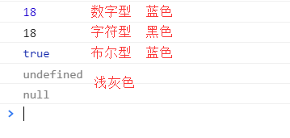

# 三、变量扩展

## 1、获取变量的数据类型

> typeof关键字

```js
var a = 10
console.log(typeof a)	// number
a = 'pink'
console.log(typeof a)	// string
a = true
console.log(typeof a)	// boolean
a = undefined
console.log(typeof a)	// undefined
a = null
console.log(typeof a)	// object
```

> 通过浏览器控制台颜色判断数据类型



## 2、字面量

- 数字字面量：8，9，10.34
- 字符串字面量：'ghs'，"干好事"
- 布尔字面量：true，false


## 3、数据类型转换

把一种数据类型的变量转换成另外一种数据类型。

### 1）转换为字符串

| 方式       | 说明         | 案例                                    |
| ---------- | ------------ | --------------------------------------- |
| toString() | 转成字符串   | var num=1; console.log(num.toString()); |
| String()   | 强制类型转换 | var num=1; console.log(String(num));    |
| +          | 用加号拼接   | var num=1; console.log('' + num);       |

- toString() 和 String() 的使用方式不一样。
- 加号拼接的转换方式也称为隐式转换。

### 2）转换为数字型

| 方式         | 说明                         | 案例                         |
| ------------ | ---------------------------- | ---------------------------- |
| parseInt()   | 将字符串转成整数             | parseInt('12')               |
| parseFloat() | 将字符串转成浮点数           | parseFloat('56.7654')        |
| Number()     | 强制类型转换                 | Number('12')                 |
| - * /        | 利用减号、乘号、除号隐式转换 | '12' - 0, '12' * 1, '12' / 1 |

```js
console.log(parseInt('120px'))		// 120
console.log(parseInt('ps120'))		// NaN
console.log(parseInt('120sfs354'))	// 120
console.log(parseInt('9.9'))		// 9
console.log('12.1' - '12')			// 0.09999999999999964 （电脑浮点计算有精度问题）
```

