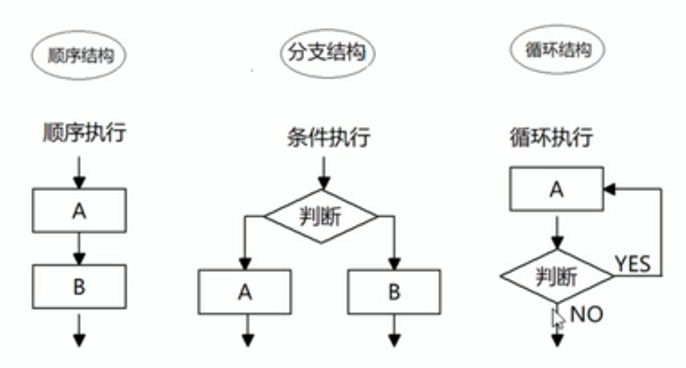

# 六、流程控制语句

流程控制就是来控制我们的代码按照什么结构顺序来执行

流程控制主要有3种结构，顺序结构、分支结构、循环结构。



## 1、顺序流程控制

程序中最简单、最基本的流程控制，没有特定的语法结构。

程序按照代码的先后顺序，依次执行。

## 2、分支流程控制 -- if语句

由从上到下执行代码的过程中，根据不同的条件、执行不同的路径代码，从而得到不同的结果。

JS的两种分支结构语句：if、switch。

```js
if (条件表达式1)
{
    // 条件1成立时
}
else if (条件表达式2)
{
    // 条件1不成立，条件2成立时
}
else
{
    // 以上条件都不成立时
}
```

## 3、三元表达式

由三元运算符组成的式子。

语法：条件表达式 ? 表达式1 : 表达式2

```js
var num = 10
console.log(num > 5 ? 'YES' : 'NO')		// YES
```

## 4、分支流程控制 -- switch语句

switch语句也是多分支语句。

当要针对变量设置一系列特定值的选项时，就可以使用switch。

```js
switch (表达式)
{
    case value1:
        // 要执行的语句
        break
    case value2:
        // 要执行的语句
        break
    // ...
    default:
        // 上面的值都不匹配时，要执行的语句
        break
}
```

- 表达式通常写成变量。
- 表达式和value匹配用的是全等（===），必须值和数据类型都一样。
- 如果当前的case里面没有break语句，则不会退出switch，而是继续往下执行下一个case里面的语句。

## 5、switch case 和 if else

1、一般情况下，两个语句可以相互替换。

2、switch...case语句通常处理case为确定值的情况，if...else常用于范围判断。

3、switch语句条件判断后直接执行到对应的语句，效率更高。而if需要逐级往下判断。

4、当分支比较少时，if比swtich效率高。

5、分支比较多时，switch执行效率更高，代码结构更清晰。

