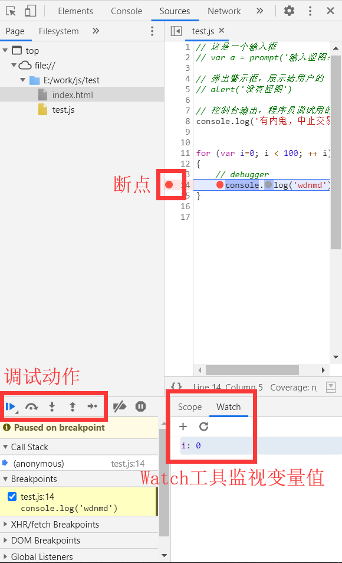

# 断点调试

断点调试是指自己在程序中的某一行设置一个断点，调试时，程序运行到这一行就会停住。在这个过程中就可以查看各个变量的值。

1、浏览器加载页面后设置

打开浏览器的开发者工具（F12）--> sources --> 找到要调试的js文件 --> 用鼠标设置断点。

2、debugger语句

在程序中写debugger语句，浏览器执行到debugger语句时会自动停止。

```js
for (var i=0; i < 100; ++ i)
{
    debugger
    console.log('wdnmd')
}
```

浏览器的调试工具：




