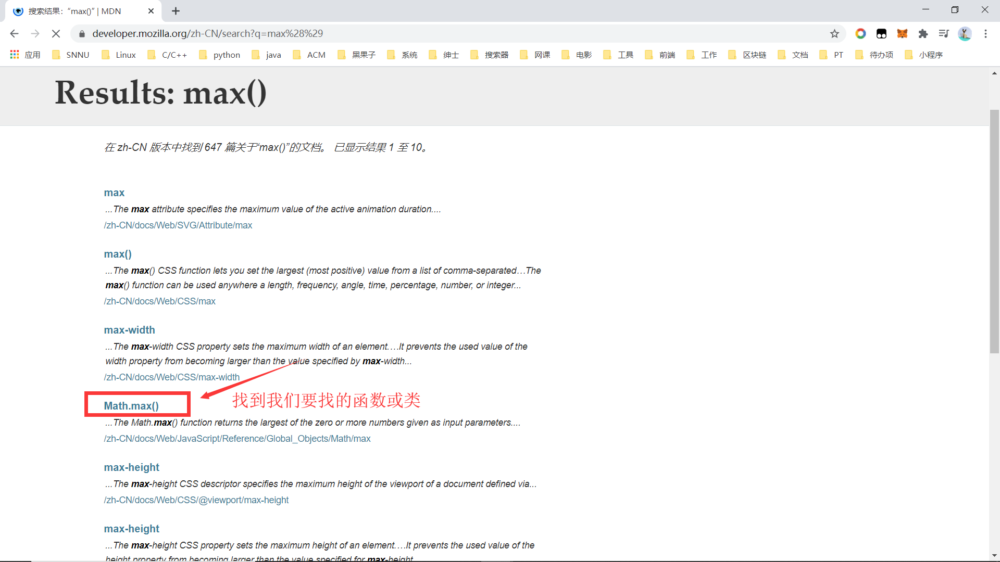
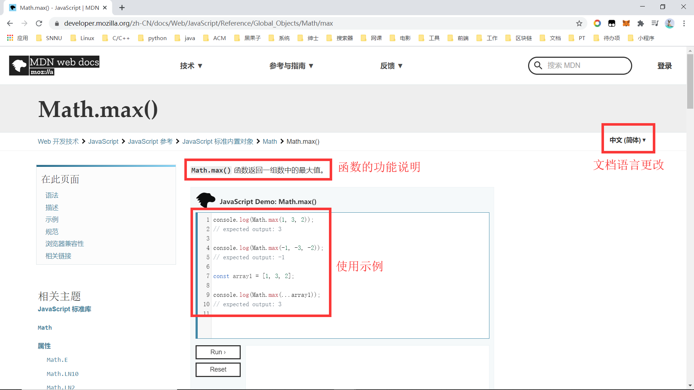

# 内置对象

- JS 中的对象分为3种：自定义对象、内置对象、浏览器对象。

- 内置对象就是指 JS 语言自带的一些对象，这些对象供开发者使用，并提供了一些常用的或是最基本而必要的功能。

- 内置对象可以帮助我们快速开发。

## 文档 -- MDN

学习一个内置对象的使用，只要学会其常用成员的使用即可，我们可以通过查文档学习，可以通过 MDN/W3C 来查询。

Mozilla 开发者网络（MDN）提供了有关开放网络技术（Open Web）的信息，包括 HTML、CSS 和万维网及 HTML5 应用的 API 。

MDN：https://developer.mozilla.org/zh-CN/

