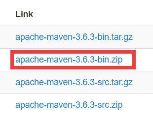

# maven环境配置

配置maven前应当先配置好java。

## 1、下载地址

http://maven.apache.org/download.cgi?Preferred=https%3A%2F%2Fmirrors.tuna.tsinghua.edu.cn%2Fapache%2F



选择Link下的 apache-maven-*-bin.zip 下载就行

## 2、解压缩

解压缩到自己喜欢的位置，记下根目录。

在环境变量中配置  M2_HOME 变量，例如：

> M2_HOME=D:\Java\apache-maven-3.6.3

然后添加 PATH：

> %M2_HOME%\bin

## 3、更改conf目录下的settings.xml文件

```xml
<?xml version="1.0" encoding="UTF-8"?>
<settings xmlns="http://maven.apache.org/SETTINGS/1.0.0"
          xmlns:xsi="http://www.w3.org/2001/XMLSchema-instance"
          xsi:schemaLocation="http://maven.apache.org/SETTINGS/1.0.0 http://maven.apache.org/xsd/settings-1.0.0.xsd">

  <!-- 配置本地repository的位置 -->
  <localRepository>D:\Java\apache-maven-3.6.3\.m2\repository</localRepository>

  <pluginGroups>

  </pluginGroups>

  <proxies>

  </proxies>

  <servers>

  </servers>


  <mirrors>
	<!-- 配置阿里云的镜像 -->
    <mirror>
      <id>aliyunmaven</id>
      <mirrorOf>*</mirrorOf>
      <name>阿里云公共仓库</name>
      <url>https://maven.aliyun.com/repository/public</url>
    </mirror>

  </mirrors>

  <profiles>

    <!-- 配置默认的jdk版本为11 -->
    <profile>
      <id>jdk-11</id>
      <activation>
        <activeByDefault>true</activeByDefault>
        <jdk>11</jdk>
      </activation>
      <properties>
        <maven.compiler.source>11</maven.compiler.source>
        <maven.compiler.target>11</maven.compiler.target>
        <maven.compiler.compilerVersion>11</maven.compiler.compilerVersion>
        <!-- 配置默认使用UTF-8编码 -->
        <project.build.sourceEncoding>UTF-8</project.build.sourceEncoding>
        <project.reporting.outputEncoding>UTF-8</project.reporting.outputEncoding>
        <maven.compiler.encoding>UTF-8</maven.compiler.encoding>
      </properties>
    </profile>

    <profile>
      <!-- 配置阿里云的spring镜像 -->
      <repositories>
        <repository>
          <id>spring</id>
          <url>https://maven.aliyun.com/repository/spring</url>
          <releases>
              <enabled>true</enabled>
          </releases>
          <snapshots>
              <enabled>true</enabled>
          </snapshots>
        </repository>
      </repositories>
    </profile>

  </profiles>

</settings>
```

