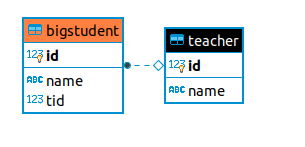

# 关于联表的处理

1、数据库表的设计

```plsql
create table teacher(
	id int primary key not null,
    name varchar(20)
);
create table bigstudent(
	id int primary key not null,
    name varchar(20),
    tid int
);
ALTER TABLE public.bigstudent ADD CONSTRAINT bigstudent_fk FOREIGN KEY (tid) REFERENCES public.teacher(id) ON UPDATE CASCADE;
```



2、插入数据

```plsql
INSERT INTO public.bigstudent (id,"name",tid) VALUES 
(1,'张三风',1)
,(2,'风轻扬',1)
,(3,'令狐冲',1)
,(4,'哈瓦一',2)
,(5,'季吉达',2)
,(6,'哑以及',3)
,(7,'啊呀呀',NULL);
INSERT INTO public.teacher (id,"name") VALUES 
(1,'周小')
,(2,'大帅')
,(3,'老巨头');
```

3、多对一的处理

​	a) 实体类

​	 Teacher.java

```java
package cn.sun.main;

public class Teacher
{
    private int id;
    private String name;

    public int getId()
    {
        return id;
    }

    public void setId(int id)
    {
        this.id = id;
    }

    public String getName()
    {
        return name;
    }

    public void setName(String name)
    {
        this.name = name;
    }
}
```

​	BigStudent.java

```java
package cn.sun.main;

public class BigStudent
{
    private int id;
    private String name;
    private Teacher teacher;        // 多个学生对应一个老师

    public Teacher getTeacher()
    {
        return teacher;
    }

    public void setTeacher(Teacher teacher)
    {
        this.teacher = teacher;
    }

    public int getId()
    {
        return id;
    }

    public void setId(int id)
    {
        this.id = id;
    }

    public String getName()
    {
        return name;
    }

    public void setName(String name)
    {
        this.name = name;
    }
}
```

​	b) 编写映射文件

​		cn/sun/main/student_mapper.xml

​		1) 结果嵌套处理

​		2) 查询嵌套处理

```xml
<?xml version="1.0" encoding="UTF-8" ?>
<!DOCTYPE mapper
        PUBLIC "-//mybatis.org//DTD Mapper 3.0//EN"
        "http://mybatis.org/dtd/mybatis-3-mapper.dtd">
<mapper namespace="cn.sun.main.BigStudent_Mapper">
    <!-- 1、按查询结果嵌套处理 -->
    <select id="getStudent" resultMap="StudentTeacher">
        select s.id sid, s.name sname, s.tid stid, t.id tid, t.name tname from bigstudent s, teacher t where s.tid=t.id
    </select>
    <resultMap id="StudentTeacher" type="cn.sun.main.BigStudent">
        <id column="sid" property="id"/>
        <result column="sname" property="name"/>
        <!-- teacher表示关联对象在BigStudent实体类中的属性 -->
        <association property="teacher" javaType="cn.sun.main.Teacher">
            <id column="tid" property="id"/>
            <result column="tname" property="name"/>
        </association>
    </resultMap>
    <!-- 2、按查询嵌套处理 -->
    <select id="getStudentB" resultMap="StudentTeacherB">
        select * from bigstudent
    </select>
    <resultMap id="StudentTeacherB" type="cn.sun.main.BigStudent">
        <!-- column关联属性在多的一方表中的列名，select使用column来做查询 -->
        <association property="teacher" column="tid" javaType="cn.sun.main.Teacher" select="cn.sun.main.BigStudent_Mapper.getTeacher"/>
    </resultMap>
    <select id="getTeacher" resultType="cn.sun.main.Teacher">
        select * from teacher where id=#{id}
    </select>
</mapper>
```

4、一对多

​	a) 实体类

​	BigStudent.java

```java
package cn.sun.main;

public class BigStudent
{
    private int id;
    private String name;
    
    public int getId()
    {
        return id;
    }

    public void setId(int id)
    {
        this.id = id;
    }

    public String getName()
    {
        return name;
    }

    public void setName(String name)
    {
        this.name = name;
    }

    @Override
    public String toString()
    {
        return "BigStudent{" +
                "id=" + id +
                ", name='" + name + '\'' +
                '}';
    }
}
```

​	Teacher.java

```java
package cn.sun.main;

import java.util.List;

public class Teacher
{
    private int id;
    private String name;
    private List<BigStudent> students;		// 一个老师对应多个学生

    public List<BigStudent> getStudents()
    {
        return students;
    }

    public void setStudents(List<BigStudent> students)
    {
        this.students = students;
    }

    public int getId()
    {
        return id;
    }

    public void setId(int id)
    {
        this.id = id;
    }

    public String getName()
    {
        return name;
    }

    public void setName(String name)
    {
        this.name = name;
    }

    @Override
    public String toString()
    {
        return "Teacher{" +
                "id=" + id +
                ", name='" + name + '\'' +
                '}';
    }
}
```

​	b) 编写映射文件

​		cn/sun/main/teacher_mapper.xml

​		1) 结果嵌套处理

​		2) 查询嵌套处理

```xml
<?xml version="1.0" encoding="UTF-8" ?>
<!DOCTYPE mapper
        PUBLIC "-//mybatis.org//DTD Mapper 3.0//EN"
        "http://mybatis.org/dtd/mybatis-3-mapper.dtd">
<mapper namespace="cn.sun.main.Teacher_Mapper">
    <!-- 1、按查询结果嵌套处理 -->
    <select id="getTeacher" resultMap="TeacherStudent" parameterType="int">
        select s.id sid, s.name sname, s.tid stid, t.id tid, t.name tname from bigstudent s, teacher t where s.tid=t.id and t.id=#{id}
    </select>
    <resultMap id="TeacherStudent" type="cn.sun.main.Teacher">
        <id column="tid" property="id"/>
        <result column="tname" property="name"/>
        <collection property="students" ofType="cn.sun.main.BigStudent">
            <id column="sid" property="id"/>
            <result column="sname" property="name"/>
        </collection>
    </resultMap>
    <!-- 2、按查询嵌套处理 -->
    <select id="getTeacherB" resultMap="TeacherStudentB" parameterType="int">
        select * from teacher where id=#{id}
    </select>
    <resultMap id="TeacherStudentB" type="cn.sun.main.Teacher">
        <id column="id" property="id"/>
        <result column="name" property="name"/>
        <!-- 使用teacher.id去查 -->
        <collection column="id" property="students" javaType="java.util.ArrayList" ofType="cn.sun.main.BigStudent" select="cn.sun.main.Teacher_Mapper.getStudentByTid"/>
    </resultMap>
    <select id="getStudentByTid" resultType="cn.sun.main.BigStudent">
        select * from bigstudent where tid=#{tid}
    </select>
</mapper>
```

