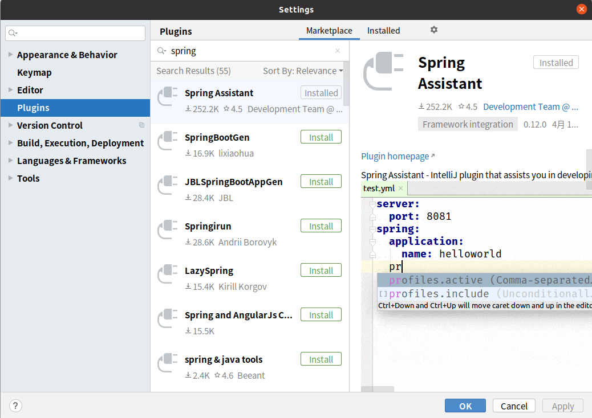
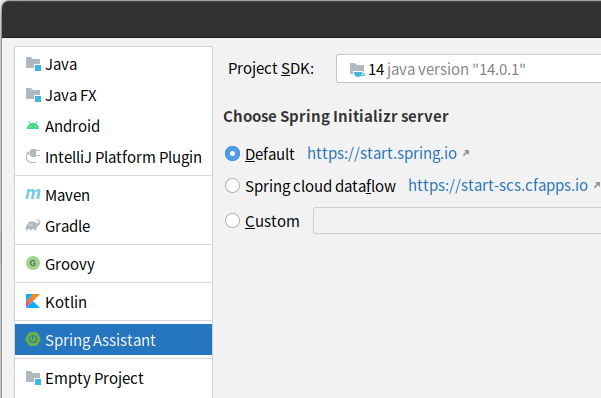

# 使用Spring Initializer快速创建Spring Boot项目

## 1、IDEA安装Spring Assistant插件

在settings的plugins中搜索插件并安装：

创建项目时选择左边的Spring Assistant。

之后项目创建向导就会引导我们创建项目（联网创建）

## 2、默认生成的Spring Boot项目

主程序已经自动生成了，只需要自己的逻辑。

resources文件夹中的目录结构

