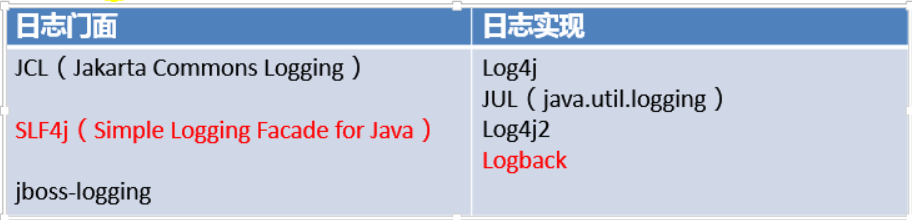
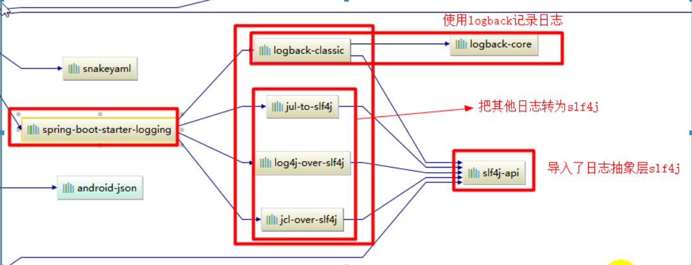
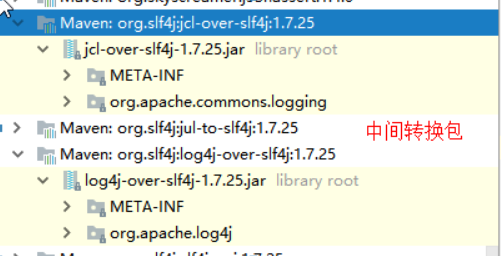

# 日志框架

JUL、JCL、Jboss-logging、logback、log4j、log4j2、slf4j ...



左边选一个门面（抽象层）、右边选一个实现。

可以选择：SLF4j + Logback

Spring框架默认是用JCL，**Spring Boot选用了SLF4j和Logback**。


## 1、使用SLF4j

不应该直接调用日志实现类的方法，而应该调用日志抽象层的方法。

要先导入slf4j的jar包和logback的jar包。

```java
import org.slf4j.Logger;
import org.slf4j.LoggerFactory;

public class HelloWorld
{
  public static void main(String[] args)
  {
    Logger logger = LoggerFactory.getLogger(HelloWorld.class);
    logger.info("Hello World");
  }
}
```

图示：


每一个日志的实现框架都有自己的配置文件。使用slf4j以后，**配置文件还是要用日志实现框架本身的配置文件**。

## 2、遗留问题

依赖的其它框架可能又有自己的日志框架。

解决：统一日志记录。


如何让系统中的所有日志都统一到slf4j：

1、将系统中其它日志框架先排除出去。

2、用中间包来替换原有的日志框架。

3、导入slf4j其它的实现。

## 3、Spring Boot的日志依赖关系

都要依赖：

```xml
<dependency>
    <groupId>org.springframework.boot</groupId>
    <artifactId>spring-boot-starter</artifactId>
</dependency>
```

Spring Boot使用的日志功能：

```xml
<dependency>
    <groupId>org.springframework.boot</groupId>
    <artifactId>spring-boot-starter-logging	</artifactId>
</dependency>
```




总结：

1）Spring Boot底层也是使用slf4j + logback的方式进行日志记录

2）Spring Boot也把其它的日志都替换成了slf4j

3）中间替换包：



4）如果我们要引入其它框架，一定要把这个框架的默认日志依赖移除掉。

```xml
<dependency>
	<!-- ... -->
    <exclusions>
      <exclusion>
        <groupId>commons-logging</groupId>
        <artifactId>commons-logging</artifactId>
      </exclusion>
    </exclusions>
</dependency>
```

**Spring Boot能自动适配所有的日志，而且底层使用slf4j + logback的方式记录日志。引入其它框架的时候，只需要把这个框架依赖的日志框架排除掉就行。**

