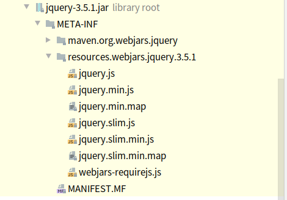

# Web开发

## 1、使用Spring Boot

1）创建Spring Boot应用，选中需要的模块

2）Spring Boot已经默认将场景配置好了，只需要在配置文件中指定少量配置就可以运行起来

3）自己编写业务代码

自动配置原理：

	- xxxAutoConfiguration：帮我们给容器中自动配置组件
	- xxxProperties：配置类来封装配置文件的内容

## 2、Spring Boot对静态资源的映射规则

```java
@ConfigurationProperties(prefix = "spring.resources", ignoreUnknownFields = false)
public class ResourceProperties {
	// 可以设置和静态资源有关的参数，缓存时间等。。
	private static final String[] CLASSPATH_RESOURCE_LOCATIONS = { "classpath:/META-INF/resources/",
			"classpath:/resources/", "classpath:/static/", "classpath:/public/" };
    // ...
}
```

```java
public class WebMvcAutoConfiguration {
    // ...
    public static class WebMvcAutoConfigurationAdapter implements WebMvcConfigurer {
        // ...
        @Override
        public void addResourceHandlers(ResourceHandlerRegistry registry) {
            if (!this.resourceProperties.isAddMappings()) {
                logger.debug("Default resource handling disabled");
                return;
            }
            Duration cachePeriod = this.resourceProperties.getCache().getPeriod();
            CacheControl cacheControl = this.resourceProperties.getCache().getCachecontrol().toHttpCacheControl();
            if (!registry.hasMappingForPattern("/webjars/**")) {
                customizeResourceHandlerRegistration(registry.addResourceHandler("/webjars/**")
                        .addResourceLocations("classpath:/META-INF/resources/webjars/")
                        .setCachePeriod(getSeconds(cachePeriod)).setCacheControl(cacheControl));
            }
            String staticPathPattern = this.mvcProperties.getStaticPathPattern();
            if (!registry.hasMappingForPattern(staticPathPattern)) {
                customizeResourceHandlerRegistration(registry.addResourceHandler(staticPathPattern)
                        .addResourceLocations(getResourceLocations(this.resourceProperties.getStaticLocations()))
                        .setCachePeriod(getSeconds(cachePeriod)).setCacheControl(cacheControl));
            }
        }
        // ...
    }
    // ...
	public static class EnableWebMvcConfiguration extends DelegatingWebMvcConfiguration implements ResourceLoaderAware {
        // ...
        // 配置欢迎页映射
        @Bean
		@Primary
		@Override
		public RequestMappingHandlerMapping requestMappingHandlerMapping(
				@Qualifier("mvcContentNegotiationManager") ContentNegotiationManager contentNegotiationManager,
				@Qualifier("mvcConversionService") FormattingConversionService conversionService,
				@Qualifier("mvcResourceUrlProvider") ResourceUrlProvider resourceUrlProvider) {
			// Must be @Primary for MvcUriComponentsBuilder to work
			return super.requestMappingHandlerMapping(contentNegotiationManager, conversionService,
					resourceUrlProvider);
		}
        // ...
    }
    // ...
}
```

1）所有"/webjars/**"，都去"classpath:/META-INF/resources/webjars/"下找资源。

webjars：以jar包的方式引入静态资源。

```xml
<!-- 引入jquery的webjar -->
<dependency>
    <groupId>org.webjars</groupId>
    <artifactId>jquery</artifactId>
    <version>3.5.1</version>
</dependency>
```

**jquery-3.5.1.jar/META-INF/resources.webjars/**jquery/3.5.1/jquery.js




浏览器访问对应位置：http://localhost:8080/webjars/jquery/3.5.1/jquery.js

2）"/**"访问当前项目的任何资源

静态资源的文件夹：

```
"classpath:/META-INF/resources/",
"classpath:/resources/", 
"classpath:/static/", 
"classpath:/public/"
```

http://localhost:8080/test.html 	会去静态资源文件夹中查找test.html

3）欢迎页。静态资源文件夹下的所有index.html页面，被"/**"映射

http://localhost:8080	找index页面

4）"**/favicon.ico"

在静态资源文件下找 favicon.ico

把favicon.ico放到静态资源文件夹下就能生效。

## 3、手动设置静态资源文件夹

```yaml
spring:
  resources:
    static-locations:
      - classpath:/hello/
      - classpath:/oct/
```

设置后原来的静态资源文件夹失效，但是favicon.ico、index映射规则依然正常。

