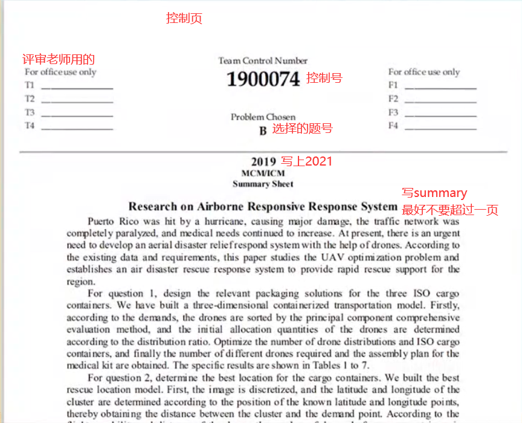
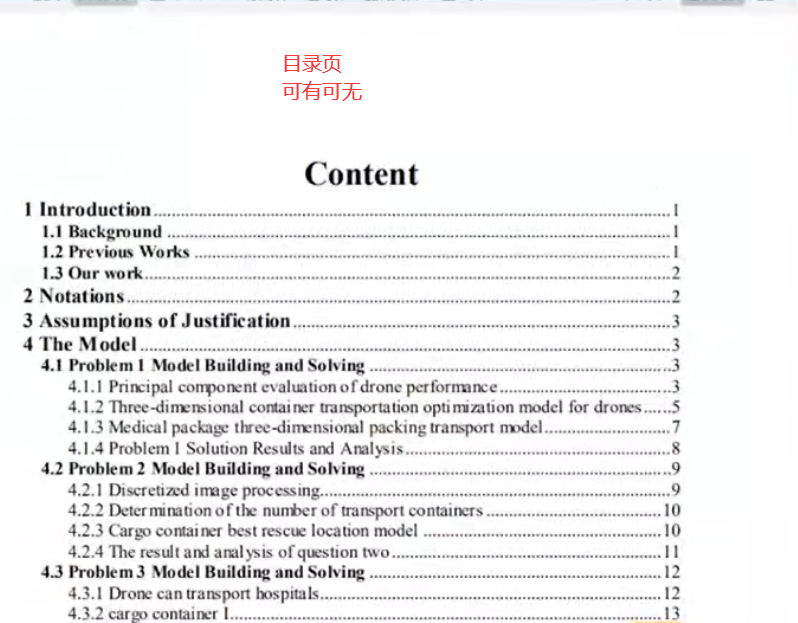
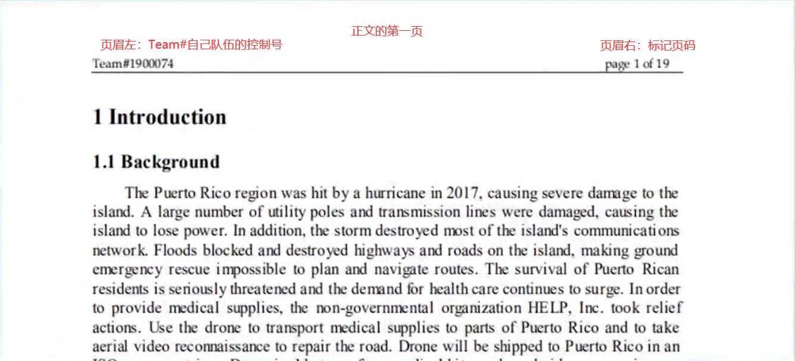
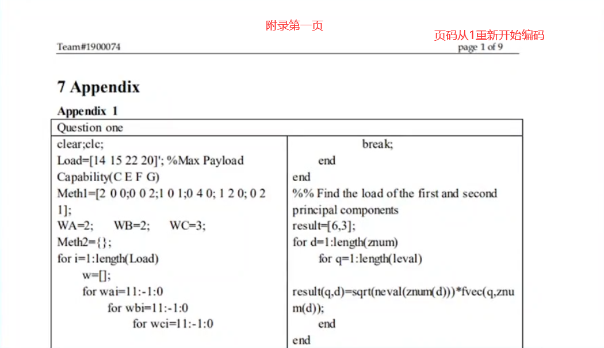

# 美赛论文格式规范

## 页面格式

ps：

1. 最终文档一定要是pdf，用官网生成的`控制号`命名。

2. `参考文献`建议放正文，如果放`正文`导致超过20页，可以考虑放在`附录`里。
3. `正文`一定不要超过20页。
4. `目录页`可有可无。
5. `概要页`建议不要超过1页。

## 论文构成

### 首页

#### 标题

居中，字体 Arial 14

#### 概要 Summnary

三部分，第一是背景介绍，2-4 行左右就行，第二是主体部分，第三是结尾，一般阐述模型的优点与不足

#### 关键词

3-5 个

### 正文

#### 问题的介绍 Introduction

这三个部分一定要有：

- 问题的背景 Background of the Problem

- 文献综述（先前的工作）Previous Works

- 本文的工作 Our Work

#### 符号的说明 Symbol Descriptions

列个表，说明一下

#### 模型的假设 Model Hypothesis 

写出假设，还对为什么要这样假设做出解释。

#### 模型的建立与求解 Our Solution

重点阐述以下内容：

- 问题的分析（分析框架、数学原理等）
- 模型建立（建模思路、模型建立）
- 模型计算（程序说明、结果阐述）
- 模型检验与灵敏度分析
- 计算的结果，以及结果形成的原因

#### 模型的推广 Model Extensions

这个模型除了解决当前问题，还可以做其他的什么

#### 讨论与结论 Discussions and conclusions

有哪些结论

有哪些建议

#### 模型的不足 The strengths and weaknesses of the model

模型需要加强或者需要进一步研究的地方

数据的限制、指标收集的限制、方法的限制

模型还可以继续深入下去，但是由于时间的限制做不下去，把想做但又做不下去的东西也写一写

#### 参考文献 References

建议10篇以上，文中注明引用部分

### 附录 Appendix

不是特别重要

附上核心代码

