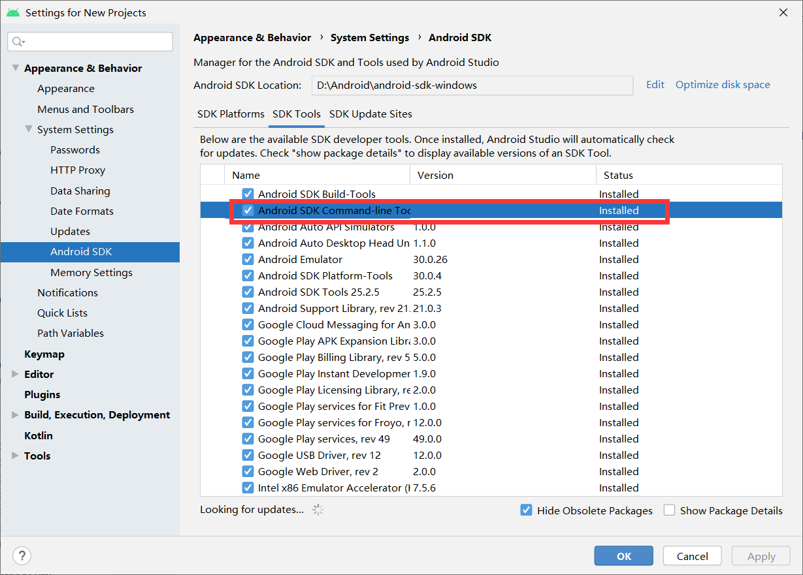
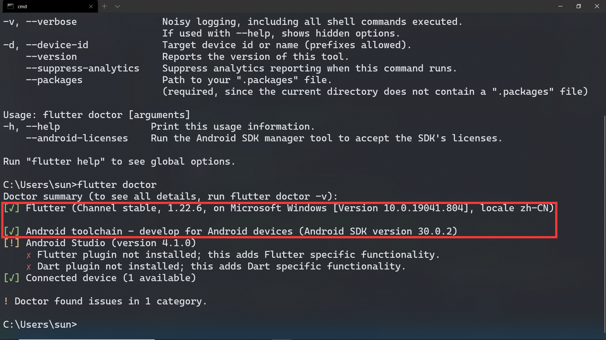
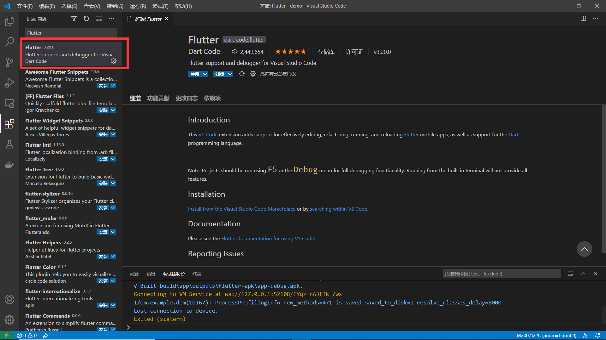
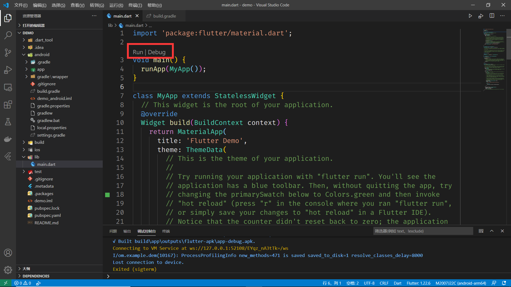

# 第一个Flutter应用

> 参考：
>
> https://flutter.cn/docs/get-started/install/windows
>
> https://mirrors.tuna.tsinghua.edu.cn/help/flutter/

## 系统环境

- Windows 7 SP1 或更高的版本（基于 x86-64 的 64 位操作系统）
- `Git for Windows` https://git-scm.com/downloads

## 获取Flutter SDK

下载：https://storage.flutter-io.cn/flutter_infra/releases/stable/windows/flutter_windows_1.22.6-stable.zip

解压到`D:\flutter`目录下

## 设置环境变量

```sh
Path 中添加 D:\flutter\bin
FLUTTER_STORAGE_BASE_URL=https://mirrors.tuna.tsinghua.edu.cn/flutter
PUB_HOSTED_URL=https://mirrors.tuna.tsinghua.edu.cn/dart-pub
```

## android SDK



## flutter doctor

```sh
flutter doctor --android-licenses
# 之后输入y接受协议
```

```sh
# 自检，并安装依赖
flutter doctor
```

前两个打✔就行。



## 项目创建

```sh
# 项目创建于E:\work\flutter\demo下
flutter create demo
```

## Vscode插件

安装`Flutter`插件，`Dart`插件会自动安装。



用`Vscode`打开项目，修改`android\build.gradle`文件：

*有两处需要修改*

```gradle
repositories {
    // google()
    // jcenter()
    maven { url 'https://maven.aliyun.com/repository/google' }
    maven { url 'https://maven.aliyun.com/repository/jcenter' }
    maven { url 'https://maven.aliyun.com/repository/public' }
}
```

## 调试

打开手机的调试模式，用数据线连接电脑。

在`Vscode`中打开`lib\main.dart`。



单击`Run`或者`Debug`运行`demo`工程。

