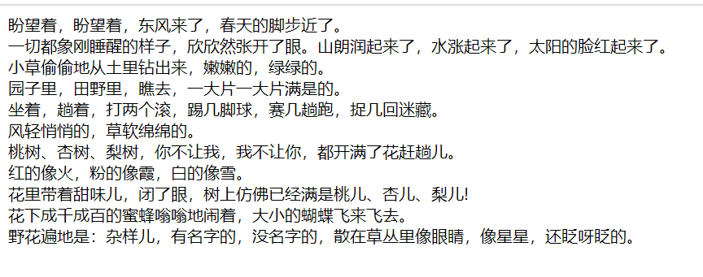
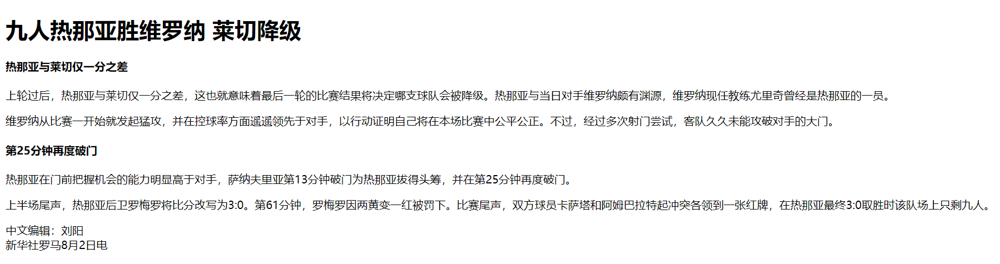
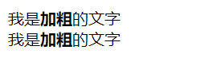
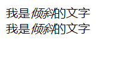
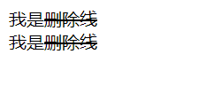
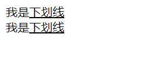
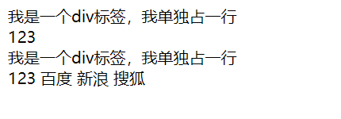
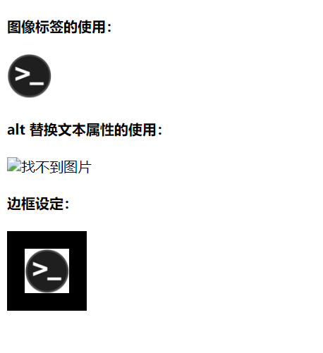
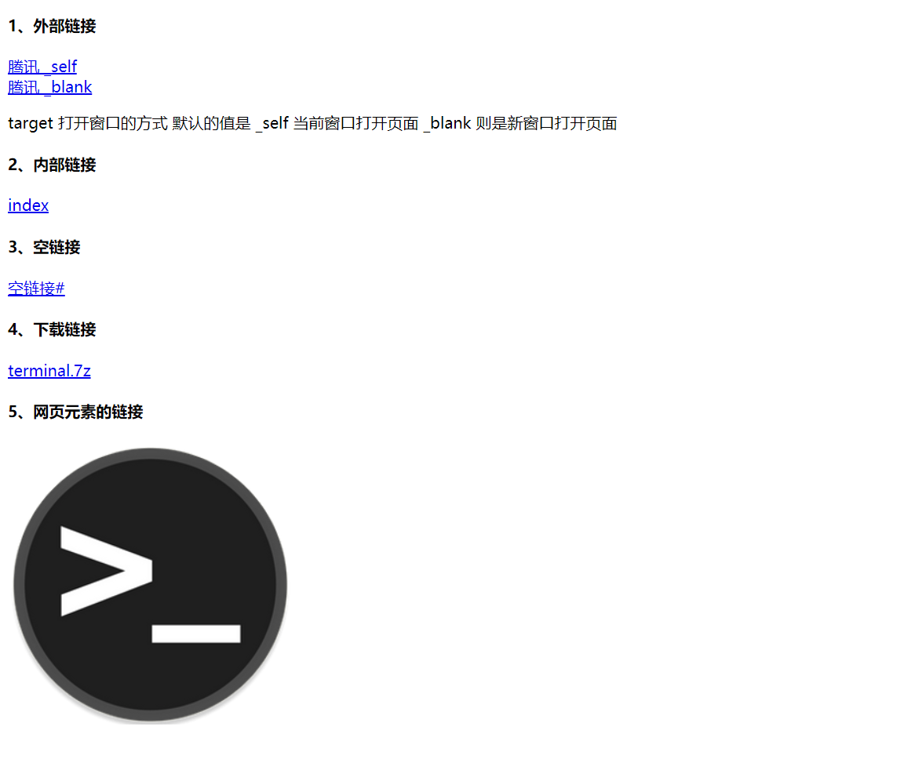
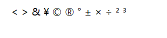

# html 标签（上）

## 1、标签语义

学习标签是有技巧的，重点是记住每个标签的语义。简单理解就是指标签的含义，即这个标签是用来干嘛的。

根据标签的语义，在合适的地方添加一个最为合理的标签，可以让页面结构更清晰。


## 2、标题标签 \<h1\> - \<h6\>

为了使网页更具有语义化，我们经常会在页面中用到标题标签。HTML 提供了 6 个等级的网页标题。

即 \<h1\> - \<h6\> 。

```html
<h1>我是一级标题</h1>
```

单词 head 的缩写，意为头部、标题。

**标签语义：**==作为标题使用，并且依据重要性递减。==

**特点：**

- 加了标题的文字会加粗，字号也会变大
- 一个标题独占一行

**示例：**

```html
<!DOCTYPE html>
<html lang="zh-CN">
    <head>
        <meta charset="UTF-8">
        <title>标题标签</title>
    </head>
    <body>
        <h1>我是一级标题</h1>
        <h2>我是二级标题</h2>
        <h3>我是三级标题</h3>
        <h4>我是四级标题</h4>
        <h5>我是五级标题</h5>
        <h6>我是六级标题</h6>
    </body>
</html>
```


## 3、段落标签 \<p\>

在网页中，要把文字有条理地显示出来，就需要将这些文字分段显示。在 HTML 标签中，\<p\> 标签用于定义段落，它可以将整个网页分为若干个段落。

```html
<p>这是一个段落标签</p>
```

单词 paragraph 的缩写，意为段落。

**标签语义：**==可以把 HTML 文档分割为若干段落。==

**特点：**

- 文本在一个段落中会根据浏览器窗口的大小自动换行
- 段落和段落之间保有空隙

**示例：**

```html
<!DOCTYPE html>
<html lang="zh-CN">
    <head>
        <meta charset="UTF-8">
        <title>段落标签</title>
    </head>
    <body>
        <p>盼望着，盼望着，东风来了，春天的脚步近了。</p>
        <p>一切都象刚睡醒的样子，欣欣然张开了眼。山朗润起来了，水涨起来了，太阳的脸红起来了。</p>
        <p>
            小草偷偷地从土里钻出来，嫩嫩的，绿绿的。
            园子里，田野里，瞧去，一大片一大片满是的。
            坐着，趟着，打两个滚，踢几脚球，赛几趟跑，捉几回迷藏。
            风轻悄悄的，草软绵绵的。
            桃树、杏树、梨树，你不让我，我不让你，都开满了花赶趟儿。
            红的像火，粉的像霞，白的像雪。
            花里带着甜味儿，闭了眼，树上仿佛已经满是桃儿、杏儿、梨儿!
            花下成千成百的蜜蜂嗡嗡地闹着，大小的蝴蝶飞来飞去。
            野花遍地是：杂样儿，有名字的，没名字的，散在草丛里像眼睛，像星星，还眨呀眨的。
        </p>
    </body>
</html>
```


## 4、换行标签 \<br/\>

在 HTML 中，一个段落中的文字会从左到右依次排列，直到浏览器窗口的右端，然后才自动换行。

如果希望某段文本强制换行显示，就需要使用换行标签 \<br/\> 。

```html
我是换行标签<br/>
```

单词 break 的缩写，意为打断、换行。

**标签语义：**==强制换行。==

**特点：**

- \<br/\> 是一个单标签
- \<br/\> 标签只是简单地开始新的一行，和 \<p\> 不一样，段落之间会插入一些垂直的间距

**示例：**

```html
<!DOCTYPE html>
<html lang="zh-CN">
    <head>
        <meta charset="UTF-8">
        <title>换行标签</title>
    </head>
    <body>
        盼望着，盼望着，东风来了，春天的脚步近了。<br/>
        一切都象刚睡醒的样子，欣欣然张开了眼。山朗润起来了，水涨起来了，太阳的脸红起来了。<br/>
        小草偷偷地从土里钻出来，嫩嫩的，绿绿的。<br/>
        园子里，田野里，瞧去，一大片一大片满是的。<br/>
        坐着，趟着，打两个滚，踢几脚球，赛几趟跑，捉几回迷藏。<br/>
        风轻悄悄的，草软绵绵的。<br/>
        桃树、杏树、梨树，你不让我，我不让你，都开满了花赶趟儿。<br/>
        红的像火，粉的像霞，白的像雪。<br/>
        花里带着甜味儿，闭了眼，树上仿佛已经满是桃儿、杏儿、梨儿!<br/>
        花下成千成百的蜜蜂嗡嗡地闹着，大小的蝴蝶飞来飞去。<br/>
        野花遍地是：杂样儿，有名字的，没名字的，散在草丛里像眼睛，像星星，还眨呀眨的。<br/>
    </body>
</html>
```




## 5、案例 -- 体育新闻

代码：

```html
<!DOCTYPE html>
<html lang="zh-CN">
    <head>
        <meta charset="UTF-8">
        <title>体育新闻</title>
    </head>
    <body>
        <h1>九人热那亚胜维罗纳 莱切降级</h1>

        <h4>热那亚与莱切仅一分之差</h4>
        <p>
            上轮过后，热那亚与莱切仅一分之差，这也就意味着最后一轮的比赛结果将决定哪支球队会被降级。热那亚与当日对手维罗纳颇有渊源，维罗纳现任教练尤里奇曾经是热那亚的一员。
        </p>
        <p>
            维罗纳从比赛一开始就发起猛攻，并在控球率方面遥遥领先于对手，以行动证明自己将在本场比赛中公平公正。不过，经过多次射门尝试，客队久久未能攻破对手的大门。
        </p>

        <h4>第25分钟再度破门</h4>
        <p>
            热那亚在门前把握机会的能力明显高于对手，萨纳夫里亚第13分钟破门为热那亚拔得头筹，并在第25分钟再度破门。
        </p>
        <p>
            上半场尾声，热那亚后卫罗梅罗将比分改写为3:0。第61分钟，罗梅罗因两黄变一红被罚下。比赛尾声，双方球员卡萨塔和阿姆巴拉特起冲突各领到一张红牌，在热那亚最终3:0取胜时该队场上只剩九人。
        </p>
        
        <p>
            中文编辑：刘阳<br/>
            新华社罗马8月2日电
        </p>
    </body>
</html>
```

效果：




## 6、文本格式化标签

在网页中，有时需要为文字设置**粗体**、*斜体*、<u>下划线</u> 等效果，这时就需要用到 HTML 中的文本格式化标签，使文字以特殊的方式显示。

**标签语义：**==突出重要性，比普通文字更重要。==

| 语义   | 标签                                   |
| ------ | -------------------------------------- |
| 加粗   | \<strong\>\</strong\> 或者 \<b\>\</b\> |
| 倾斜   | \<em\>\</em\> 或者 \<i\>\</i\>         |
| 删除线 | \<del\>\</del\> 或者 \<s\>\</s\>       |
| 下划线 | \<ins\>\</ins\> 或者 \<u\>\</u\>       |

### 1）加粗 \<strong\> \<b\>

**示例：**

```html
<!DOCTYPE html>
<html lang="zh-CN">
    <head>
        <meta charset="UTF-8">
        <title>文本格式化标签</title>
    </head>
    <body>
        我是<strong>加粗</strong>的文字<br/>
        我是<b>加粗</b>的文字
    </body>
</html>
```



### 2）倾斜 \<em\> \<i\>

**示例：**

```html
<!DOCTYPE html>
<html lang="zh-CN">
    <head>
        <meta charset="UTF-8">
        <title>文本格式化标签</title>
    </head>
    <body>
        我是<em>倾斜</em>的文字<br/>
        我是<i>倾斜</i>的文字
    </body>
</html>
```



### 3）删除线 \<del\> \<s\>

**示例：**

```html
<!DOCTYPE html>
<html lang="zh-CN">
    <head>
        <meta charset="UTF-8">
        <title>文本格式化标签</title>
    </head>
    <body>
        我是<del>删除线</del><br/>
        我是<s>删除线</s>
    </body>
</html>
```



### 4）下划线 \<ins\> \<u\>

**示例：**

```html
<!DOCTYPE html>
<html lang="zh-CN">
    <head>
        <meta charset="UTF-8">
        <title>文本格式化标签</title>
    </head>
    <body>
        我是<ins>下划线</ins><br/>
        我是<u>下划线</u>
    </body>
</html>
```




## 7、盒子标签 \<div\> \<span\>

\<div\> 和 \<span\> 是没有语义的，它们就是一个盒子，用来装内容的。

```html
<div>盒子</div>
<span>盒子</span>
```

div 是 division 的缩写，表示分割、分区，span 意为跨度、跨距。

**特点：**

- \<div\> 标签用来布局，但是现在一行只能放一个 \<div\> 。可以理解为大盒子
- \<span\> 标签用来布局，一行可以放多个 \<span\> 。可以理解为小盒子

**示例：**

```html
<!DOCTYPE html>
<html lang="zh-CN">
    <head>
        <meta charset="UTF-8">
        <title>盒子标签</title>
    </head>
    <body>
        <div>我是一个div标签，我单独占一行</div>123
        <div>我是一个div标签，我单独占一行</div>123
        <span>百度</span>
        <span>新浪</span>
        <span>搜狐</span>
    </body>
</html>
```




## 8、图像标签 \

在 HTML 标签中，\ 标签用于定义 HTML 页面中的图像。

```html

```

单词 image 的缩写，意为图像。

src 是 \ 标签的必须属性，它用于指定图像文件的路径。

属性：属于标签的特性。

**标签的其它属性：**

| 属性   | 属性值     | 说明                           |
| ------ | ---------- | ------------------------------ |
| src    | 图片的路径 | 必须属性                       |
| alt    | 文本       | 当图像不能显示时，显示的文字   |
| title  | 文本       | 当鼠标放到图像上时，提示的文字 |
| width  | 像素       | 设置图像的宽度                 |
| height | 像素       | 设置图像的高度                 |
| border | 像素       | 设置图像的边框粗细             |

**注意点：**

- 图像标签可以有多个属性，必须写在标签名后面
- 属性之间不分先后顺序，属性与属性之间用空格分开
- 属性采取键值对的格式，即 key="value" 的格式

**示例：**

```html
<!DOCTYPE html>
<html lang="zh-CN">
    <head>
        <meta charset="UTF-8">
        <title>图像标签</title>
    </head>
    <body>
        <h4>图像标签的使用：</h6>
        
        <h4>alt 替换文本属性的使用：</h4>
        
        <h4>边框设定：</h4>
        
    </body>
</html>
```



**关于路径：**

- 目录文件夹
    - 存放了页面相关的素材（比如 html文件、图片文件）
- 根目录
    - 目录文件夹的第一层就是根目录
- 路径
    - 相对路径
        - 以引用文件所在位置为参考基础，而建立出的目录路径（图片相对于 HTML 页面的位置）
    - 绝对路径
        - 目录下的绝对位置，直接到达目标位置，通常是从盘符开始或从根路径开始，抑或是 URL 地址


## 9、超链接标签 \<a\>

在 HTML 标签中，\<a\> 标签用于定义超链接，作用是从一个页面链接到另一个页面。

```html
<a href="跳转目标路径" target="窗口的弹出方式">文本或图像</a>
```

单词 anchor 的缩写，意为：锚。

| 属性   | 作用                                                         |
| ------ | ------------------------------------------------------------ |
| href   | 必须属性，用于指定链接目标的 url 地址，当为标签应用了 href 属性时，它就具有了超链接的功能 |
| target | 用于指定链接页面的打开方式，\_self 为默认值（在当前窗口打开），\_blank （在新窗口中打开） |

**链接分类：**

| 链接         | 说明                                                     |
| ------------ | -------------------------------------------------------- |
| 外部链接     | 链接外部网站，href 里面是一个完整的 URL                  |
| 内部链接     | 网站内部页面之间的相互链接，直接链接内部页面名称即可。   |
| 空链接       | 当没有确定链接目标时                                     |
| 下载链接     | href 里面的地址是一个文件或者压缩包                      |
| 网页元素链接 | 在网页中的各种网页元素，如文本、图像、表格、音频、视频等 |
| 锚点链接     | 可以快速定位到页面中的某个位置                           |

**示例：**

```html
<!DOCTYPE html>
<html lang="zh-CN">
    <head>
        <meta charset="UTF-8">
        <title>超链接标签</title>
    </head>
    <body>
        <h4>1、外部链接</h4>
        <a href="https://www.qq.com" target="_self">腾讯 _self</a><br/>
        <a href="https://www.qq.com" target="_blank">腾讯 _blank</a><br/>
        <p>target 打开窗口的方式  默认的值是 _self 当前窗口打开页面  _blank 则是新窗口打开页面</p>
        <h4>2、内部链接</h4>
        <a href="index.html">index</a>
        <h4>3、空链接</h4>
        <a href="#">空链接#</a>
        <h4>4、下载链接</h4>
        <a href="terminal.7z">terminal.7z</a>
        <h4>5、网页元素的链接</h4>
        <a href="https://www.baidu.com"></a>
    </body>
</html>
```



锚点链接的例子：

```html
<!DOCTYPE html>
<html lang="zh-CN">
    <head>
        <meta charset="UTF-8">
        <title>超链接标签</title>
    </head>
    <body>
        <h4>6、锚点链接</h4>
        <a href="#chrome">常用浏览器</a><br/>
        ....
        ....
        ....
        ....
        ....
        ....
        ....
        <h4 id="chrome">## 2、常用浏览器</h4><br/>
        ....
        ....
        ....
        ....
        ....
    </body>
</html>
```


## 10、注释标签 \<!-- --\>

如果需要在 HTML 文档中添加一些便于阅读和理解但又不需要显示在页面中的注释文字，就需要使用注释标签。

HTML 中的注释以 "\<!--" 开头，以 "--\>" 结束。

```html
<!-- 这里是注释 -->
```

注释标签里面的内容是给程序员看的，这个代码是不显示到页面中的。

添加注释是为了更好地解释代码功能，便于相关开发人员理解和阅读代码。


## 11、特殊字符 \&  ;

在 HTML 中，一些特殊的符号很难或者不方便直接使用，此时我们就可以使用特殊字符的代码来代替。

| 特殊字符 | 描述     | 字符的代码 |
| -------- | -------- | ---------- |
|          | 空格     | \&nbsp;    |
| <        | 小于     | \&lt;      |
| >        | 大于     | \&gt;      |
| &        | and符    | \&amp;     |
| ¥        | 人名币   | \&yen;     |
| ©        | 版权     | \&copy;    |
| ®        | 注册商标 | \&reg;     |
| °        | 摄氏度   | \&deg;     |
| ±        | 正负     | \&plusmn;  |
| ×        | 承       | \&times;   |
| ÷        | 除       | \&divide;  |
| ²        | 2 次方   | \&sup2;    |
| ³        | 3 次方   | \&sup3;    |

**例子：**

```html
<!DOCTYPE html>
<html>
    <head>
        <meta charset="UTF-8">
        <title>Document</title>
        <!-- 2、内嵌式的js -->
        <script>
            // alert("我要一份涩图")
            // alert("希望涩图多点萝莉")
        </script>
        <!-- 3、外部的js  script双标签 -->
        <script src="test.js"></script>
    </head>
    <body>
        &nbsp;
        &lt;
        &gt;
        &amp;
        &yen;
        &copy;
        &reg;
        &deg;
        &plusmn;
        &times;
        &divide;
        &sup2;
        &sup3;
    </body>
</html>
```




## 12、综合案例 -- 圣诞节

demo.html

```html
<!DOCTYPE html>
<html lang="zh-CN">
<head>
    <meta charset="UTF-8">
    <title>Document</title>
</head>
<body>
    <h1>圣诞节的那些事</h1>

    1.<a href="#day">圣诞是怎样由来的 </a><br/>
    2.<a href="#oldman">圣诞老人的由来 </a><br/>
    3.<a href="#tree">圣诞树的由来 </a><br/>

    <h2 id="day">圣诞是怎样由来的</h2>
    
    <p>圣诞节是基督教世界最大的节日。一般认为12月25日作为圣诞节可能开始于公元336年的罗马教会。4世纪初，1月6日是罗马帝国东部各教会纪念耶稣降生和受洗的双重节日，即上帝通过耶稣向世人显示自己。 这一天又是罗马历书的冬至节，意味着万物复苏的开始。可能由于这个原因，罗马教会才选择这一天作为圣诞节。后来，因为各地教会使用的历书不同，具体日期不能统一，于是就把12月24日到第二年的1月6日定为圣诞节节期（Christmas Tide），各地教会可以根据当地具体情况在这段节期之内庆祝圣诞节。 在欧美许多国家里，人们非常重视这个节日，把它和新年连在一起，而庆祝活动之热闹与隆重大大超过了新年，成为一个全民的节日。12月24日平安夜、12月25日圣诞节的主要纪念活动都与耶稣降生的传说有关 。</p>
    
    
    
    <h2 id="oldman">圣诞老人的由来</h2>
    
    <p>圣诞节当然少不了<a href="oldman.html" target="_blank">圣诞老人</a>，根据圣经记载，书中并没有提起这一号人物。到底他是如何成为圣诞的主角之一呢？</p>
    
    
    
    <p>相传在一千六百多年前，荷兰巴里地方有一个老人，名叫尼古拉斯，他一生最爱帮助贫穷的人家。其中有一次他帮助三个贫穷的少女，送她们三袋金子以逃过被卖的不幸。</p>
    
    <p>到了一八二二年，由荷兰传教士把这位伟大慈善家的故事传到美国，装扮圣诞老人渐渐地流行于世界各国。根据调查，以上故事还有下文；当尼古拉斯偷偷把其中一袋金子送给其中一名女子时，他把金子从其中一个窗户扔进去，恰好掉进晾在壁炉上的一只长袜中。于是，将礼物放在圣诞袜子的送礼方法便传到至今。</p>
    
    <p>在平安夜里，孩子总会把一双双色彩缤纷的袜子挂在床头，然后在袜子旁边放杯热牛奶让圣诞老人喝，以让劳苦功高的圣诞老人解渴，并送份大礼给自己。?</p>
    
    <h2 id="tree">圣诞树的由来</h2>
    
    <p>圣诞一直是庆祝圣诞节不可少的装饰物，如果家中没有圣诞树，就大大减少了过节气氛。关于圣诞树的来源有多种不同的传说。</p>
    
    <p>其中一个是说：大约在十六世纪，圣诞树最先出现在德国，德国人把长青的松柏枝拿到屋中去摆设，将之成为圣诞树。后来，由德国人马丁路德把蜡烛放在树林中的枞树枝，然后点燃蜡烛，使它看起来像是引导人们到伯利恒去。而近今日，人们已经改用粉色的小灯泡了。</p>
    
    <p>另一个传说记载。在很久以前，曾有一位农民，在圣诞节那天遇到一个穷苦小孩，他热情地接待了这个儿童。儿童临走时折下一根松枝插在地上，松枝立即变成一棵树，上面都挂满礼物，以答谢农民的好意。</p>
    
    <p>圣诞树真正出现在圣诞节时，首先见于德国，之后又传入欧洲和美国，并以其优美的姿态，成为圣诞节不可缺少的装饰。圣诞树的种类繁多，有天然松柏圣诞树、也有人造圣诞树及白色圣诞树。</p>
    
    <p>每棵圣诞树上都挂满琳琅满目的装饰品，但每棵树的顶端必定有个特大的星星，象征三博士跟随该星而找到耶稣，而且也只有该家庭的一家之主可以把这棵希望之星挂上。</p>
    
    

    <p>更多内容可以<a href="https://baidu.com" target="_blank">百度一下</a></p>
</body>
</html>
```

oldman.html

```html
<!DOCTYPE html>
<html lang="zh-CN">
<head>
    <meta charset="UTF-8">
    <title>Document</title>
</head>
<body>
    <h1>圣诞老人 （西方文化的传说人物）</h1>

    <p>圣诞老人（Santa Claus）别称Saint Nick、Kris Kringle、Father Christmas或Santa（爱尔兰英语的Santy），一位专门在圣诞节前夜时悄悄赠送礼物给小孩子的神秘人物，是节日主题的代表角色之一。他普遍被认为是基督教的圣人圣·尼古拉斯（Saint Nicholas）的衍生形象。 传说每到12月24日晚上，有个神秘人会乘驾由9只驯鹿拉的雪橇在天上飞翔，挨家挨户地从烟囱进入屋里，然后偷偷把礼物放在好孩子床头的袜子里，或者堆在壁炉旁的圣诞树下。他在一年中的其他时间里，都是忙于制作礼物和监督孩子们的行为。 虽然没有人真的见过神秘人的样子，但是人们会装扮成他的样子来给孩子送上礼物。他通常被描述为一位老人，头戴红色帽子，大大的白色胡子，一身红色棉衣，脚穿红色靴子的样子，拿着装有礼物的大袋子，因为总在圣诞节前夜出现派发礼物，所以习惯地称他为“圣诞老人”。    </p>

    
</body>
</html>
```

