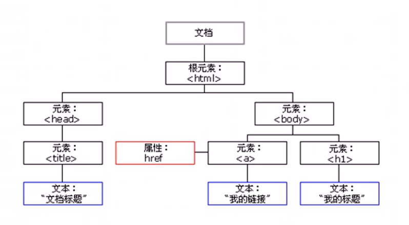

# DOM

## 1、什么是 DOM

文档对象模型（Document Object Model，简称 DOM），是 W3C 组织推荐的处理可扩展标记语言（HTML 或者 XML）的标准编程接口。

W3C 已经定义了一系列的 DOM 接口，通过这些 DOM 接口可以改变网页的内容、结构和样式。

## 2、DOM树

- 文档：一个页面就是一个文档，DOM 中使用 document 表示
- 元素：页面中的所有标签都是元素，DOM 中使用 element 表示
- 节点：网页中的所有内容都是节点（标签、属性、文本、注释等），DOM 中使用 node 表示

**DOM 把以上内容都看作是对象**

