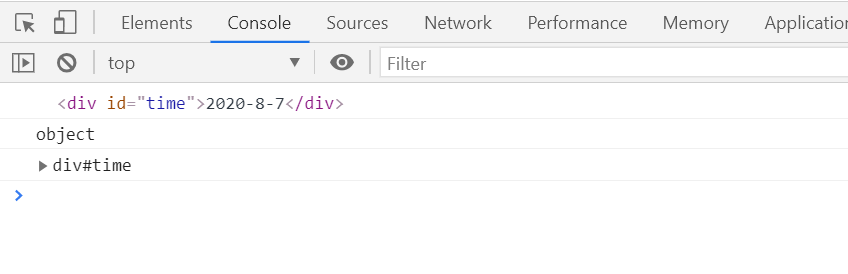

# DOM 获取元素

DOM 在我们实际开发中主要用来操作元素。

## 1、根据 ID 获取

使用 getElementById() 方法可以获取带有 ID 的元素对象。

**语法：**

```js
var element = document.getElementById(id);
```

- **`id`**是大小写敏感的字符串，代表了所要查找的元素的唯一ID.

- 返回一个匹配到 ID 的 DOM Element 对象。没有找到则返回 null。

**例子：**

```html
<!DOCTYPE html>
<html lang="en">
<head>
    <meta charset="UTF-8">
    <title>Document</title>
</head>
<body>
    <div id="time">2020-8-7</div>
    <script>
        // 因为文档页面从上往下加载，所以先得有标签。因此，script 写到标签的下面。
        var element = document.getElementById('time');
        console.log(element);
        console.log(typeof element);
        console.dir(element);
    </script>
</body>
</html>
```

**效果：**



## 2、根据标签名获取

