# BaaS新手体验日志

## 1、进入体验平台

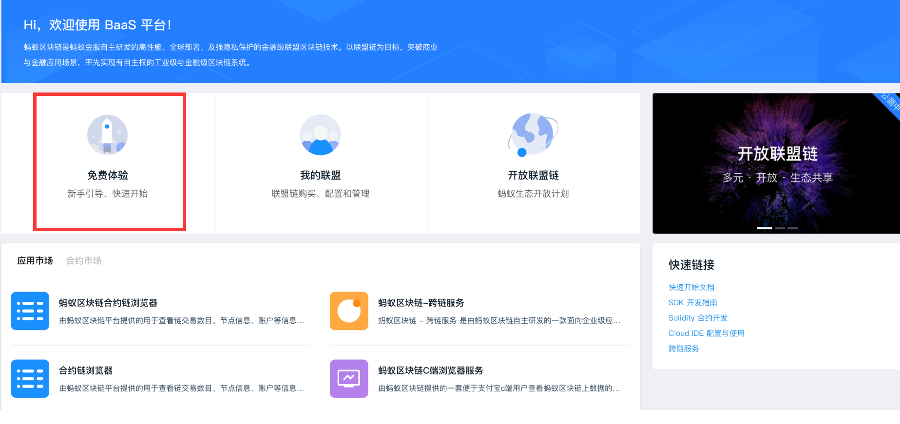


## 2、申请证书

这个证书是用于提供访问权限的，有了这个证书，电脑才能和云端的区块链进行交互。

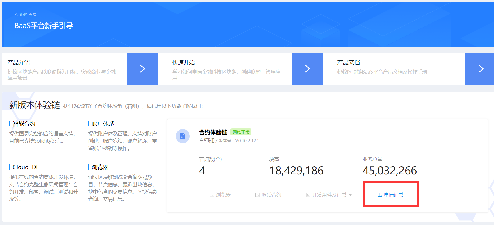

证书的生成方式有两种，自动生成和openSSL生成。

自动生成：操作简单，直接在网页上就能生成，不需要技术知识。

手动生成：需要有电脑的命令行基础，如果对云端生成的安全性不放心，可以使用openSSL在本地生成然后上传。（感觉也没安全多少）

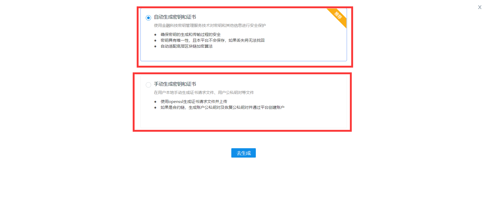

这里采用自动生成的方式：

填写信息：SSL私钥密码在开发时会用到，要记住。

省、城市填自己的电脑所在地就行，机构名填公司的名字，组织单位名称填部门，通用名称填公司的简称。

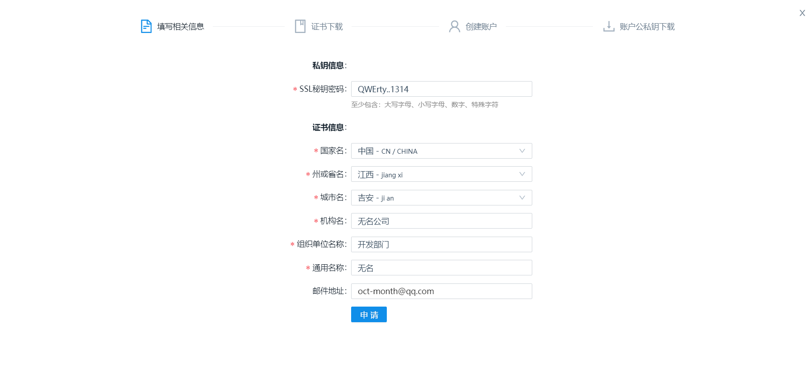

填好后有两个文件需要下载，这都是开发要用到的文件。

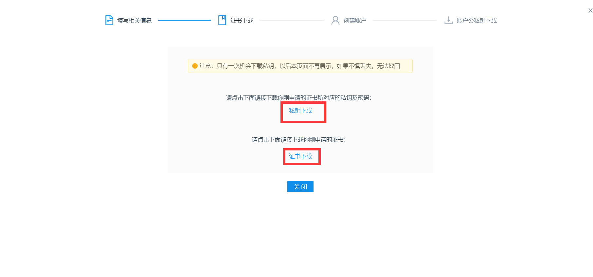

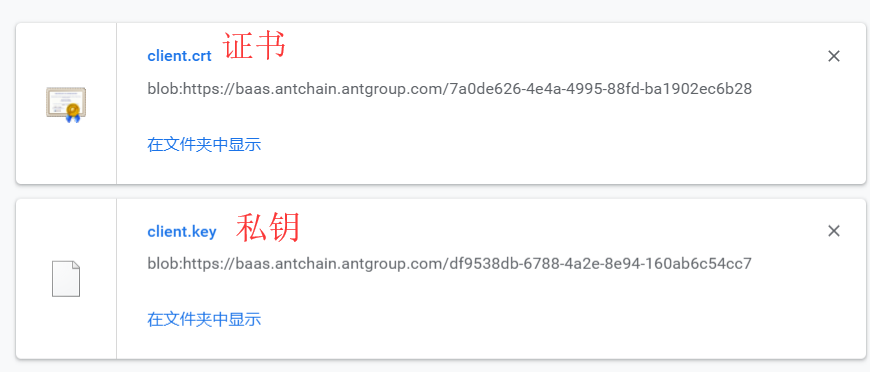

然后要创建账户，这个账户将用于发起交易、调用智能合约、部署智能合约。

账户私钥保护密码开发也需要用到，要记住。

账户的恢复私钥保护密码开发应该用不到，不过也要记住，使用`恢复私钥`时需要这个密码。

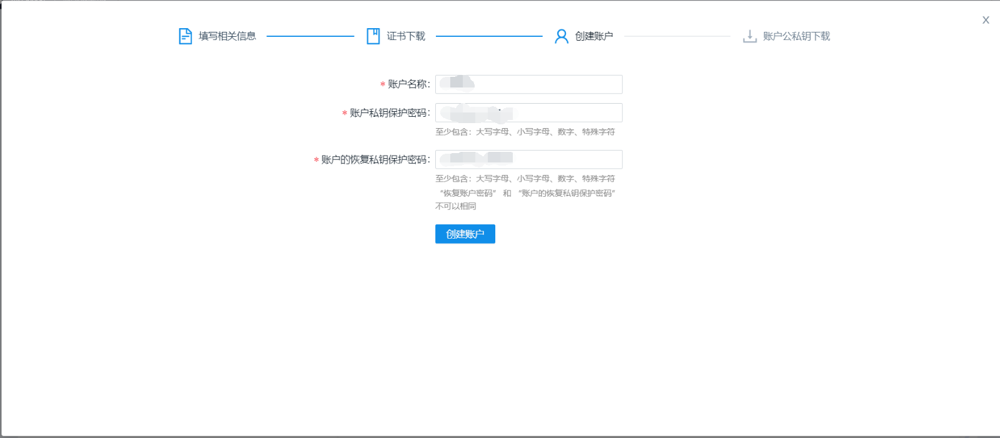

然后要把账户的公钥和私钥都下载下来。

恢复公钥和恢复私钥应该是用来恢复账户的公钥和私钥的，不太清楚。


## 3、下载开发所需要的证书和SDK

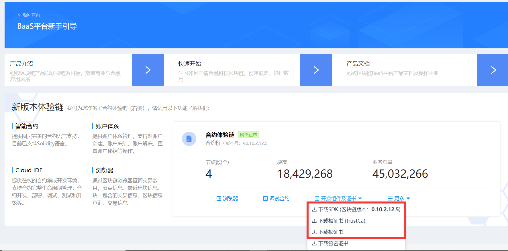

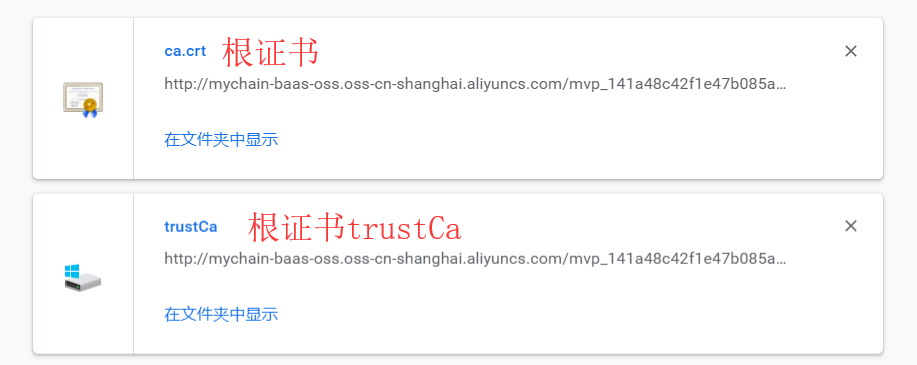

SDK有 java、js、C++ 3种，我熟悉 java ，所以下载的是 Java SDK。

Java SDK 的下载：

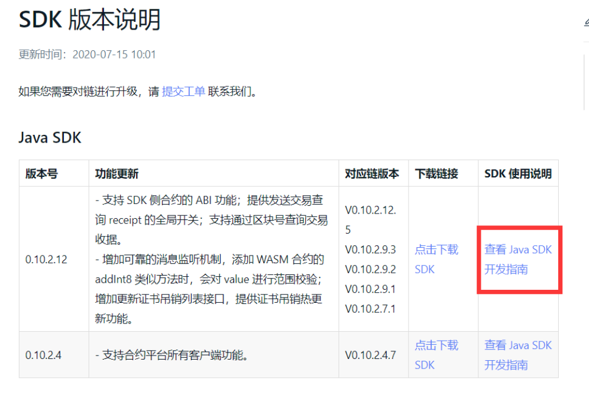

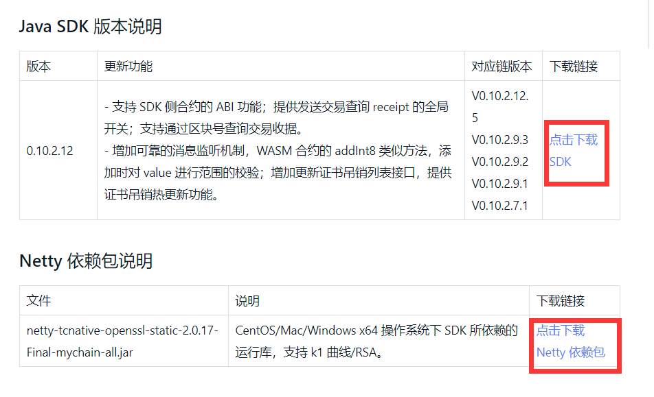

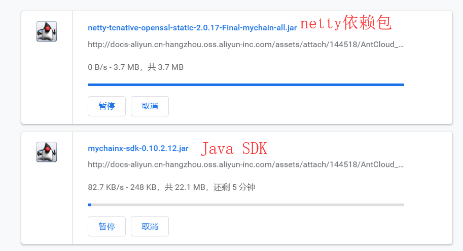

自此，开发所需的文件已全部下载好。

## 4、安装SDK

进入下载了SDK的 jar 的目录下，执行一下命令以把 mychainx-sdk 和 nerry 安装到 maven 的本地仓库中。

```sh
mvn install:install-file -Dfile=mychainx-sdk-0.10.2.12.jar -DgroupId=com.alipay.mychainx -DartifactId=mychainx-sdk -Dversion=0.10.2.12 -Dpackaging=jar
```

```sh
mvn install:install-file -Dfile=netty-tcnative-openssl-static-2.0.17-Final-mychain-all.jar -DgroupId=io.netty -DartifactId=netty-tcnative-openssl-static -Dversion=2.0.17-Final-mychain-all -Dpackaging=jar -Dclassifier=windows-x86_64
```


## 5、创建工程

工程使用maven创建：

```sh
mvn -B archetype:generate -DarchetypeGroupId=org.apache.maven.archetypes  -DgroupId=cn.sun -DartifactId=demo
```

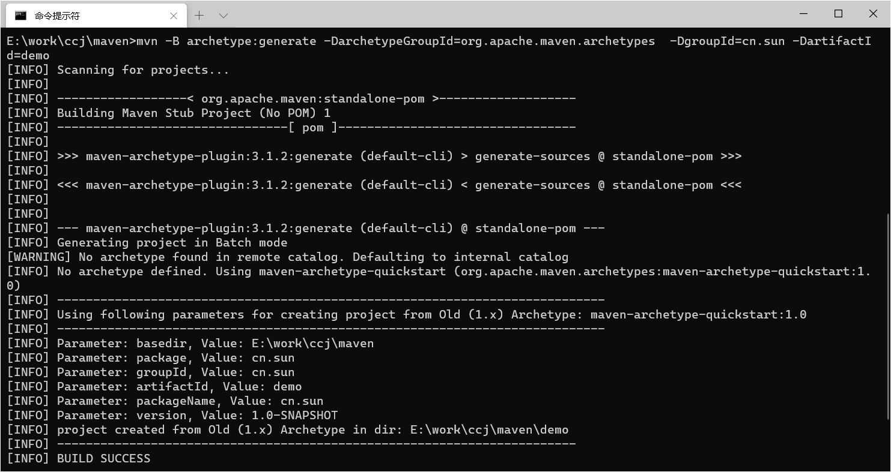

该命令会在当前路径下创建一个demo工程，即demo目录。

目录结构：

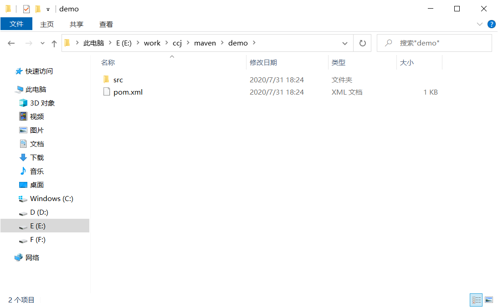

使用 IDEA 打开：


修改 pom.xml 文件，导入依赖。

```xml
<project xmlns="http://maven.apache.org/POM/4.0.0" xmlns:xsi="http://www.w3.org/2001/XMLSchema-instance"
  xsi:schemaLocation="http://maven.apache.org/POM/4.0.0 http://maven.apache.org/maven-v4_0_0.xsd">
  <modelVersion>4.0.0</modelVersion>
  <groupId>cn.sun</groupId>
  <artifactId>demo</artifactId>
  <packaging>jar</packaging>
  <version>1.0-SNAPSHOT</version>
  <name>demo</name>
  <url>http://maven.apache.org</url>

  <dependencies>
    <dependency>
      <groupId>com.alipay.mychainx</groupId>
      <artifactId>mychainx-sdk</artifactId>
      <!--请使用最新 SDK 版本 -->
      <version>0.10.2.12</version>
    </dependency>
    <dependency>
      <groupId>org.bouncycastle</groupId>
      <artifactId>bcpkix-jdk15on</artifactId>
      <version>1.60</version>
    </dependency>
    <dependency>
      <groupId>io.netty</groupId>
      <artifactId>netty-all</artifactId>
      <version>4.1.29.Final</version>
    </dependency>
    <dependency>
      <groupId>io.netty</groupId>
      <artifactId>netty-tcnative-boringssl-static</artifactId>
      <version>2.0.17.Final</version>
    </dependency>
    <dependency>
      <groupId>org.slf4j</groupId>
      <artifactId>slf4j-api</artifactId>
      <version>1.7.25</version>
    </dependency>
    <dependency>
      <groupId>commons-io</groupId>
      <artifactId>commons-io</artifactId>
      <version>2.6</version>
    </dependency>
    <dependency>
      <groupId>com.alibaba</groupId>
      <artifactId>fastjson</artifactId>
      <version>1.2.60</version>
    </dependency>
    <dependency>
      <groupId>com.google.guava</groupId>
      <artifactId>guava</artifactId>
      <version>20.0</version>
    </dependency>
    <dependency>
      <groupId>org.apache.commons</groupId>
      <artifactId>commons-collections4</artifactId>
      <version>4.2</version>
    </dependency>
    <dependency>
      <groupId>org.apache.commons</groupId>
      <artifactId>commons-lang3</artifactId>
      <version>3.5</version>
    </dependency>
    <dependency>
      <groupId>org.slf4j</groupId>
      <artifactId>slf4j-log4j12</artifactId>
      <version>1.8.0-alpha0</version>
    </dependency>
    <dependency>
      <groupId>junit</groupId>
      <artifactId>junit</artifactId>
      <version>3.8.1</version>
      <scope>test</scope>
    </dependency>
  </dependencies>

  <build>
    <extensions>
      <extension>
        <groupId>kr.motd.maven</groupId>
        <artifactId>os-maven-plugin</artifactId>
        <version>1.6.1</version>
      </extension>
    </extensions>
  </build>

</project>
```

新建resources目录：

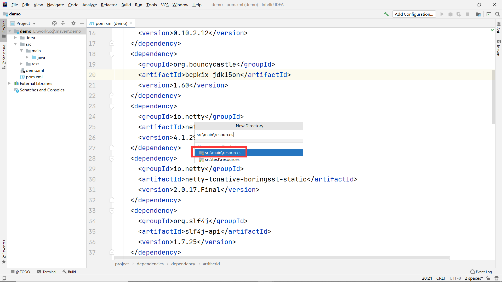

将4个文件放入resources目录下：

| **文件名称** | **文件说明**              | **文件来源**                                                 |
| ------------ | ------------------------- | ------------------------------------------------------------ |
| client.crt   | 客户端的证书文件          | 使用 BaaS 提供的 密钥生成工具 生成证书请求文件 client.csr，提交请求文件到 BaaS 平台申请证书，申请成功后可下载此 crt 文件。 |
| client.key   | 客户端的私钥文件          | 通过 BaaS 提供的 密钥生成工具 生成。                         |
| trustCa      | 存储 CA 证书的 trustStore | 通过 BaaS 平台下载，trustCa 文件密码为 mychain。             |
| user.key     | 账户私钥文件              | 通过 BaaS 提供的 密钥生成工具 手动生成，或自动生成下载。     |

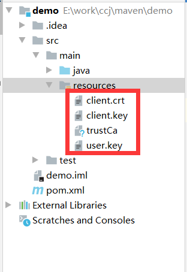

## 6、编写代码

添加 log 配置文件：

resources/log4j.properties

```properties
log4j.rootLogger=INFO, R

# 日志输出位置为控制台
log4j.appender.stdout=org.apache.log4j.ConsoleAppender
log4j.appender.stdout.layout=org.apache.log4j.PatternLayout
log4j.appender.stdout.layout.ConversionPattern=[QC] %p [%t] %C.%M(%L) | %m%n

# 日志输出位置为文件
log4j.appender.R=org.apache.log4j.DailyRollingFileAppender
log4j.appender.R.File=./sdk.log
log4j.appender.R.layout=org.apache.log4j.PatternLayout
log4j.appender.R.layout.ConversionPattern=%d-[TS] %p %t %c - %m%n
```

编写主程序：

下载地址：[DemoSample.java](http://docs-aliyun.cn-hangzhou.oss.aliyun-inc.com/assets/attach/144520/AntCloud_zh/1575026691993/DemoSample.java)

修改必要的配置项（5个地方）：

```java
package cn.sun;

import com.alipay.mychain.sdk.api.MychainClient;
import com.alipay.mychain.sdk.api.env.ClientEnv;
import com.alipay.mychain.sdk.api.env.ISslOption;
import com.alipay.mychain.sdk.api.env.SignerOption;
import com.alipay.mychain.sdk.api.env.SslBytesOption;
import com.alipay.mychain.sdk.api.logging.AbstractLoggerFactory;
import com.alipay.mychain.sdk.api.logging.ILogger;
import com.alipay.mychain.sdk.api.utils.ConfidentialUtil;
import com.alipay.mychain.sdk.api.utils.Utils;
import com.alipay.mychain.sdk.common.VMTypeEnum;
import com.alipay.mychain.sdk.crypto.MyCrypto;
import com.alipay.mychain.sdk.crypto.keyoperator.Pkcs8KeyOperator;
import com.alipay.mychain.sdk.crypto.keypair.Keypair;
import com.alipay.mychain.sdk.crypto.signer.SignerBase;
import com.alipay.mychain.sdk.domain.account.Identity;
import com.alipay.mychain.sdk.errorcode.ErrorCode;
import com.alipay.mychain.sdk.message.query.QueryAccountResponse;
import com.alipay.mychain.sdk.message.transaction.AbstractTransactionRequest;
import com.alipay.mychain.sdk.message.transaction.TransactionReceiptResponse;
import com.alipay.mychain.sdk.message.transaction.confidential.ConfidentialRequest;
import com.alipay.mychain.sdk.message.transaction.contract.CallContractRequest;
import com.alipay.mychain.sdk.message.transaction.contract.DeployContractRequest;
import com.alipay.mychain.sdk.type.BaseFixedSizeUnsignedInteger;
import com.alipay.mychain.sdk.utils.ByteUtils;
import com.alipay.mychain.sdk.utils.IOUtil;
import com.alipay.mychain.sdk.utils.RandomUtil;
import com.alipay.mychain.sdk.vm.EVMOutput;
import com.alipay.mychain.sdk.vm.EVMParameter;

import java.io.IOException;
import java.math.BigInteger;
import java.net.InetSocketAddress;
import java.util.ArrayList;
import java.util.List;

public class DemoSample {
    /**
     * contract code
     */
    private static String contractCodeString
        =
        "6080604052633b9aca00600055600060015534801561001d57600080fd5b5033600281905550610492806100346000396000f3006080604"
            +
            "05260043610610057576000357c0100000000000000000000000000000000000000000000000000000000900463ffffffff168063"
            +
            "af7c102c1461005c578063b2628df81461009d578063d4486019146100ec575b600080fd5b34801561006857600080fd5b5061008"
            +
            "76004803603810190808035906020019092919050505061013b565b6040518082815260200191505060405180910390f35b348015"
            +
            "6100a957600080fd5b506100d26004803603810190808035906020019092919080359060200190929190505050610158565b60405"
            +
            "1808215151515815260200191505060405180910390f35b3480156100f857600080fd5b5061012160048036038101908080359060"
            +
            "200190929190803590602001909291905050506102d8565b604051808215151515815260200191505060405180910390f35b60006"
            +
            "0036000838152602001908152602001600020549050919050565b6000600254331415156101d3576040517f08c379a00000000000"
            +
            "000000000000000000000000000000000000000000000081526004018080602001828103825260118152602001807f5065726d697"
            +
            "373696f6e2064656e69656400000000000000000000000000000081525060200191505060405180910390fd5b6000548260015401"
            +
            "131580156101ee57506001548260015401135b80156101fa5750600082135b151561026e576040517f08c379a0000000000000000"
            +
            "00000000000000000000000000000000000000000815260040180806020018281038252600e8152602001807f496e76616c696420"
            +
            "76616c75652100000000000000000000000000000000000081525060200191505060405180910390fd5b816003600085815260200"
            +
            "190815260200160002060008282540192505081905550816001600082825401925050819055508183337f31a52246bf8c995cecfd"
            +
            "d5404cf290ae6c2f4e174e888e4de4fd208137ec274d60405160405180910390a46001905092915050565b6000816003600033815"
            +
            "26020019081526020016000205412151515610365576040517f08c379a00000000000000000000000000000000000000000000000"
            +
            "000000000081526004018080602001828103825260138152602001807f62616c616e6365206e6f7420656e6f75676821000000000"
            +
            "0000000000000000081525060200191505060405180910390fd5b60008213801561037757506000548213155b15156103eb576040"
            +
            "517f08c379a000000000000000000000000000000000000000000000000000000000815260040180806020018281038252600e815"
            +
            "2602001807f496e76616c69642076616c756521000000000000000000000000000000000000815250602001915050604051809103"
            +
            "90fd5b816003600033815260200190815260200160002060008282540392505081905550816003600085815260200190815260200"
            +
            "1600020600082825401925050819055508183337f97c0c2106db19ca3c64afdc86820cd157d60361f777bf0e5323254d6c9689550"
            +
            "60405160405180910390a460009050929150505600a165627a7a72305820371af9e83b0e49ca71634c470c75e504d08db9abbaf39"
            + "92f30434f8d7a7994d40029";

    private static byte[] contractCode = ByteUtils.hexStringToBytes(contractCodeString);
    /**
     * contract id
     */
    private static String testContractId = "CreditManager" + System.currentTimeMillis();

    /**
     * baas上创建的帐户名字
     */
/* *************************************** 1 **************************************************** */
    private static final String account = "账户的名称（申请证书时创建的账户）";
    private static Identity userIdentity;
    private static Keypair userKeypair;

    /**
     * create account test
     */
    private static Identity testAccount1 = Utils.getIdentityByName("test_account_"+System.currentTimeMillis());
    /**
     * sdk client
     */
    private static MychainClient sdk;
    /**
     * client key password
     */
/* *************************************** 2 **************************************************** */
    private static String keyPassword = "SSL密钥密码";  //根据实际情况更新，申请证书时候指定的SSL密码
    /**
     * user password
     */
/* *************************************** 3 **************************************************** */
    private static String userPassword = "账户私钥保护密码"; //根据实际情况更新。申请证书时，创建账户的密码
    /**
     * host ip
     */
/* *************************************** 4 **************************************************** */
    private static String host = "自己电脑的IP地址"; //根据实际情况更新，在BaaS平台，通过查看目标合约链"详情"，在"区块浏览器"中查看"节点详情"可获取链节点的 IP地址 和 端口号。

    /**
     * server port
     */
/* *************************************** 5 **************************************************** */
    private static int port = 18130; // 端口号，根据实际情况更新，一般是18130
    /**
     * trustCa password.
     */
    private static String trustStorePassword = "mychain";
    /**
     * mychain environment
     */
    private static ClientEnv env;
    /**
     * mychain is tee Chain
     */
    private static boolean isTeeChain = false;
    /**
     * tee chain publicKeys
     */
    private static List<byte[]> publicKeys = new ArrayList<byte[]>();
    /**
     * tee chain secretKey
     */
    private static String secretKey = "123456";


    private static void exit(String tag, String msg) {
        exit(String.format("%s error : %s ", tag, msg));
    }

    private static void exit(String msg) {
        System.out.println(msg);
        System.exit(0);
    }

    private static String getErrorMsg(int errorCode) {
        int minMychainSdkErrorCode = ErrorCode.SDK_INTERNAL_ERROR.getErrorCode();
        if (errorCode < minMychainSdkErrorCode) {
            return ErrorCode.valueOf(errorCode).getErrorDesc();
        } else {
            return ErrorCode.valueOf(errorCode).getErrorDesc();
        }
    }

    private static void initMychainEnv() throws IOException {
        // any user key for sign message
        String userPrivateKeyFile = "user.key";
        userIdentity = Utils.getIdentityByName(account);
        Pkcs8KeyOperator pkcs8KeyOperator = new Pkcs8KeyOperator();
        userKeypair = pkcs8KeyOperator.load(IOUtil.inputStreamToByte(DemoSample.class.getClassLoader().getResourceAsStream(userPrivateKeyFile)), userPassword);

        // use publicKeys by tee
        if(isTeeChain) {
            Keypair keypair = new Pkcs8KeyOperator()
                .loadPubkey(
                    IOUtil.inputStreamToByte(DemoSample.class.getClassLoader().getResourceAsStream("test_seal_pubkey.pem")));
            byte[] publicKeyDer = keypair.getPubkeyEncoded(); //tee_rsa_public_key.pem 从BaaS下载获取
            publicKeys.add(publicKeyDer);
        }

        env = buildMychainEnv();

        ILogger logger = AbstractLoggerFactory.getInstance(DemoSample.class);
        env.setLogger(logger);
    }

    private static ClientEnv buildMychainEnv() throws IOException {
        InetSocketAddress inetSocketAddress = InetSocketAddress.createUnresolved(host, port);
        String keyFilePath = "client.key";
        String certFilePath = "client.crt";
        String trustStoreFilePath = "trustCa";

        // build ssl option
        ISslOption sslOption = new SslBytesOption.Builder()
            .keyBytes(IOUtil.inputStreamToByte(DemoSample.class.getClassLoader().getResourceAsStream(keyFilePath)))
            .certBytes(IOUtil.inputStreamToByte(DemoSample.class.getClassLoader().getResourceAsStream(certFilePath)))
            .keyPassword(keyPassword)
            .trustStorePassword(trustStorePassword)
            .trustStoreBytes(
                IOUtil.inputStreamToByte(DemoSample.class.getClassLoader().getResourceAsStream(trustStoreFilePath)))
            .build();

        List<InetSocketAddress> socketAddressArrayList = new ArrayList<InetSocketAddress>();
        socketAddressArrayList.add(inetSocketAddress);

        List<SignerBase> signerBaseList = new ArrayList<SignerBase>();
        SignerBase signerBase = MyCrypto.getInstance().createSigner(userKeypair);
        signerBaseList.add(signerBase);
        SignerOption signerOption = new SignerOption();
        signerOption.setSigners(signerBaseList);

        return ClientEnv.build(socketAddressArrayList, sslOption, signerOption);
    }


    private static void signRequest(AbstractTransactionRequest request) {
        // sign request
        long ts = sdk.getNetwork().getSystemTimestamp();
        request.setTxTimeNonce(ts, BaseFixedSizeUnsignedInteger.Fixed64BitUnsignedInteger
            .valueOf(RandomUtil.randomize(ts + request.getTransaction().hashCode())), true);
        request.complete();
        sdk.getConfidentialService().signRequest(env.getSignerOption().getSigners(), request);
    }

    private static void deployContract() {
        EVMParameter contractParameters = new EVMParameter();

        // build DeployContractRequest
        DeployContractRequest request = new DeployContractRequest(userIdentity,
            Utils.getIdentityByName(testContractId), contractCode, VMTypeEnum.EVM,
            contractParameters, BigInteger.ZERO);

        //  set Gas limit
        // Make sure your account balance is greater than 50,000
        request.setTxGas(50000);

        TransactionReceiptResponse deployContractResult;
        if (isTeeChain) {
            signRequest(request);

            // generate transaction key
            byte[] transactionKey = ConfidentialUtil.keyGenerate(secretKey,
                request.getTransaction().getHash().getValue());

            ConfidentialRequest confidentialRequest = new ConfidentialRequest(request, publicKeys, transactionKey);

            deployContractResult = sdk.getConfidentialService().confidentialRequest(confidentialRequest);
        } else {
            deployContractResult = sdk.getContractService().deployContract(request);
        }

        // deploy contract
        if (!deployContractResult.isSuccess()
            || deployContractResult.getTransactionReceipt().getResult() != 0) {
            exit("deployContract",
                getErrorMsg((int)deployContractResult.getTransactionReceipt().getResult()));
        } else {
            System.out.println("deploy contract success.");
        }
    }

    private static void issue() {
        EVMParameter parameters = new EVMParameter("Issue(identity,int256)");
        parameters.addIdentity(userIdentity);
        parameters.addUint(BigInteger.valueOf(100));

        // build CallContractRequest
        CallContractRequest request = new CallContractRequest(userIdentity,
            Utils.getIdentityByName(testContractId), parameters, BigInteger.ZERO, VMTypeEnum.EVM);

        //  set Gas limit
        // Make sure your account balance is greater than 50,000
        request.setTxGas(50000);

        TransactionReceiptResponse callContractResult;
        if (isTeeChain) {
            signRequest(request);

            // generate transaction key
            byte[] transactionKey = ConfidentialUtil.keyGenerate(secretKey,
                request.getTransaction().getHash().getValue());

            ConfidentialRequest confidentialRequest = new ConfidentialRequest(request, publicKeys, transactionKey);

            callContractResult = sdk.getConfidentialService().confidentialRequest(confidentialRequest);
        } else {
            callContractResult = sdk.getContractService().callContract(request);
        }

        if (!callContractResult.isSuccess() || callContractResult.getTransactionReceipt().getResult() != 0) {
            exit("issue", getErrorMsg((int)callContractResult.getTransactionReceipt().getResult()));
        } else {
            System.out.println("issue success.");
        }
    }

    private static void transfer() {
        // contract parameters
        EVMParameter contractParameters = new EVMParameter("Transfer(identity,int256)");
        contractParameters.addIdentity(testAccount1);
        contractParameters.addUint(BigInteger.valueOf(50));

        CallContractRequest request = new CallContractRequest(userIdentity,
            Utils.getIdentityByName(testContractId), contractParameters, BigInteger.ZERO, VMTypeEnum.EVM);

        //  set Gas limit
        // Make sure your account balance is greater than 50,000
        request.setTxGas(50000);

        TransactionReceiptResponse callContractResult;
        if (isTeeChain) {
            signRequest(request);

            // generate transaction key
            byte[] transactionKey = ConfidentialUtil.keyGenerate(secretKey,
                request.getTransaction().getHash().getValue());

            ConfidentialRequest confidentialRequest = new ConfidentialRequest(request, publicKeys, transactionKey);

            callContractResult = sdk.getConfidentialService().confidentialRequest(confidentialRequest);
        } else {
            callContractResult = sdk.getContractService().callContract(request);
        }

        if (!callContractResult.isSuccess() || callContractResult.getTransactionReceipt().getResult() != 0) {
            exit("transfer", getErrorMsg((int)callContractResult.getTransactionReceipt().getResult()));
        } else {
            System.out.println("transfer success.");
        }
    }

    private static BigInteger query(Identity account) {
        // contract parameters
        EVMParameter parameters = new EVMParameter("Query(identity)");
        parameters.addIdentity(account);

        // build call contract request
        CallContractRequest request = new CallContractRequest(userIdentity,
            Utils.getIdentityByName(testContractId), parameters, BigInteger.ZERO, VMTypeEnum.EVM);

        //  set Gas limit
        // Make sure your account balance is greater than 50,000
        request.setTxGas(50000);

        TransactionReceiptResponse callContractResult;
        if (isTeeChain) {
            signRequest(request);

            // generate transaction key
            byte[] transactionKey = ConfidentialUtil.keyGenerate(secretKey,
                request.getTransaction().getHash().getValue());

            ConfidentialRequest confidentialRequest = new ConfidentialRequest(request, publicKeys, transactionKey);

            callContractResult = sdk.getConfidentialService().confidentialRequest(confidentialRequest);
        } else {
            callContractResult = sdk.getContractService().callContract(request);
        }

        if (!callContractResult.isSuccess() || callContractResult.getTransactionReceipt().getResult() != 0) {
            exit("query", getErrorMsg((int)callContractResult.getTransactionReceipt().getResult()));
        }

        byte[] output = null;
        if (isTeeChain) {
            output = ConfidentialUtil.decrypt(secretKey, callContractResult.getTransactionReceipt().getOutput(), request.getTransaction().getHash().hexStrValue());
        } else {
            output = callContractResult.getTransactionReceipt().getOutput();
        }

        if (output == null) {
            exit("decrypt tee", "decrypt tee output failed");
            return BigInteger.ZERO;
        }

        // decode return values
        EVMOutput contractReturnValues = new EVMOutput(ByteUtils.toHexString(output));
        return contractReturnValues.getUint();
    }

    private static void expect(BigInteger balance, BigInteger expectBalance) {
        if (balance.compareTo(expectBalance) != 0) {
            exit("expect", "the account value is not expected.");
        } else {
            System.out.println("check account balance success.");
        }
    }

    private static void initSdk() {
        sdk = new MychainClient();
        boolean initResult = sdk.init(env);
        if (!initResult) {
            exit("initSdk", "sdk init failed.");
        }
    }


    public static void main(String[] args) throws Exception {
        //step 1:init mychain env.
        // 导入用户的私钥
        initMychainEnv();

        //step 2: init sdk client
        // 初始化 SDK 的环境
        initSdk();

        QueryAccountResponse queryAccountResponse = sdk.getQueryService().queryAccount(Utils.getIdentityByName("Xy19952"));

        //step 3 : deploy a contract using useridentity.
        // 部署合约
        deployContract();

        //step 4 issue 100 assets to testAccount1.
        // 发行100个资产给用户
        issue();

        //step 5 : transfer 50 assets from useridentity to testAccount1
        // 从用户向测试账户转账50个资产
        transfer();

        //step 6 : query testAccount1 whose balance should be 50.
        // 查询测试账户的余额
        BigInteger balance = query(testAccount1);

        //step 7 : compare to expect balance.
        // 检查测试账户的余额是否为50
        expect(balance, BigInteger.valueOf(50));

        //step 8 : sdk shut down
        // 关闭 sdk 连接
        sdk.shutDown();
    }
}
```

编译：

```sh
mvn clean compile
```

运行：

```sh
mvn exec:java -Dexec.mainClass="cn.sun.DemoSample"
```

执行成功输出的日志：

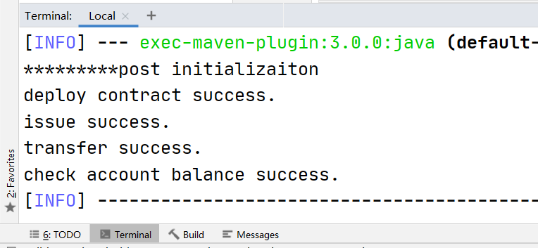


