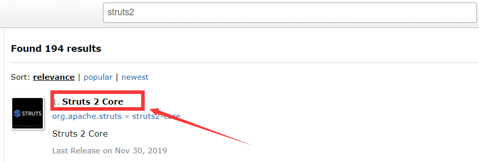
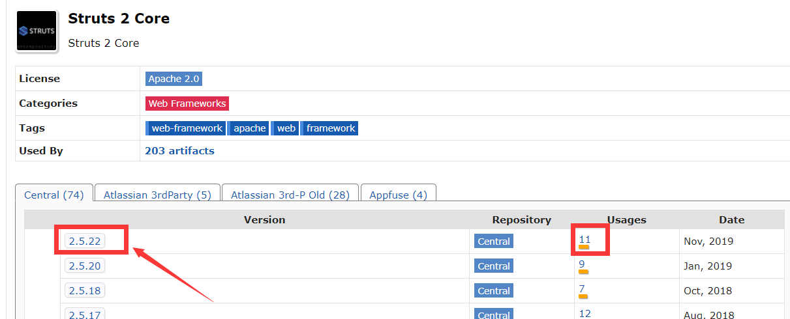
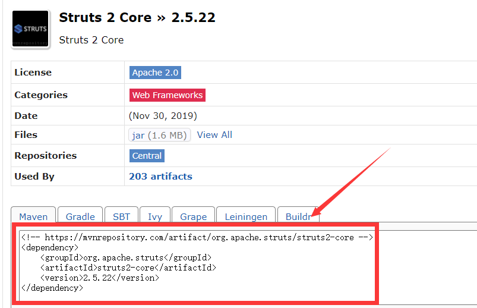

# maven仓库

## 1、坐标

groupId：定义当前Maven项目隶属的实际项目。由于Maven中模块的概念，因此一个项目会被划分成为很多的模块。它的表示方法与java的包名类似，通常与域名反向。

artifactId：定义实际项目中的一个模块，通常使用实际项目名称作为前缀来命名。比如spring-bean

version：定义项目当前所处的版本。

packaging：定义项目的打包方式，默认打包成jar包。

classifier：定义构建输出的附属构件，比如javadoc.jar和sources.jar。

## 2、寻找依赖包

打开中央仓库：https://mvnrepository.com/

在search这里：

可以直接搜索，比如搜索struts2：

点击进入：

最新版本2.5.22，使用数量 11。

这里已经帮你把依赖文件的写法都放好了，直接copy就行了。

## 3、仓库的概念

仓库分为两类：本地仓库和远程仓库。

当maven根据坐标寻找构件的时候，它会先查看本地仓库，没有的话就会去远程仓库下载。

远程仓库分3种：

> 中央仓库	默认使用的就是中央仓库

> 私服			nexus 在局域网内架设一个私有的仓库服务器，代理所有的外部仓库。内部的项目还能部署上去供其它项目使用。

> 公共库		公共

