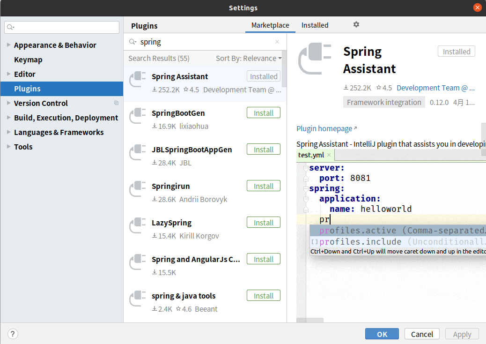
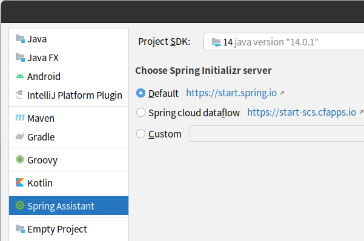

# 使用Spring Initializer快速创建Spring Boot项目

## 1、IDEA安装Spring Assistant插件

在settings的plugins中搜索插件并安装：

创建项目时选择左边的Spring Assistant。

之后项目创建向导就会引导我们创建项目（联网创建）

## 2、默认生成的Spring Boot项目

特点：

- 主程序已经生成好了，只需要编写业务逻辑就行了
- resources文件夹的目录结构：
    - static：保存所有的静态资源；js、css、图片
    - templates：保存所有的模板页面；默认不支持jsp，可以使用模板引擎。
    - application.properties：Spring Boot应用的配置文件，可以修改一些默认设置

