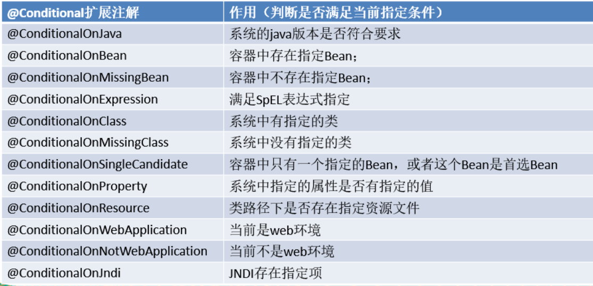

# 自动配置原理

1）Spring Boot启动的时候加载主配置类，开启了自动配置功能@EnableAutoConfiguration。

2）@EnableAutoConfiguration作用：

	- 利用AutoConfigurationImportSelector给容器中导入一些组件
	
	- 可以查看selectImports()方法的内容，就可以知道导入了哪些组件

-  autoConfigurationEntry.getConfigurations();	获取候选的配置

- 扫描所有jar包类路径下 META-INF/spring.factories，把扫描到的这些文件的内容包装成properties对象。从properties中获取到EnableAutoConfiguration.class类的类名对应的值，然后把他们添加在容器中。

  将类路径下META-INF/spring.factories里面的所有EnableAutoConfiguration的值加入到了容器中。

  spring-boot-autoconfigure.jar/META-INF/spring.factories：

  ```properties
  # Auto Configure
  org.springframework.boot.autoconfigure.EnableAutoConfiguration=\
  org.springframework.boot.autoconfigure.admin.SpringApplicationAdminJmxAutoConfiguration,\
  org.springframework.boot.autoconfigure.aop.AopAutoConfiguration,\
  org.springframework.boot.autoconfigure.amqp.RabbitAutoConfiguration,\
  org.springframework.boot.autoconfigure.batch.BatchAutoConfiguration,\
  org.springframework.boot.autoconfigure.cache.CacheAutoConfiguration,\
  org.springframework.boot.autoconfigure.cassandra.CassandraAutoConfiguration,\
  org.springframework.boot.autoconfigure.context.ConfigurationPropertiesAutoConfiguration,\
  org.springframework.boot.autoconfigure.context.LifecycleAutoConfiguration,\
  org.springframework.boot.autoconfigure.context.MessageSourceAutoConfiguration,\
  org.springframework.boot.autoconfigure.context.PropertyPlaceholderAutoConfiguration,\
  org.springframework.boot.autoconfigure.couchbase.CouchbaseAutoConfiguration,\
  org.springframework.boot.autoconfigure.dao.PersistenceExceptionTranslationAutoConfiguration,\
  org.springframework.boot.autoconfigure.data.cassandra.CassandraDataAutoConfiguration,\
  org.springframework.boot.autoconfigure.data.cassandra.CassandraReactiveDataAutoConfiguration,\
  org.springframework.boot.autoconfigure.data.cassandra.CassandraReactiveRepositoriesAutoConfiguration,\
  org.springframework.boot.autoconfigure.data.cassandra.CassandraRepositoriesAutoConfiguration,\
  org.springframework.boot.autoconfigure.data.couchbase.CouchbaseDataAutoConfiguration,\
  org.springframework.boot.autoconfigure.data.couchbase.CouchbaseReactiveDataAutoConfiguration,\
  org.springframework.boot.autoconfigure.data.couchbase.CouchbaseReactiveRepositoriesAutoConfiguration,\
  org.springframework.boot.autoconfigure.data.couchbase.CouchbaseRepositoriesAutoConfiguration,\
  org.springframework.boot.autoconfigure.data.elasticsearch.ElasticsearchDataAutoConfiguration,\
  org.springframework.boot.autoconfigure.data.elasticsearch.ElasticsearchRepositoriesAutoConfiguration,\
  org.springframework.boot.autoconfigure.data.elasticsearch.ReactiveElasticsearchRepositoriesAutoConfiguration,\
  org.springframework.boot.autoconfigure.data.elasticsearch.ReactiveElasticsearchRestClientAutoConfiguration,\
  org.springframework.boot.autoconfigure.data.jdbc.JdbcRepositoriesAutoConfiguration,\
  org.springframework.boot.autoconfigure.data.jpa.JpaRepositoriesAutoConfiguration,\
  org.springframework.boot.autoconfigure.data.ldap.LdapRepositoriesAutoConfiguration,\
  org.springframework.boot.autoconfigure.data.mongo.MongoDataAutoConfiguration,\
  org.springframework.boot.autoconfigure.data.mongo.MongoReactiveDataAutoConfiguration,\
  org.springframework.boot.autoconfigure.data.mongo.MongoReactiveRepositoriesAutoConfiguration,\
  org.springframework.boot.autoconfigure.data.mongo.MongoRepositoriesAutoConfiguration,\
  org.springframework.boot.autoconfigure.data.neo4j.Neo4jDataAutoConfiguration,\
  org.springframework.boot.autoconfigure.data.neo4j.Neo4jRepositoriesAutoConfiguration,\
  org.springframework.boot.autoconfigure.data.solr.SolrRepositoriesAutoConfiguration,\
  org.springframework.boot.autoconfigure.data.r2dbc.R2dbcDataAutoConfiguration,\
  org.springframework.boot.autoconfigure.data.r2dbc.R2dbcRepositoriesAutoConfiguration,\
  org.springframework.boot.autoconfigure.data.r2dbc.R2dbcTransactionManagerAutoConfiguration,\
  org.springframework.boot.autoconfigure.data.redis.RedisAutoConfiguration,\
  org.springframework.boot.autoconfigure.data.redis.RedisReactiveAutoConfiguration,\
  org.springframework.boot.autoconfigure.data.redis.RedisRepositoriesAutoConfiguration,\
  org.springframework.boot.autoconfigure.data.rest.RepositoryRestMvcAutoConfiguration,\
  org.springframework.boot.autoconfigure.data.web.SpringDataWebAutoConfiguration,\
  org.springframework.boot.autoconfigure.elasticsearch.ElasticsearchRestClientAutoConfiguration,\
  org.springframework.boot.autoconfigure.flyway.FlywayAutoConfiguration,\
  org.springframework.boot.autoconfigure.freemarker.FreeMarkerAutoConfiguration,\
  org.springframework.boot.autoconfigure.groovy.template.GroovyTemplateAutoConfiguration,\
  org.springframework.boot.autoconfigure.gson.GsonAutoConfiguration,\
  org.springframework.boot.autoconfigure.h2.H2ConsoleAutoConfiguration,\
  org.springframework.boot.autoconfigure.hateoas.HypermediaAutoConfiguration,\
  org.springframework.boot.autoconfigure.hazelcast.HazelcastAutoConfiguration,\
  org.springframework.boot.autoconfigure.hazelcast.HazelcastJpaDependencyAutoConfiguration,\
  org.springframework.boot.autoconfigure.http.HttpMessageConvertersAutoConfiguration,\
  org.springframework.boot.autoconfigure.http.codec.CodecsAutoConfiguration,\
  org.springframework.boot.autoconfigure.influx.InfluxDbAutoConfiguration,\
  org.springframework.boot.autoconfigure.info.ProjectInfoAutoConfiguration,\
  org.springframework.boot.autoconfigure.integration.IntegrationAutoConfiguration,\
  org.springframework.boot.autoconfigure.jackson.JacksonAutoConfiguration,\
  org.springframework.boot.autoconfigure.jdbc.DataSourceAutoConfiguration,\
  org.springframework.boot.autoconfigure.jdbc.JdbcTemplateAutoConfiguration,\
  org.springframework.boot.autoconfigure.jdbc.JndiDataSourceAutoConfiguration,\
  org.springframework.boot.autoconfigure.jdbc.XADataSourceAutoConfiguration,\
  org.springframework.boot.autoconfigure.jdbc.DataSourceTransactionManagerAutoConfiguration,\
  org.springframework.boot.autoconfigure.jms.JmsAutoConfiguration,\
  org.springframework.boot.autoconfigure.jmx.JmxAutoConfiguration,\
  org.springframework.boot.autoconfigure.jms.JndiConnectionFactoryAutoConfiguration,\
  org.springframework.boot.autoconfigure.jms.activemq.ActiveMQAutoConfiguration,\
  org.springframework.boot.autoconfigure.jms.artemis.ArtemisAutoConfiguration,\
  org.springframework.boot.autoconfigure.jersey.JerseyAutoConfiguration,\
  org.springframework.boot.autoconfigure.jooq.JooqAutoConfiguration,\
  org.springframework.boot.autoconfigure.jsonb.JsonbAutoConfiguration,\
  org.springframework.boot.autoconfigure.kafka.KafkaAutoConfiguration,\
  org.springframework.boot.autoconfigure.availability.ApplicationAvailabilityAutoConfiguration,\
  org.springframework.boot.autoconfigure.ldap.embedded.EmbeddedLdapAutoConfiguration,\
  org.springframework.boot.autoconfigure.ldap.LdapAutoConfiguration,\
  org.springframework.boot.autoconfigure.liquibase.LiquibaseAutoConfiguration,\
  org.springframework.boot.autoconfigure.mail.MailSenderAutoConfiguration,\
  org.springframework.boot.autoconfigure.mail.MailSenderValidatorAutoConfiguration,\
  org.springframework.boot.autoconfigure.mongo.embedded.EmbeddedMongoAutoConfiguration,\
  org.springframework.boot.autoconfigure.mongo.MongoAutoConfiguration,\
  org.springframework.boot.autoconfigure.mongo.MongoReactiveAutoConfiguration,\
  org.springframework.boot.autoconfigure.mustache.MustacheAutoConfiguration,\
  org.springframework.boot.autoconfigure.orm.jpa.HibernateJpaAutoConfiguration,\
  org.springframework.boot.autoconfigure.quartz.QuartzAutoConfiguration,\
  org.springframework.boot.autoconfigure.r2dbc.R2dbcAutoConfiguration,\
  org.springframework.boot.autoconfigure.rsocket.RSocketMessagingAutoConfiguration,\
  org.springframework.boot.autoconfigure.rsocket.RSocketRequesterAutoConfiguration,\
  org.springframework.boot.autoconfigure.rsocket.RSocketServerAutoConfiguration,\
  org.springframework.boot.autoconfigure.rsocket.RSocketStrategiesAutoConfiguration,\
  org.springframework.boot.autoconfigure.security.servlet.SecurityAutoConfiguration,\
  org.springframework.boot.autoconfigure.security.servlet.UserDetailsServiceAutoConfiguration,\
  org.springframework.boot.autoconfigure.security.servlet.SecurityFilterAutoConfiguration,\
  org.springframework.boot.autoconfigure.security.reactive.ReactiveSecurityAutoConfiguration,\
  org.springframework.boot.autoconfigure.security.reactive.ReactiveUserDetailsServiceAutoConfiguration,\
  org.springframework.boot.autoconfigure.security.rsocket.RSocketSecurityAutoConfiguration,\
  org.springframework.boot.autoconfigure.security.saml2.Saml2RelyingPartyAutoConfiguration,\
  org.springframework.boot.autoconfigure.sendgrid.SendGridAutoConfiguration,\
  org.springframework.boot.autoconfigure.session.SessionAutoConfiguration,\
  org.springframework.boot.autoconfigure.security.oauth2.client.servlet.OAuth2ClientAutoConfiguration,\
  org.springframework.boot.autoconfigure.security.oauth2.client.reactive.ReactiveOAuth2ClientAutoConfiguration,\
  org.springframework.boot.autoconfigure.security.oauth2.resource.servlet.OAuth2ResourceServerAutoConfiguration,\
  org.springframework.boot.autoconfigure.security.oauth2.resource.reactive.ReactiveOAuth2ResourceServerAutoConfiguration,\
  org.springframework.boot.autoconfigure.solr.SolrAutoConfiguration,\
  org.springframework.boot.autoconfigure.task.TaskExecutionAutoConfiguration,\
  org.springframework.boot.autoconfigure.task.TaskSchedulingAutoConfiguration,\
  org.springframework.boot.autoconfigure.thymeleaf.ThymeleafAutoConfiguration,\
  org.springframework.boot.autoconfigure.transaction.TransactionAutoConfiguration,\
  org.springframework.boot.autoconfigure.transaction.jta.JtaAutoConfiguration,\
  org.springframework.boot.autoconfigure.validation.ValidationAutoConfiguration,\
  org.springframework.boot.autoconfigure.web.client.RestTemplateAutoConfiguration,\
  org.springframework.boot.autoconfigure.web.embedded.EmbeddedWebServerFactoryCustomizerAutoConfiguration,\
  org.springframework.boot.autoconfigure.web.reactive.HttpHandlerAutoConfiguration,\
  org.springframework.boot.autoconfigure.web.reactive.ReactiveWebServerFactoryAutoConfiguration,\
  org.springframework.boot.autoconfigure.web.reactive.WebFluxAutoConfiguration,\
  org.springframework.boot.autoconfigure.web.reactive.error.ErrorWebFluxAutoConfiguration,\
  org.springframework.boot.autoconfigure.web.reactive.function.client.ClientHttpConnectorAutoConfiguration,\
  org.springframework.boot.autoconfigure.web.reactive.function.client.WebClientAutoConfiguration,\
  org.springframework.boot.autoconfigure.web.servlet.DispatcherServletAutoConfiguration,\
  org.springframework.boot.autoconfigure.web.servlet.ServletWebServerFactoryAutoConfiguration,\
  org.springframework.boot.autoconfigure.web.servlet.error.ErrorMvcAutoConfiguration,\
  org.springframework.boot.autoconfigure.web.servlet.HttpEncodingAutoConfiguration,\
  org.springframework.boot.autoconfigure.web.servlet.MultipartAutoConfiguration,\
  org.springframework.boot.autoconfigure.web.servlet.WebMvcAutoConfiguration,\
  org.springframework.boot.autoconfigure.websocket.reactive.WebSocketReactiveAutoConfiguration,\
  org.springframework.boot.autoconfigure.websocket.servlet.WebSocketServletAutoConfiguration,\
  org.springframework.boot.autoconfigure.websocket.servlet.WebSocketMessagingAutoConfiguration,\
  org.springframework.boot.autoconfigure.webservices.WebServicesAutoConfiguration,\
  org.springframework.boot.autoconfigure.webservices.client.WebServiceTemplateAutoConfiguration
  ```

  每一个这样的xxxAutoConfiguration类都是容器中的一个组件，都加入到容器中；用它们来做自动配置。

3）每一个自动配置类都进行自动配置功能。

4）例：

```java
@Configuration(proxyBeanMethods = false)	// 表示这是一个配置类，就和以前的xml配置文件一样，也可以给容器中添加组件
@EnableConfigurationProperties(ServerProperties.class)	// 启用指定类的ConfigurationProperties功能。将配置文件中对应的值和ServerProperties绑定起来。把ServerProperties加入到IOC容器中。
@ConditionalOnWebApplication(type = ConditionalOnWebApplication.Type.SERVLET)	// 如果满足指定的条件，整个配置类里面的配置才会生效。如果当前是web应用，当前配置类生效。
@ConditionalOnClass(CharacterEncodingFilter.class)	// 判断当前项目有没有CharacterEncodingFilter类
@ConditionalOnProperty(prefix = "server.servlet.encoding", value = "enabled", matchIfMissing = true)	// 判断配置文件中是否存在server.servlet.encoding配置，matchIfMissing=true表示如果配置文件中没有配置server.servlet.encoding=true则默认生效。
public class HttpEncodingAutoConfiguration {
    // 它已经和Spring Boot的配置文件映射了
    private final Encoding properties;
    // 在只有一个有参构造器的情况下，参数的值就会从容器中拿
    public HttpEncodingAutoConfiguration(ServerProperties properties) {
		this.properties = properties.getServlet().getEncoding();
	}
    
    @Bean	// 给容器中添加一个组件，这个组件中的某些值需要从properties中获取
	@ConditionalOnMissingBean	// 判断容器中没有这个组件
	public CharacterEncodingFilter characterEncodingFilter() {
		CharacterEncodingFilter filter = new OrderedCharacterEncodingFilter();
		filter.setEncoding(this.properties.getCharset().name());
		filter.setForceRequestEncoding(this.properties.shouldForce(Encoding.Type.REQUEST));
		filter.setForceResponseEncoding(this.properties.shouldForce(Encoding.Type.RESPONSE));
		return filter;
	}
    // ...
}
```

根据当前不同的条件判断，决定这个配置类是否生效。

一旦这个配置类生效，这个配置类就会给容器中添加各种组件。这些组件的属性是从对应的properties类中获取的，这些类里面的每一个属性又是和配置文件绑定的。

5）所有在配置文件中能配置的属性都是在xxxProperties类中封装着。配置文件能配置啥，就可以参照某个功能对应的这个prefix。

```java
@ConfigurationProperties(prefix = "server", ignoreUnknownFields = true)	// 从配置文件中获取指定的值和beans属性进行绑定
public class ServerProperties {
    // ...
}
```

6）精髓

	- Spring Boot启动会加载大量的自动配置类
	- 我们看我们需要的功能有没有Spring Boot默认写好的自动配置类
	- 再看自动配置类中配置了哪些组件（只要我们要用的组件有，我们就不需要再来配置了）
	- 给容器中自动配置类添加组件的时候，会从properties类中获取某些属性。我们就可以在配置文件中指定这些属性的值。

# 细节

1、@Conditionalxxx派生注解

作用：必须要Conditionalxxx指定的条件成立，才给容器中添加组件，配置类里面的内容才会生效。



**自动配置类必须在一定条件下才能生效**。

可以在配置文件中设置：

```yaml
debug: true
```

控制台就会打印配置报告。

```txt
============================
CONDITIONS EVALUATION REPORT
============================


Positive matches:	（自动配置类启用的）
-----------------

   AopAutoConfiguration matched:
      - @ConditionalOnProperty (spring.aop.auto=true) matched (OnPropertyCondition)
......

Negative matches:	（没有启动，没有匹配成功的配置类）
-----------------

   ActiveMQAutoConfiguration:
      Did not match:
         - @ConditionalOnClass did not find required class 'javax.jms.ConnectionFactory' (OnClassCondition)
......

```


