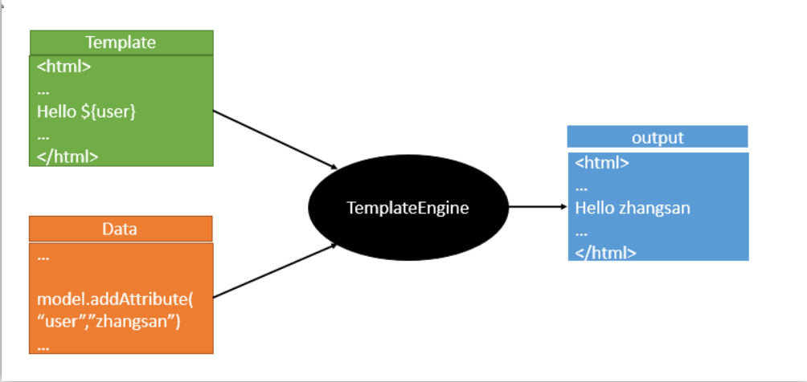
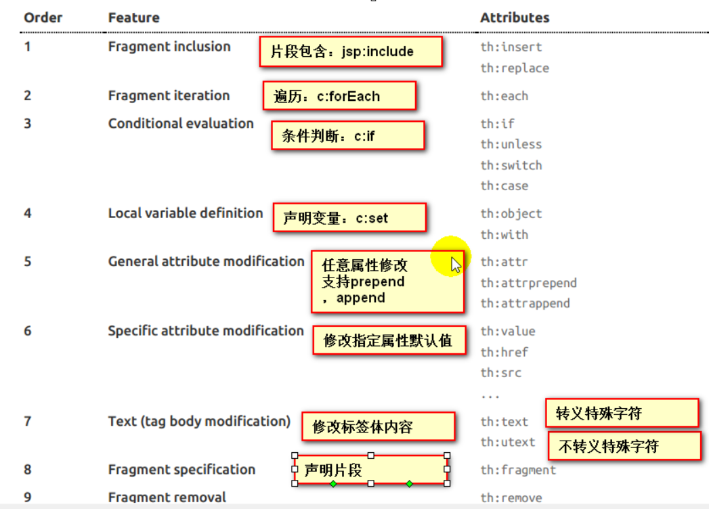

# 模板引擎

JSP、Velocity、Freemarker、Thymeleaf；



Spring Boot推荐Thymeleaf。

语法更简单、功能更强大。

## 1、引入Thymeleaf

```xml
<!-- 引入thymeleaf -->
<dependency>
    <groupId>org.springframework.boot</groupId>
    <artifactId>spring-boot-starter-thymeleaf</artifactId>
</dependency>
```

## 2、Thymeleaf的使用和语法

1）使用

只要把html页面放在classpath:/templates/，thymeleaf就能自动渲染了。

```java
@ConfigurationProperties(prefix = "spring.thymeleaf")
public class ThymeleafProperties {
	// 默认编码
	private static final Charset DEFAULT_ENCODING = StandardCharsets.UTF_8;
	// 默认前缀
	public static final String DEFAULT_PREFIX = "classpath:/templates/";
	// 默认后缀
	public static final String DEFAULT_SUFFIX = ".html";
	// ...
}
```

templates/success.html

```html
<!DOCTYPE html>
<html lang="zh">
<head>
    <meta charset="UTF-8">
    <title>success</title>
</head>
<body>
    <h1>成功！</h1>
</body>
</html>
```

HelloController.java

```java
package top.oct.webcrud.controller;

import org.springframework.stereotype.Controller;
import org.springframework.web.bind.annotation.RequestMapping;
import org.springframework.web.bind.annotation.ResponseBody;

@Controller
public class HelloController
{
    @ResponseBody
    @RequestMapping("/hello")
    public String hello()
    {
        return "success";
    }

    @RequestMapping("/success")
    public String success()
    {
        return "success";
    }
}
```

启动服务后，当访问 /hello 时，返回的是success字符串；当访问 /success 时，返回的是success.html页面。

2）语法

导入thymeleaf的名称空间

```html
<html lang="zh" xmlns:th="http://www.thymeleaf.org">
```

使用thymeleaf的语法

```html
<!DOCTYPE html>
<html lang="zh" xmlns:th="http://www.thymeleaf.org">
    <head>
        <meta charset="UTF-8">
        <title>success</title>
    </head>
    <body>
        <h1>成功！</h1><br/>
        <div th:text="${hello}">这是显示欢迎信息</div>
    </body>
</html>
```

## 3、语法规则

1）th:text。改变当前元素里面的文本内容。

th:class	替换原来的class

th:id	替换原来的id

th:任意html属性

th属性的优先级：




2）表达式

```properties
Simple expressions:（表达式语法）
    Variable Expressions: ${...}	# 获取变量值
    	1）获取对象的属性、调用方法
    	2）使用内置的基本对象
    		#ctx : the context object.
            #vars: the context variables.
            #locale : the context locale.
            #request : (only in Web Contexts) the HttpServletRequest object.
            #response : (only in Web Contexts) the HttpServletResponse object.
            #session : (only in Web Contexts) the HttpSession object.
            #servletContext : (only in Web Contexts) the ServletContext object.
            	${session.foo}
       3）内置的一些工具对象
            #execInfo : information about the template being processed.
            #messages : methods for obtaining externalized messages inside variables expressions, in the same way as they
            would be obtained using #{...} syntax.
            #uris : methods for escaping parts of URLs/URIs
            Page 20 of 106#conversions : methods for executing the configured conversion service (if any).
            #dates : methods for java.util.Date objects: formatting, component extraction, etc.
            #calendars : analogous to #dates , but for java.util.Calendar objects.
            #numbers : methods for formatting numeric objects.
            #strings : methods for String objects: contains, startsWith, prepending/appending, etc.
            #objects : methods for objects in general.
            #bools : methods for boolean evaluation.
            #arrays : methods for arrays.
            #lists : methods for lists.
            #sets : methods for sets.
            #maps : methods for maps.
            #aggregates : methods for creating aggregates on arrays or collections.
            #ids : methods for dealing with id attributes that might be repeated (for example, as a result of an iteration).
    Selection Variable Expressions: *{...}	# 选择表达式，和${}在功能上一样（有一个补充功能）
    	补充配置: th:object="${session.user}"
            <div th:object="${session.user}">
                <p>Name: <span th:text="*{firstName}">Sebastian</span>.</p>
                <p>Surname: <span th:text="*{lastName}">Pepper</span>.</p>
                <p>Nationality: <span th:text="*{nationality}">Saturn</span>.</p>
            </div>
    Message Expressions: #{...}	# 获取国际化内容
    Link URL Expressions: @{...}	# 定义url链接
    	<!-- Will produce 'http://localhost:8080/gtvg/order/details?orderId=3' (plus rewriting) -->
        <a href="details.html"
        	th:href="@{http://localhost:8080/gtvg/order/details(orderId=${o.id})}">view</a>
        <!-- Will produce '/gtvg/order/details?orderId=3' (plus rewriting) -->
        <a href="details.html" th:href="@{/order/details(orderId=${o.id})}">view</a>
        <!-- Will produce '/gtvg/order/3/details' (plus rewriting) -->
        <a href="details.html" th:href="@{/order/{orderId}/details(orderId=${o.id})}">view</a>
        @{/order/process(execId=${execId},execType='FAST')}
    Fragment Expressions: ~{...}	# 片段引用表达式
    	<div th:insert="~{commons :: main}">...</div>

Literals：（字面量）
    Text literals: 'one text' , 'Another one!' ,...
    Number literals: 0 , 34 , 3.0 , 12.3 ,...
    Boolean literals: true , false
    Null literal: null
    Literal tokens: one , sometext , main ,...

Text operations：（文本操作）
    String concatenation: +
    Literal substitutions: |The name is ${name}|
    
Arithmetic operations：（数学运算）
    Binary operators: + , - , * , / , %
    Minus sign (unary operator): -
    
Boolean operations：（布尔运算）
    Binary operators: and , or
    Boolean negation (unary operator): ! , not
    
Comparisons and equality：（比较运算）
    Comparators: > , < , >= , <= ( gt , lt , ge , le )
    Equality operators: == , != ( eq , ne )
    
Conditional operators：（条件运算）
    If-then: (if) ? (then)
    If-then-else: (if) ? (then) : (else)
    Default: (value) ?: (defaultvalue)
    
Special tokens：（特殊操作）
    No-Operation: _
```

